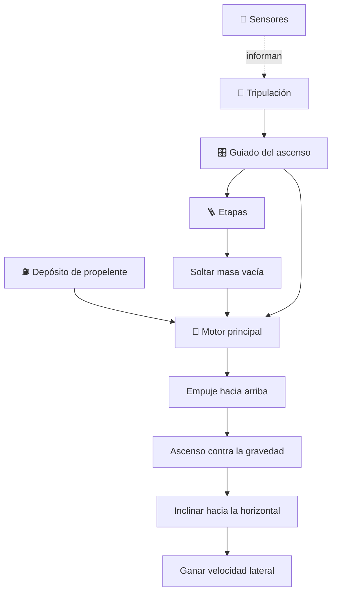

# 🚀 Curso: Thunderbird 3

[🏠 Inicio](../../README.md) · [🌌 Naves de ficción](../README.md) · [🎓 Guía de curso](../../docs/08-guia-de-estilo-y-curso.md)

> ⚖️ Material educativo original; los derechos de las obras pertenecen a sus titulares.

---

> Curso de análisis educativo de ciencia ficción inspirado en el estilo
> "Thunderbirds". Estudiamos un cohete de rescate genérico para entender la
> física real del ascenso al espacio: por qué llegar a órbita no es solo subir,
> sino alcanzar una enorme velocidad lateral, y por qué el combustible manda.

---

## 🎯 Objetivos de aprendizaje

Al terminar este curso deberías poder:

- Explicar por qué llegar al espacio exige velocidad orbital lateral, no solo altura.
- Entender el papel de la gravedad y del aire durante el ascenso de un cohete.
- Describir por qué conviene soltar masa vacía con cohetes de varias etapas.
- Razonar sobre la ecuación del cohete y el crecimiento exponencial del combustible.
- Distinguir que evoca la ficción que sería real y que rompe la física.
- Traducir todo lo anterior a variables de un simulador educativo.

---

## 🗺️ Mapa del vehículo

---

## 📚 Módulos del curso

| # | Módulo | Contenido | Enlace |
| :-: | --- | --- | --- |
| 1 | 📜 Historia | Contexto de la nave de ficción y su idea de vuelo. | [Abrir](historia/historia-thunderbird-3.md) |
| 2 | 📋 Características | Que es un cohete de rescate genérico y para que sirve. | [Abrir](operacion/caracteristicas-thunderbird-3.md) |
| 3 | 🔧 Sistemas mecánicos | Tecnología imaginaria frente a la física real. | [Abrir](operacion/sistemas-mecanicos-thunderbird-3.md) |
| 4 | 🎛️ Mandos e instrumentos | Puesto de mando conceptual y controles. | [Abrir](mandos/manual-mandos-thunderbird-3.md) |
| 5 | 🧪 Principios y operación | Ascenso, etapas y ecuación del cohete: que si y que no. | [Abrir](operacion/principios-thunderbird-3.md) |
| 6 | 🌍 Entornos | Rampa, atmósfera baja, atmósfera alta y órbita. | [Abrir](operacion/entornos-thunderbird-3.md) |
| 7 | ⚖️ Reglas del universo | Las leyes internas de la ficción frente a la física. | [Abrir](reglamentos/reglas-universo-thunderbird-3.md) |
| 8 | 🎮 Diseño de simulación | Variables, ciclo y modo ciencia o ficción. | [Abrir](simulacion/diseno-simulador-thunderbird-3.md) |
| 9 | 🧰 Recursos | Glosario, enlaces y diagramas. | [Abrir](recursos/recursos-thunderbird-3.md) |

---

## 🧩 Requisitos previos

Ninguno formal. Ayuda tener nociones básicas de las leyes de Newton, pero el
curso las explica desde cero. La idea central es simple y potente: para quedarse
en el espacio no basta con subir muy alto, hay que moverse tan rápido de lado
que la caída hacia el planeta se convierta en una órbita estable.

---

[➡️ Empezar por el Módulo 1: Historia](historia/historia-thunderbird-3.md)
