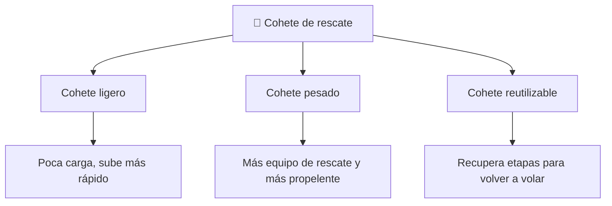

# 📋 Características del Thunderbird 3

[🏠 Inicio](../../../README.md) · [🚀 Curso: Thunderbird 3](../README.md) · 📋 Características

> ⚖️ Material educativo original; los derechos de las obras pertenecen a sus titulares.

Que es un cohete de rescate genérico, que rasgos lo definen en la ficción y cuales
tendrían sentido físico real. Este módulo da el contexto antes de abrir la
tecnología por dentro en el Módulo 3.

---

## 🧭 Definición

Un cohete de rescate, en la ficción estilo "Thunderbirds", es un vehículo capaz
de despegar deprisa, llegar al espacio y regresar para socorrer a quien lo
necesite. Lo imaginamos potente, veloz y siempre listo. En este curso lo usamos
como excusa para estudiar como subiría de verdad un vehículo así hasta la órbita.

---

## 🧬 Características clave

| Característica | Como la muestra la ficción | Lectura física real |
| --- | --- | --- |
| Despegue instantáneo | Sube en segundos y sin preparativos | Falso: el ascenso dura minutos y exige mucho propelente. |
| Ascenso vertical | Sube recto como una flecha | Solo al principio; luego debe inclinarse hacia la horizontal. |
| Llegar al espacio | Basta con subir muy alto | Insuficiente: sin velocidad lateral se vuelve a caer. |
| Cohete de una pieza | Sube y baja entero | Conviene soltar etapas vacías para no cargar peso muerto. |
| Combustible discreto | Depósito pequeño y suficiente | Real: el combustible es casi toda la masa del cohete. |
| Regreso suave | Aterriza como si nada | La reentrada libera enorme energía y calor. |

---

## 🗂️ Tipos conceptuales de cohete de rescate

| Tipo | Idea de diseño | Compromiso físico |
| --- | --- | --- |
| Cohete ligero | Poca carga útil, estructura mínima | Alcanza órbita antes pero rescata poco. |
| Cohete pesado | Mucho equipo y propelente | Más masa exige más empuje y más combustible. |
| Cohete reutilizable | Etapas que se recuperan | Ahorra a la larga pero añade peso y complejidad. |

---

## 🎯 Para qué sirve en el relato

- Dar espectáculo con despegues potentes y urgentes.
- Representar el rescate rápido como una hazaña heroica.
- Simplificar el viaje al espacio a un simple "subir muy alto".

En cambio, para este curso sirve como laboratorio: cada rasgo llamativo nos
deja preguntar si sería posible y por qué.

---

[⬅️ Anterior: Historia](../historia/historia-thunderbird-3.md) · [➡️ Siguiente: Sistemas mecánicos](sistemas-mecanicos-thunderbird-3.md)
