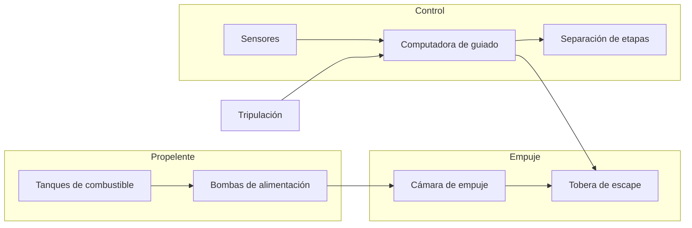
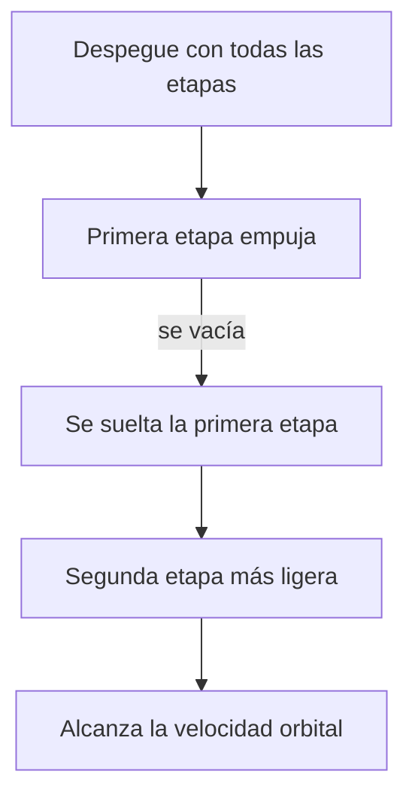

# 🔧 Sistemas mecánicos del Thunderbird 3

[🏠 Inicio](../../../README.md) · [🚀 Curso: Thunderbird 3](../README.md) · 🔧 Sistemas mecánicos

> ⚖️ Material educativo original; los derechos de las obras pertenecen a sus titulares.

Este módulo abre el cohete de rescate por dentro. Compara la tecnología imaginaria
de la ficción con la física real que la haría funcionar (o que la desmiente).
La regla del curso es clara: describimos conceptos con nuestras palabras, sin
copiar planos ni especificaciones oficiales.

---

## 1. 🚀 Motores y propelente

En la ficción, un motor compacto entrega potencia sin apenas gastar nada. En la
realidad, el motor de cohete funciona expulsando masa (propelente) a gran
velocidad hacia atrás: por la tercera ley de Newton, la nave recibe empuje hacia
adelante. Lo decisivo es que ese propelente se agota, y en un cohete real es la
mayor parte de la masa total al despegar.

| Concepto de ficción | Física real que evoca | Veredicto |
| --- | --- | --- |
| Motor que casi no gasta | Motor de cohete que expulsa propelente | No físico: el propelente es finito y se gasta rápido. |
| Empuje instantáneo a tope | Empuje limitado por el flujo de propelente | Parcial: hay empuje, pero con un máximo. |
| Depósito pequeño | El propelente domina la masa del cohete | Falso: el combustible pesa más que el resto junto. |
| Chorro decorativo | Chorro de escape que produce el empuje | Real: sin chorro de masa no hay empuje. |

---

## 2. 🪜 Etapas y separación

Aquí aparece una de las grandes ideas de la ingeniería espacial. Un cohete carga
enormes tanques que se van vaciando. Seguir arrastrando esos tanques vacíos sería
peso muerto que hay que acelerar en balde. Por eso los cohetes reales se dividen
en etapas: cuando una agota su propelente, se suelta, y el cohete continua más
ligero. La ficción suele mostrar un cuerpo único que sube y baja entero.

| Idea de la ficción | Que dice la física real |
| --- | --- |
| El cohete sube y baja de una pieza | Conviene soltar masa vacía por el camino. |
| El peso no importa una vez arriba | Cada kilo de más exige más propelente para acelerar. |
| Las etapas son un adorno | Son clave para alcanzar la velocidad orbital. |
| Todo el cohete llega al espacio | Solo una fracción pequeña llega de verdad a órbita. |

---

## 3. 🎯 Guiado del ascenso

En la ficción el cohete sube recto y ya está. En la realidad, subir recto todo el
rato sería un error: para orbitar hace falta muchisima velocidad horizontal. Por
eso el cohete arranca casi vertical para salir del aire denso y luego se inclina
poco a poco hasta empujar casi en horizontal. A esa maniobra suave se la suele
llamar giro de inclinación, y la coordina la computadora de guiado.

| Sistema | En la ficción | En la realidad |
| --- | --- | --- |
| Trayectoria | Sube recto hacia arriba | Arranca vertical y se inclina hacia la horizontal. |
| Dirección del empuje | Fija hacia abajo | Se orienta la tobera para dirigir el ascenso. |
| Objetivo | Ganar altura | Ganar sobre todo velocidad lateral. |
| Control | Instinto del piloto | Computadora que dosifica empuje y dirección. |

---

## 4. 🛢️ Estructura y tanques

Las paredes de un cohete real son sorprendentemente finas para ahorrar peso: casi
todo el volumen son tanques de propelente. La ficción imagina cascos macizos y
resistentes, pero cada gramo de estructura de más obliga a llevar aún más
combustible. El diseño real busca el equilibrio entre aguantar el esfuerzo del
despegue y pesar lo menos posible.

| Elemento | Función en la ficción | Función útil real |
| --- | --- | --- |
| Casco grueso | Aguantar cualquier golpe | Añade masa; se busca lo más ligero posible. |
| Tanques | Detalle secundario | Ocupan casi todo el cohete. |
| Aletas | Estilo y velocidad | Ayudan a estabilizar dentro del aire. |
| Escudo | Adorno | Protege del calor en la reentrada. |

---

## 5. 🪂 Sistema de rescate y reentrada

El rescate implica volver, y volver desde órbita libera muchisima energía. La
nave viaja tan rápido que, al rozar el aire, se calienta de forma extrema. La
ficción muestra aterrizajes suaves e inmediatos; la física exige un escudo
térmico, una trayectoria de frenado cuidadosa y a menudo paracaídas o motores
para posarse.

| Fase | En la ficción | En la realidad |
| --- | --- | --- |
| Salida de órbita | Instantánea | Requiere frenar con el motor en el momento justo. |
| Descenso | Suave y sin calor | El aire frena pero calienta el escudo al rojo. |
| Aterrizaje | Aterriza como si nada | Necesita paracaídas o empuje para tocar suave. |

---

## 🔁 Cómo se conecta todo

1. El **propelente** alimenta el motor que genera el empuje.
2. El **motor** acelera el cohete expulsando masa hacia abajo.
3. Las **etapas** se sueltan al vaciarse para no cargar peso muerto.
4. El **guiado** inclina la trayectoria para ganar velocidad lateral.
5. El **sistema de reentrada** disipa la energía para regresar con seguridad.

Con esto claro, el [Módulo 4: Mandos](../mandos/manual-mandos-thunderbird-3.md)
muestra cómo la tripulación operaría cada sistema.

---

[⬅️ Anterior: Características](caracteristicas-thunderbird-3.md) · [➡️ Siguiente: Mandos e instrumentos](../mandos/manual-mandos-thunderbird-3.md)
