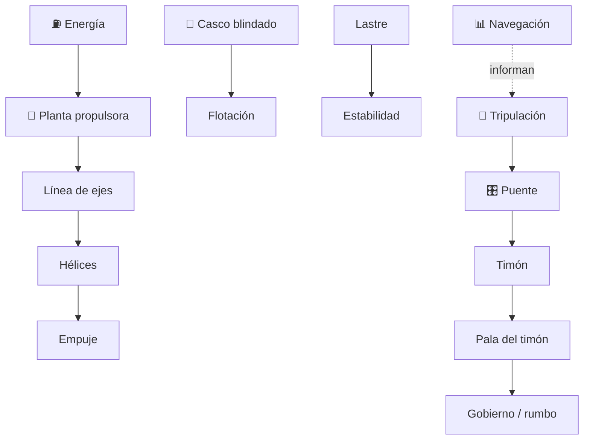

# 🛡️ Curso: Acorazados

[🏠 Inicio](../../README.md) · [🚙 Catálogo de vehículos](../README.md) · [🎓 Guía de curso](../../docs/08-guia-de-estilo-y-curso.md)

> **Curso divulgativo e histórico.** Documenta el acorazado solo con información
> pública: historia, características generales, principios físicos de flotación,
> blindaje y estabilidad, puente a nivel educativo, entornos y marco público.
> No incluye táctica, doctrina ni sistemas de armas. Ver
> [🦺 docs/04-seguridad-y-limites.md](../../docs/04-seguridad-y-limites.md).

---

## 🎯 Objetivos de aprendizaje

Al terminar este curso deberías poder:

- Explicar como un gran buque blindado flota, avanza y mantiene estabilidad.
- Identificar sus sistemas generales (casco, blindaje, propulsión, gobierno).
- Reconocer, a nivel educativo, el puente y los instrumentos de navegación.
- Comprender la física pública de flotación, blindaje y estabilidad.
- Conocer el marco institucional e internacional público aplicable.
- Traducir todo lo anterior en variables de un simulador educativo responsable.

---

## 🗺️ Mapa del vehículo

---

## 📚 Módulos del curso

| # | Módulo | Contenido | Enlace |
| :-: | --- | --- | --- |
| 1 | 📜 Historia | Origen y evolución pública del acorazado. | [Abrir](historia/historia-acorazado.md) |
| 2 | 📋 Características | Que es, tipos históricos y su papel general. | [Abrir](operacion/caracteristicas-acorazado.md) |
| 3 | 🔧 Sistemas mecánicos | Casco, blindaje, propulsión, gobierno y estabilidad. | [Abrir](operacion/sistemas-mecanicos-acorazado.md) |
| 4 | 🎛️ Mandos e instrumentos | Puente y navegación, a nivel educativo. | [Abrir](mandos/manual-mandos-acorazado.md) |
| 5 | 🧪 Principios y operación | Física de flotación, blindaje y estabilidad. | [Abrir](operacion/principios-acorazado.md) |
| 6 | 🌍 Entornos de trabajo | Puerto, costa, mar abierto y clima. | [Abrir](operacion/entornos-acorazado.md) |
| 7 | ⚖️ Reglamentos | Marco público institucional e internacional. | [Abrir](reglamentos/reglamentos-acorazado.md) |
| 8 | 🎮 Diseño de simulación | Variables, ciclo y modos de simulación. | [Abrir](simulacion/diseno-simulador-acorazado.md) |
| 9 | 🧰 Recursos | Glosario náutico, enlaces y diagramas. | [Abrir](recursos/recursos-acorazado.md) |

---

## 🧩 Requisitos previos

Conviene haber visto antes el curso de
[🚢 Barcos mercantes](../barcos-mercantes/README.md) para dominar flotación,
inercia y gobierno. El acorazado agrega el blindaje y la escala, siempre desde un
enfoque histórico y público. Límites en
[🦺 docs/04-seguridad-y-limites.md](../../docs/04-seguridad-y-limites.md).

---

[➡️ Empezar por el Módulo 1: Historia](historia/historia-acorazado.md)
