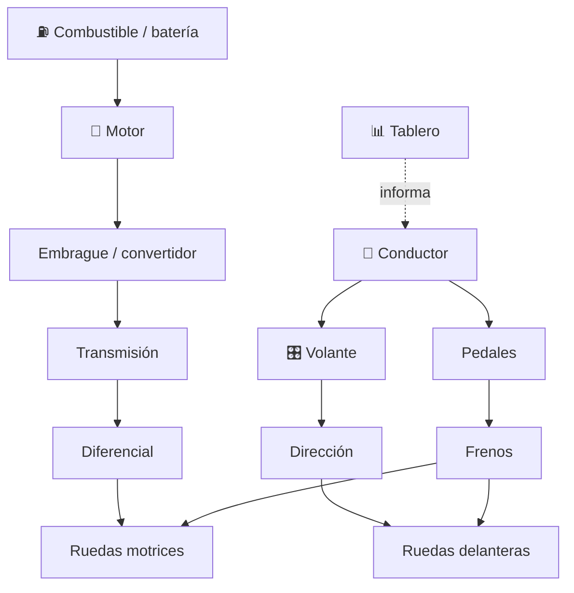

# 🚗 Curso: Automóviles

[🏠 Inicio](../../README.md) · [🚙 Catálogo de vehículos](../README.md) · [🎓 Guía de curso](../../docs/08-guia-de-estilo-y-curso.md)

> **Curso del automóvil de principio a fin.** Documenta el vehículo más común de
> la vía: historia, características, mecánica en profundidad, mandos, física de
> la conducción, entornos, reglamentos chilenos y diseño de simulación. Sigue la
> plantilla de oro del curso de motocicletas.

---

## 🎯 Objetivos de aprendizaje

Al terminar este curso deberías poder:

- Explicar como un automóvil acelera, frena, gira y transmite la fuerza al suelo.
- Identificar sus sistemas mecánicos y cómo se conectan entre sí.
- Reconocer todos los mandos e instrumentos del puesto de conducción.
- Comprender la física de la conducción (tracción, adherencia, transferencia de peso).
- Conocer los reglamentos chilenos aplicables (licencia clase B, cinturón, seguridad).
- Traducir todo lo anterior en variables de un simulador educativo.

---

## 🗺️ Mapa del vehículo

---

## 📚 Módulos del curso

| # | Módulo | Contenido | Enlace |
| :-: | --- | --- | --- |
| 1 | 📜 Historia | Origen y evolución del automóvil, línea de tiempo. | [Abrir](historia/historia-automovil.md) |
| 2 | 📋 Características | Que es, tipos de automóvil y para que sirve cada uno. | [Abrir](operacion/caracteristicas-automovil.md) |
| 3 | 🔧 Sistemas mecánicos | Motor, transmisión, dirección, frenos, suspensión, eléctrico. | [Abrir](operacion/sistemas-mecanicos-automovil.md) |
| 4 | 🎛️ Mandos e instrumentos | Puesto de conducción, controles y tablero. | [Abrir](mandos/manual-mandos-automovil.md) |
| 5 | 🧪 Principios y operación | Física de la conducción y fases de operación. | [Abrir](operacion/principios-automovil.md) |
| 6 | 🌍 Entornos de trabajo | Ciudad, carretera, autopista, montaña, lluvia. | [Abrir](operacion/entornos-automovil.md) |
| 7 | ⚖️ Reglamentos | Ley chilena: licencia clase B, cinturón, seguridad. | [Abrir](reglamentos/reglamentos-automovil.md) |
| 8 | 🎮 Diseño de simulación | Variables, ciclo y modos de juego. | [Abrir](simulacion/diseno-simulador-automovil.md) |
| 9 | 🧰 Recursos | Glosario, enlaces y diagramas. | [Abrir](recursos/recursos-automovil.md) |

---

## 🧩 Requisitos previos

Ninguno obligatorio. Conviene revisar antes el curso de
[🏍️ Motocicletas](../motos/README.md) porque explica aceleración, frenado y
transmisión con menor complejidad. El automóvil agrega carrocería, cuatro ruedas,
transferencia de peso lateral y más ayudas electrónicas. Marco legal común en
[⚖️ docs/07-marco-legal-chile.md](../../docs/07-marco-legal-chile.md).

---

[➡️ Empezar por el Módulo 1: Historia](historia/historia-automovil.md)
