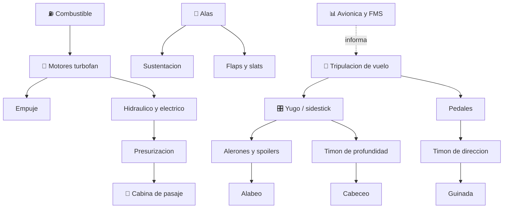

# 🛫 Curso: Aviones de pasajeros

[🏠 Inicio](../../README.md) · [🚙 Catalogo de vehiculos](../README.md) · [🎓 Guia de curso](../../docs/08-guia-de-estilo-y-curso.md)

> **Curso de aviacion comercial de transporte.** Documenta el avion de pasajeros
> de principio a fin: historia, caracteristicas, sistemas de la aeronave en
> profundidad, cabina de vuelo, fisica del vuelo, entornos aeronauticos,
> reglamentos chilenos y diseno de simulacion. El eje del curso es la operacion
> comercial segura de una aeronave de transporte de pasajeros.

---

## 🎯 Objetivos de aprendizaje

Al terminar este curso deberias poder:

- Explicar como un avion de pasajeros genera sustentacion, avanza, gira y desciende.
- Identificar el fuselaje presurizado, las alas, las superficies de control y los motores turbofan.
- Reconocer los instrumentos de la cabina de vuelo y los mandos de una aeronave de transporte.
- Comprender la fisica del vuelo (sustentacion, resistencia, empuje, peso) a alta velocidad y altitud.
- Conocer el marco aeronautico chileno (DGAC, licencia ATP, operacion comercial AOC).
- Traducir todo lo anterior en variables de un simulador educativo.

---

## 🗺️ Mapa del vehiculo

---

## 📚 Modulos del curso

| # | Modulo | Contenido | Enlace |
| :-: | --- | --- | --- |
| 1 | 📜 Historia | Origen y evolucion del avion de pasajeros, linea de tiempo. | [Abrir](historia/historia-avion-pasajeros.md) |
| 2 | 📋 Caracteristicas | Que es, tipos de avion de pasajeros y para que sirve cada uno. | [Abrir](operacion/caracteristicas-avion-pasajeros.md) |
| 3 | 🔧 Sistemas mecanicos | Fuselaje presurizado, alas, control, turbofan, sistemas y avionica. | [Abrir](operacion/sistemas-mecanicos-avion-pasajeros.md) |
| 4 | 🎛️ Mandos e instrumentos | Cabina de vuelo, controles y avionica. | [Abrir](mandos/manual-mandos-avion-pasajeros.md) |
| 5 | 🧪 Principios y operacion | Fisica del vuelo y fases de operacion comercial. | [Abrir](operacion/principios-avion-pasajeros.md) |
| 6 | 🌍 Entornos de trabajo | Aeropuerto, espacio aereo controlado y meteorologia. | [Abrir](operacion/entornos-avion-pasajeros.md) |
| 7 | ⚖️ Reglamentos | Ley chilena: DGAC, licencia ATP, operacion comercial. | [Abrir](reglamentos/reglamentos-avion-pasajeros.md) |
| 8 | 🎮 Diseno de simulacion | Variables, ciclo y modos de juego. | [Abrir](simulacion/diseno-simulador-avion-pasajeros.md) |
| 9 | 🧰 Recursos | Glosario, enlaces y diagramas. | [Abrir](recursos/recursos-avion-pasajeros.md) |

---

## 🧩 Requisitos previos

Conviene haber visto antes el curso de
[🛩️ Aviones pequenos](../aviones-pequenos/README.md), que introduce el vuelo en
tres ejes y la fisica basica con menor complejidad. El avion de pasajeros agrega
la presurizacion, los motores turbofan, la operacion a gran altitud y el marco de
la aviacion comercial. Marco legal comun en
[⚖️ docs/07-marco-legal-chile.md](../../docs/07-marco-legal-chile.md).

---

[➡️ Empezar por el Modulo 1: Historia](historia/historia-avion-pasajeros.md)
