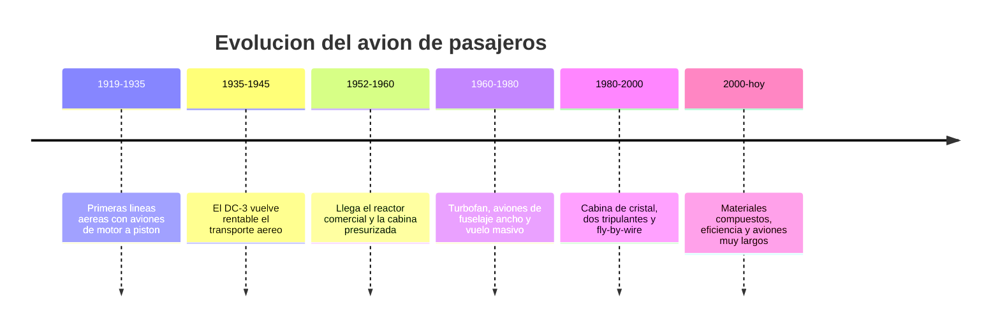

# 📜 Historia del avion de pasajeros

[🏠 Inicio](../../../README.md) · [🛫 Curso: Aviones de pasajeros](../README.md) · 📜 Historia

## Origen

El avion de pasajeros nace tras la Primera Guerra Mundial, cuando los primeros
operadores adaptaron aviones de motor a piston para llevar correo y pasajeros. El
salto decisivo llego con el DC-3 en los anos treinta, que por primera vez hizo
rentable el transporte de pasajeros sin subsidio del correo. Despues, el reactor
y la cabina presurizada permitieron volar mas alto, mas rapido y mas comodo.

## Linea de tiempo

| Periodo | Hito | Importancia |
| --- | --- | --- |
| 1919-1935 | Primeras lineas aereas | El transporte aereo comercial se pone en marcha. |
| 1935-1945 | El DC-3 | Vuelve rentable llevar pasajeros. |
| 1952-1960 | El reactor comercial | Vuelo mas alto, rapido y presurizado. |
| 1960-1980 | Turbofan y fuselaje ancho | Transporte masivo y mas eficiente. |
| 1980-2000 | Cabina de cristal y fly-by-wire | Dos pilotos y control asistido por computador. |
| 2000-presente | Compuestos y eficiencia | Menor consumo y mayor alcance. |

## Evolucion tecnologica

- **Estructura**: del aluminio remachado a los materiales compuestos.
- **Propulsion**: del motor a piston al turborreactor y al turbofan de alto indice de derivacion.
- **Cabina**: de decenas de relojes a pantallas integradas (glass cockpit) y FMS.
- **Control**: de mandos mecanicos y por cable a sistemas fly-by-wire con protecciones.
- **Presurizacion**: cabinas que permiten volar comodo a gran altitud.
- **Seguridad**: redundancia de sistemas, procedimientos y gestion de recursos de tripulacion.

## Tipos representativos

| Tipo | Uso tipico | Caracteristica destacada |
| --- | --- | --- |
| Turbohelice regional | Rutas cortas y pistas modestas | Eficiente a baja altitud. |
| Reactor regional | Conexiones cortas de baja densidad | Alcance corto, menos asientos. |
| Fuselaje estrecho | Rutas cortas y medias | Un pasillo, muy comun en flotas. |
| Fuselaje ancho | Rutas largas intercontinentales | Dos pasillos, gran alcance. |
| Carguero derivado | Transporte de carga | Fuselaje de pasaje adaptado. |

## Impacto social y economico

El avion de pasajeros conecto ciudades y continentes en horas, transformando el
turismo, el comercio y la vida de millones de personas. En paises largos y de
geografia dificil, como Chile, la aviacion comercial es clave para unir el
territorio. Su operacion exige un marco de seguridad estricto porque transporta a
muchas personas en cada vuelo.

## Fuentes

- Registrar aqui las fuentes publicas consultadas.
- Enlazar cada fuente tambien en [`manuales/fuentes.md`](../../../manuales/fuentes.md).

---

[🎓 Portada del curso](../README.md) · [➡️ Siguiente: Caracteristicas](../operacion/caracteristicas-avion-pasajeros.md)
