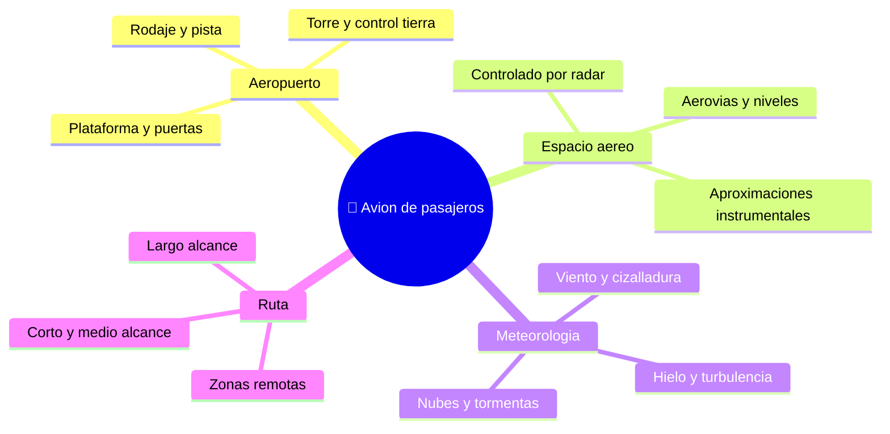

# 🌍 Entornos de trabajo del avion de pasajeros

[🏠 Inicio](../../../README.md) · [🛫 Curso: Aviones de pasajeros](../README.md) · 🌍 Entornos

Donde opera un avion de pasajeros y como cambia el vuelo segun el entorno. Cada
entorno implica reglas, riesgos y ajustes distintos, y en simulacion se traduce
en escenarios diferentes.

---

## 🗺️ Entornos principales

| Entorno | Caracteristicas | Riesgos tipicos | Ajuste de vuelo |
| --- | --- | --- | --- |
| Aeropuerto | Plataforma, rodaje, pista. | Trafico en tierra, incursion de pista. | Seguir autorizaciones, listas y senalizacion. |
| Espacio aereo controlado | Radar, aerovias, niveles de vuelo. | Interferir con otros vuelos. | Seguir instrucciones del control, transponder activo. |
| Aproximacion instrumental | Guiado por instrumentos a la pista. | Baja visibilidad, cizalladura. | Estabilizar la aproximacion, procedimientos definidos. |
| Meteorologia adversa | Tormentas, hielo, viento. | Turbulencia, desvio de ruta. | Radar meteorologico, rutas alternativas, antihielo. |
| Largo alcance | Rutas oceanicas o remotas. | Distancia a aeropuertos alternativos. | Planificacion, combustible y reglas de desvio. |
| Gran altitud | Aire fino, crucero rapido. | Despresurizacion, envolvente estrecha. | Presurizacion, control de velocidad y nivel. |

---

## 🌦️ Factores del entorno

- **Viento y cizalladura**: el viento cruzado y las rafagas complican despegue y
  aterrizaje; la cizalladura cerca del suelo es un riesgo serio.
- **Meteorologia**: tormentas, hielo y baja visibilidad exigen radar, antihielo y
  procedimientos por instrumentos.
- **Densidad del aire**: calor y altitud del aeropuerto afectan el rendimiento.
- **Trafico y control**: el espacio aereo controlado ordena rutas, niveles y turnos.

---

## 🎮 Traduccion a simulacion

Cada entorno es un escenario con su tipo de espacio aereo, su clima y su
aeropuerto. Ver como se modela en el
[Modulo 8: Diseno de simulacion](../simulacion/diseno-simulador-avion-pasajeros.md).

---

[⬅️ Anterior: Principios y operacion](principios-avion-pasajeros.md) · [➡️ Siguiente: Reglamentos](../reglamentos/reglamentos-avion-pasajeros.md)
