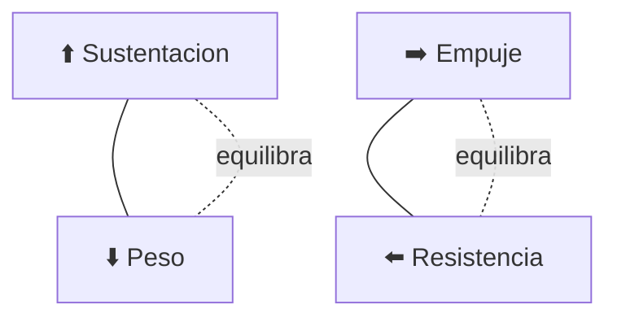

# 🧪 Principios y operacion del avion de pasajeros

[🏠 Inicio](../../../README.md) · [🛫 Curso: Aviones de pasajeros](../README.md) · 🧪 Principios

Documento general y educativo. No sustituye la formacion aeronautica certificada
ni los manuales del operador y del fabricante. Describe como se opera un avion de
pasajeros en simulacion y que principios fisicos conviene representar.

## Principios de funcionamiento

- **Sustentacion**: el ala genera una fuerza hacia arriba al moverse por el aire;
  crece con la velocidad y el angulo de ataque, hasta la entrada en perdida.
- **Peso**: la gravedad tira del avion hacia abajo; se equilibra con la sustentacion.
- **Empuje**: los motores turbofan impulsan el avion; lo regulan las palancas de gases.
- **Resistencia**: el aire frena el avance; aumenta con la velocidad y la configuracion.
- **Vuelo a gran altitud**: la cabina presurizada permite volar comodo donde el
  aire es fino, mas eficiente para el crucero rapido.

## Las cuatro fuerzas del vuelo

En vuelo nivelado y estable, la sustentacion equilibra el peso y el empuje
equilibra la resistencia. Cambiar una fuerza obliga a reajustar las demas.

## Fases de operacion

| Fase | Que ocurre | Puntos clave |
| --- | --- | --- |
| Prevuelo | Inspeccion, plan y checklist | Combustible, peso y balance, meteorologia, NOTAM. |
| Rodaje | Mover el avion en tierra | Control con pedales y frenos, autorizaciones del control. |
| Despegue | Acelerar y rotar | Velocidades de decision y rotacion, configuracion de despegue. |
| Ascenso | Ganar altitud hacia el crucero | Empuje de ascenso, velocidad y rumbo estables. |
| Crucero | Volar hacia el destino | Ajustar nivel y velocidad, navegar con FMS, comunicar. |
| Descenso | Bajar de altitud | Reducir empuje, gestionar la senda y la velocidad. |
| Aproximacion | Alinear con la pista | Configurar flaps, velocidad de aproximacion estable. |
| Aterrizaje | Tomar tierra | Redondeo, toma suave, spoilers, reversa y frenos. |

## Aproximacion y aterrizaje: idea general

1. Planificar el descenso con anticipacion segun distancia y altitud.
2. Configurar flaps y velocidad por etapas segun el procedimiento.
3. Alinear con la pista y seguir la senda de planeo (guiado por instrumentos).
4. Estabilizar la aproximacion antes de un punto de referencia definido.
5. Hacer el redondeo, tomar suave y frenar con spoilers, reversa y frenos.

## La operacion en tripulacion

- El vuelo se reparte entre **piloto que vuela** y **piloto que monitorea**.
- Las **listas de verificacion** ordenan cada fase y previenen olvidos.
- La **gestion de recursos de tripulacion** busca decisiones seguras y comunicadas.
- El **piloto automatico** y el **autothrottle** reducen la carga en crucero.

## Errores comunes que la simulacion puede ensenar a evitar

- Volar demasiado lento y acercarse a la entrada en perdida.
- Descuidar el peso y balance o el calculo de combustible.
- No estabilizar la aproximacion y aun asi continuar el aterrizaje.
- Omitir o apurar las listas de verificacion.
- Ignorar las alertas de trafico o de proximidad al terreno.

## Relacion con los niveles de realismo

- **Nivel 1 (educativo)**: despegar, subir, crucero, descender y aterrizar guiado.
- **Nivel 2 (simplificado)**: agregar sustentacion, resistencia, entrada en perdida
  y uso basico del piloto automatico.
- **Nivel 3 (tecnico)**: sumar gestion de sistemas, presurizacion, FMS, checklist
  y operacion en tripulacion.

Ver [`docs/03-niveles-de-realismo.md`](../../../docs/03-niveles-de-realismo.md) para el detalle de cada nivel.

---

[⬅️ Anterior: Mandos](../mandos/manual-mandos-avion-pasajeros.md) · [➡️ Siguiente: Entornos de trabajo](entornos-avion-pasajeros.md)
