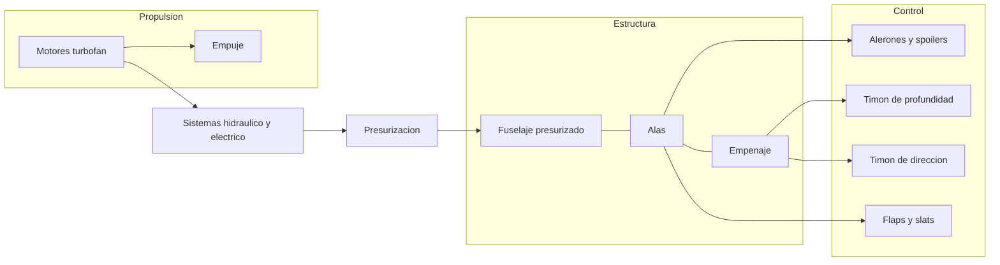
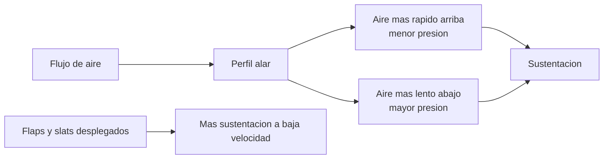
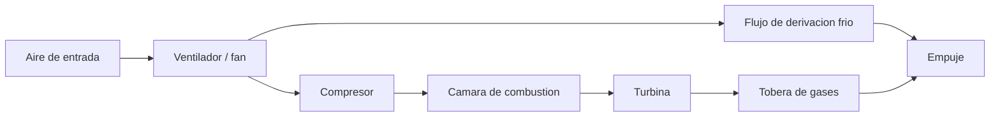
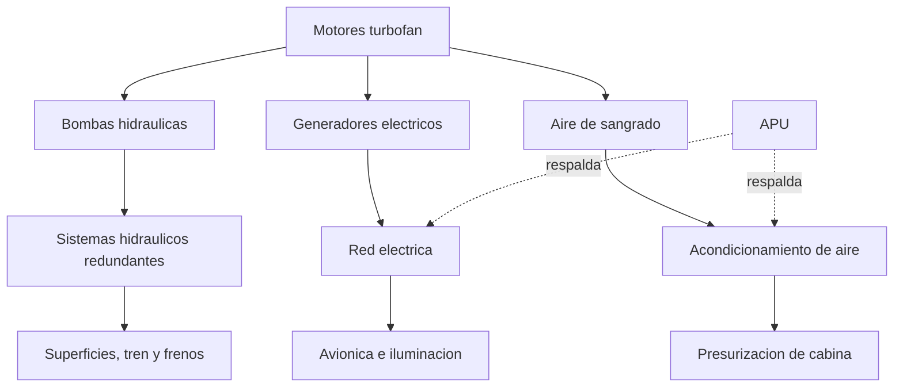

# 🔧 Sistemas mecanicos del avion de pasajeros

[🏠 Inicio](../../../README.md) · [🛫 Curso: Aviones de pasajeros](../README.md) · 🔧 Sistemas mecanicos

Este modulo abre el avion de pasajeros por dentro. Explica cada sistema, como
funciona y como se conecta con los demas. Es la base tecnica para entender los
mandos (Modulo 4) y la fisica del vuelo (Modulo 5). Frente a un avion pequeno,
aqui aparecen la presurizacion, los motores turbofan y la redundancia de sistemas.

---

## 1. 🧱 Celula y fuselaje presurizado

La celula es la estructura que sostiene todo. En un avion de pasajeros, el
fuselaje ademas es una vasija a presion que permite volar comodo a gran altitud.

- **Fuselaje**: cuerpo central; aloja cabina de pasaje, carga y une alas y empenaje.
- **Cuadernas y larguerillos**: dan rigidez y forma cilindrica para resistir presion.
- **Revestimiento estructural**: la piel soporta parte de las cargas y contiene la presion.
- **Ciclos de presurizacion**: cada vuelo presuriza y despresuriza el fuselaje; es
  un factor clave en la fatiga estructural y las inspecciones.

| Elemento | Funcion | Nota |
| --- | --- | --- |
| Cuadernas | Definen la seccion y resisten la presion | Forma casi cilindrica. |
| Larguerillos | Rigidizan el revestimiento | Reparten cargas longitudinales. |
| Mamparos de presion | Cierran la vasija a presion | En proa y cola. |
| Revestimiento | Piel exterior estructural | Parte de la resistencia. |
| Ventanas y puertas | Aberturas reforzadas | Zonas criticas de la presurizacion. |

---

## 2. 🛫 Alas y dispositivos hipersustentadores

El ala genera la sustentacion. En transporte, se optimiza para crucero rapido y,
con dispositivos moviles, para volar lento y seguro en despegue y aterrizaje.

| Elemento del ala | Funcion |
| --- | --- |
| Perfil alar | Crea la diferencia de presion y la sustentacion. |
| Flecha (barrido) | Retrasa efectos de compresibilidad a alta velocidad. |
| Flaps | Aumentan sustentacion y resistencia para despegue y aterrizaje. |
| Slats / borde de ataque | Retrasan la entrada en perdida a baja velocidad. |
| Winglets | Reducen la resistencia inducida en las puntas. |
| Cajon de torsion | Estructura interna que aloja combustible. |

---

## 3. 🎚️ Superficies de control

Controlan la aeronave en sus tres ejes. En transporte se agregan superficies
como los spoilers para frenar y descender.

| Eje | Movimiento | Superficie | Mando en cabina |
| --- | --- | --- | --- |
| Longitudinal | Alabeo (rolido) | Alerones y spoilers de rolido | Yugo o sidestick a izquierda / derecha. |
| Lateral | Cabeceo | Timon de profundidad / estabilizador | Yugo o sidestick adelante / atras. |
| Vertical | Guinada | Timon de direccion | Pedales. |

- **Alerones**: en los bordes exteriores de las alas; suben un ala y bajan la otra.
- **Spoilers**: se levantan para reducir sustentacion, frenar en el aire y en pista.
- **Timon de profundidad y estabilizador**: controlan y compensan el cabeceo.
- **Timon de direccion**: orienta la nariz y coordina el vuelo.
- **Fly-by-wire**: en muchos aviones, las ordenes van por senal electrica a los
  actuadores, con protecciones que evitan salir de la envolvente segura.

---

## 4. ⚙️ Motores turbofan

Convierten combustible en empuje. El turbofan mueve una gran masa de aire con un
ventilador frontal, lo que lo hace eficiente y mas silencioso.

| Componente | Funcion |
| --- | --- |
| Ventilador (fan) | Mueve gran masa de aire; da la mayor parte del empuje. |
| Compresor | Comprime el aire antes de la combustion. |
| Camara de combustion | Quema combustible y libera energia. |
| Turbina | Extrae energia para mover fan y compresor. |
| Reversa de empuje | Redirige el flujo para frenar en pista. |
| FADEC | Control electronico que regula el motor con precision. |

---

## 5. 🛞 Tren de aterrizaje

Sostiene el avion en tierra y absorbe el impacto del aterrizaje; en transporte es
retractil y con varias ruedas por su peso.

- **Configuracion triciclo**: tren de nariz mas dos o mas patas principales.
- **Retractil**: se recoge en vuelo para reducir la resistencia.
- **Amortiguadores oleoneumaticos**: absorben la energia del contacto.
- **Frenos y antideslizante (antiskid)**: detienen el avion sin bloquear ruedas.
- **Direccion de rueda de nariz**: para maniobrar en tierra.

---

## 6. 🔩 Sistemas hidraulico, electrico y de presurizacion

Los grandes aviones dependen de sistemas potentes y redundantes que mueven
superficies, tren y frenos, y mantienen habitable la cabina.

| Sistema | Funcion | Nota de seguridad |
| --- | --- | --- |
| Hidraulico | Mueve superficies, tren y frenos | Varios circuitos independientes. |
| Electrico | Alimenta avionica, luces y equipos | Generadores mas baterias y RAT. |
| Neumatico (sangrado) | Aire caliente del motor | Acondicionamiento y antihielo. |
| Presurizacion | Mantiene presion de cabina comoda | Controla la altitud de cabina. |
| APU | Turbina auxiliar en tierra y respaldo | Energia sin motores en marcha. |
| Combustible | Depositos en alas y centro | Bombas y trasvase entre tanques. |

---

## 7. 📟 Avionica y sistemas de navegacion

Informan a la tripulacion y gestionan el vuelo cuando no hay referencias visuales.

| Sistema | Funcion |
| --- | --- |
| Pantallas primarias de vuelo (PFD) | Actitud, velocidad, altitud y rumbo integrados. |
| Pantalla multifuncion (ND / MFD) | Navegacion, ruta y meteorologia. |
| Sistema de gestion de vuelo (FMS) | Planifica y sigue la ruta, optimiza el vuelo. |
| Piloto automatico y autothrottle | Mantienen rumbo, altitud, velocidad y senda. |
| Radios y transponder | Comunicacion y respuesta al control de trafico. |
| Sistemas de alerta (TCAS, GPWS) | Previenen colision y vuelo contra el terreno. |

---

## 🔁 Como se conecta todo

1. Los **motores turbofan** generan **empuje** y alimentan los sistemas.
2. El empuje da **velocidad**, y las **alas** la convierten en **sustentacion**.
3. Las **superficies de control** orientan el avion en los tres ejes.
4. El **fuselaje presurizado** aloja al pasaje y contiene la presion en altitud.
5. Los **sistemas hidraulico, electrico y neumatico** mueven todo y mantienen la cabina.
6. La **avionica** informa y asiste a la tripulacion para volar con seguridad.

Con esto entendido, el [Modulo 4: Mandos](../mandos/manual-mandos-avion-pasajeros.md)
muestra como la tripulacion opera cada uno de estos sistemas desde la cabina de vuelo.

---

[⬅️ Anterior: Caracteristicas](caracteristicas-avion-pasajeros.md) · [➡️ Siguiente: Mandos e instrumentos](../mandos/manual-mandos-avion-pasajeros.md)
