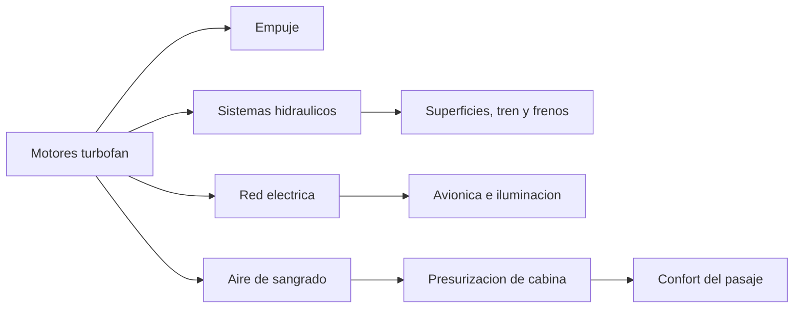

# 🧰 Recursos del avion de pasajeros

[🏠 Inicio](../../../README.md) · [🛫 Curso: Aviones de pasajeros](../README.md) · 🧰 Recursos

Glosario especifico, enlaces y diagramas de apoyo del curso de aviones de
pasajeros. Amplia el [glosario general](../../../docs/05-glosario-general.md).

---

## 📖 Glosario especifico

| Termino | Definicion |
| --- | --- |
| Turbofan | Motor a reaccion con gran ventilador frontal, eficiente y silencioso. |
| Presurizacion | Sistema que mantiene una presion de cabina comoda a gran altitud. |
| Fly-by-wire | Mando de vuelo por senal electrica con protecciones de envolvente. |
| Spoiler | Superficie que reduce sustentacion para descender y frenar. |
| Slat | Dispositivo de borde de ataque que retrasa la entrada en perdida. |
| FMS | Sistema de gestion de vuelo que planifica y sigue la ruta. |
| Autothrottle | Sistema que ajusta el empuje de forma automatica. |
| ATP | Licencia de Piloto de Transporte de Linea Aerea. |
| AOC | Certificado de operador aereo que autoriza la operacion comercial. |
| IAS | Velocidad indicada respecto al aire, en nudos. |
| Nivel de vuelo | Altitud de referencia estandar en aviacion de crucero. |

---

## 🗺️ Diagrama de la cadena de energia y sistemas

---

## 🔗 Enlaces y fuentes

- Marco legal: [⚖️ docs/07-marco-legal-chile.md](../../../docs/07-marco-legal-chile.md)
- Registro de fuentes: [📚 manuales/fuentes.md](../../../manuales/fuentes.md)
- Reglamentacion aeronautica (DGAC) y normas DAN/DAR: ver el registro de fuentes.

Registrar cada recurso nuevo con su origen y licencia, siguiendo
[`recursos/README.md`](../../../recursos/README.md).

---

[🎓 Portada del curso](../README.md) · [⬅️ Anterior: Diseno de simulacion](../simulacion/diseno-simulador-avion-pasajeros.md)
