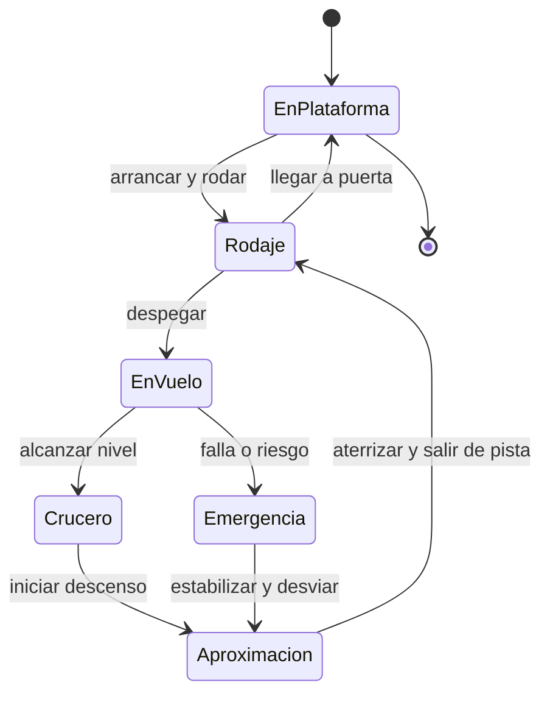

# 🎮 Diseno de simulacion del avion de pasajeros

[🏠 Inicio](../../../README.md) · [🛫 Curso: Aviones de pasajeros](../README.md) · 🎮 Simulacion

## Objetivo de la simulacion

Que el usuario aprenda a operar un avion de pasajeros en tripulacion: preparar el
vuelo, despegar, ascender, gestionar el crucero con el piloto automatico y el FMS,
descender y realizar una aproximacion instrumental estable hasta el aterrizaje,
respetando el control de trafico y los procedimientos, de forma progresiva.

## Nivel de realismo

- Nivel elegido: se ofrece del 1 al 3 (ver `docs/03-niveles-de-realismo.md`).
- Justificacion: el avion de pasajeros suma presurizacion, motores turbofan,
  gestion de sistemas y operacion comercial, por lo que es un curso avanzado
  respecto del avion pequeno.

## Variables principales

| Variable | Tipo | Rango | Afecta a | Comentarios |
| --- | --- | --- | --- | --- |
| Velocidad (IAS/Mach) | numerica | 0-350 nudos / Mach | Sustentacion y limites | Clave para la envolvente segura. |
| Altitud | numerica | 0-41000 pies | Rendimiento y navegacion | Ligada a la presion y al nivel de vuelo. |
| Actitud (cabeceo/alabeo) | numerica | -30..30 grados | Trayectoria de vuelo | Referencia del PFD. |
| Empuje de motores | numerica | 0-100% | Empuje disponible | Con autothrottle opcional. |
| Configuracion de flaps/slats | discreta | 0..varias etapas | Sustentacion y resistencia | Por fase de vuelo. |
| Altitud de cabina | numerica | 0-8000 pies equiv. | Confort y seguridad | Salud de la presurizacion. |
| Combustible | numerica | 0-100% | Autonomia y alcance | Incluye reserva y alternativa. |
| Modo de piloto automatico | discreta | manual / auto | Carga de trabajo | Rumbo, altitud, velocidad, senda. |
| Viento | vectorial | direccion + fuerza | Rumbo y aterrizaje | El cruzado y la cizalladura exigen correccion. |

## Ciclo basico

1. Leer entrada del usuario (mandos de vuelo, gases, flaps, spoilers, panel FCU/MCP).
2. Actualizar estado de motores, sistemas y configuracion aerodinamica.
3. Calcular fuerzas: sustentacion, peso, empuje y resistencia.
4. Aplicar el entorno (viento, densidad del aire, meteorologia).
5. Actualizar velocidad, altitud, actitud, posicion y estado de la cabina.
6. Refrescar PFD, ND y alertas (perdida, TCAS, GPWS) y el piloto automatico.

## Modos de juego futuros

- Tutorial guiado de cabina, checklist y operacion en tripulacion.
- Practica de despegue, crucero con FMS y aproximacion instrumental.
- Misiones de navegacion entre aeropuertos con control de trafico.
- Desafios de viento cruzado, meteorologia y aproximacion estabilizada.
- Situaciones de emergencia controladas (falla de motor, despresurizacion) sin
  contenido sensible.

## Elementos fuera de alcance

- Maniobras peligrosas presentadas como recomendables.
- Reproduccion de accidentes o victimas de forma sensacionalista.
- Datos tecnicos que permitan alterar sistemas reales de una aeronave.

## Pendientes

- [ ] Definir valores por defecto de cada variable por tipo de avion.
- [ ] Prototipar el modelo de sustentacion, envolvente y perdida.
- [ ] Modelar la operacion en tripulacion y las listas de verificacion.
- [ ] Agregar fuentes tecnicas publicas a [`manuales/fuentes.md`](../../../manuales/fuentes.md).

---

[⬅️ Anterior: Reglamentos](../reglamentos/reglamentos-avion-pasajeros.md) · [➡️ Siguiente: Recursos](../recursos/recursos-avion-pasajeros.md)
