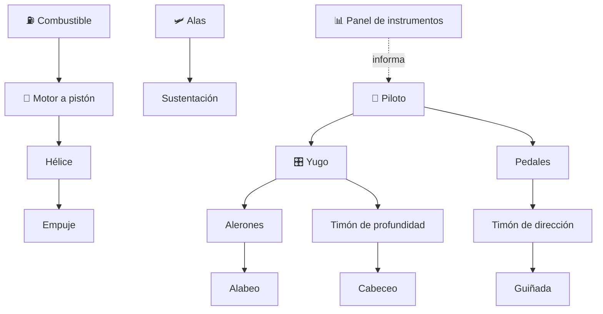

# 🛩️ Curso: Aviones pequeños

[🏠 Inicio](../../README.md) · [🚙 Catálogo de vehículos](../README.md) · [🎓 Guía de curso](../../docs/08-guia-de-estilo-y-curso.md)

> **Curso completo de aviación general.** Documenta el avión pequeño de
> principio a fin: historia, características, sistemas de la aeronave en
> profundidad, cabina y mandos, física del vuelo, entornos aeronáuticos,
> reglamentos chilenos y diseño de simulación. Sigue el modelo del curso de
> motos.

---

## 🎯 Objetivos de aprendizaje

Al terminar este curso deberías poder:

- Explicar como un avión genera sustentación, avanza, gira y desciende.
- Identificar la célula, las alas, las superficies de control y el grupo motor.
- Reconocer los instrumentos de vuelo y los mandos de la cabina.
- Comprender la física del vuelo (sustentación, resistencia, empuje, peso).
- Conocer el marco aeronáutico chileno (DGAC, licencias, reglas de vuelo).
- Traducir todo lo anterior en variables de un simulador educativo.

---

## 🗺️ Mapa del vehículo

---

## 📚 Módulos del curso

| # | Módulo | Contenido | Enlace |
| :-: | --- | --- | --- |
| 1 | 📜 Historia | Origen y evolución de la aviación general, línea de tiempo. | [Abrir](historia/historia-avion-pequeno.md) |
| 2 | 📋 Características | Que es, tipos de avión pequeño y para que sirve cada uno. | [Abrir](operacion/caracteristicas-avion-pequeno.md) |
| 3 | 🔧 Sistemas mecánicos | Célula, alas, superficies de control, motor, tren, instrumentos. | [Abrir](operacion/sistemas-mecanicos-avion-pequeno.md) |
| 4 | 🎛️ Mandos e instrumentos | Cabina, controles de vuelo y panel de instrumentos. | [Abrir](mandos/manual-mandos-avion-pequeno.md) |
| 5 | 🧪 Principios y operación | Física del vuelo y fases de operación. | [Abrir](operacion/principios-avion-pequeno.md) |
| 6 | 🌍 Entornos de trabajo | Aeródromo, espacio aéreo y meteorología. | [Abrir](operacion/entornos-avion-pequeno.md) |
| 7 | ⚖️ Reglamentos | Ley chilena: DGAC, licencia PPL, reglas de vuelo. | [Abrir](reglamentos/reglamentos-avion-pequeno.md) |
| 8 | 🎮 Diseño de simulación | Variables, ciclo y modos de juego. | [Abrir](simulacion/diseno-simulador-avion-pequeno.md) |
| 9 | 🧰 Recursos | Glosario, enlaces y diagramas. | [Abrir](recursos/recursos-avion-pequeno.md) |

---

## 🧩 Requisitos previos

Se recomienda haber revisado antes el curso de motos, que introduce aceleración,
frenado y transferencia de peso con menor complejidad. El avión pequeño agrega el
vuelo en tres ejes y la meteorología. Marco legal común en
[⚖️ docs/07-marco-legal-chile.md](../../docs/07-marco-legal-chile.md).

---

[➡️ Empezar por el Módulo 1: Historia](historia/historia-avion-pequeno.md)
