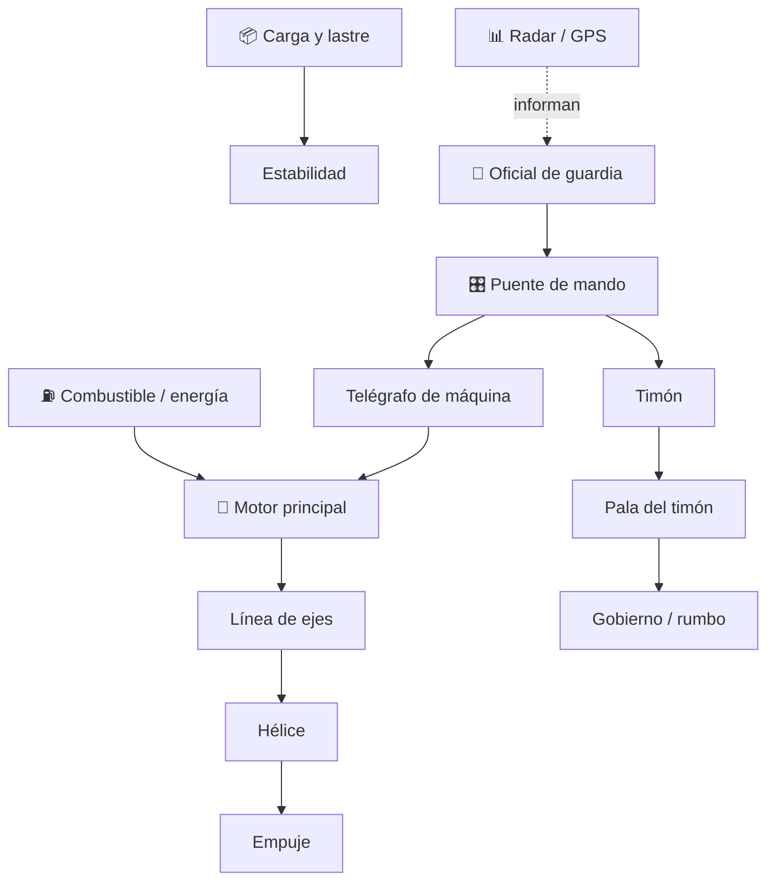

# 🚢 Curso: Barcos mercantes

[🏠 Inicio](../../README.md) · [🚙 Catálogo de vehículos](../README.md) · [🎓 Guía de curso](../../docs/08-guia-de-estilo-y-curso.md)

> **Curso civil de navegación mercante.** Documenta el buque mercante de
> principio a fin: historia, características, mecánica naval en profundidad,
> puente de mando, física de flotación y gobierno, entornos, reglamentos
> marítimos chilenos e internacionales y diseño de simulación.

---

## 🎯 Objetivos de aprendizaje

Al terminar este curso deberías poder:

- Explicar como un buque mercante flota, avanza, gobierna y se detiene.
- Identificar sus sistemas (casco, propulsión, gobierno, carga) y cómo se conectan.
- Reconocer los mandos e instrumentos del puente y su función.
- Comprender la física de la navegación (flotación, empuje, inercia de grandes masas).
- Conocer los reglamentos aplicables (COLREG, SOLAS, MARPOL, DIRECTEMAR).
- Traducir todo lo anterior en variables de un simulador educativo.

---

## 🗺️ Mapa del vehículo

---

## 📚 Módulos del curso

| # | Módulo | Contenido | Enlace |
| :-: | --- | --- | --- |
| 1 | 📜 Historia | Origen y evolución del buque mercante, línea de tiempo. | [Abrir](historia/historia-barco-mercante.md) |
| 2 | 📋 Características | Que es, tipos de buque mercante y para que sirve cada uno. | [Abrir](operacion/caracteristicas-barco-mercante.md) |
| 3 | 🔧 Sistemas mecánicos | Casco, propulsión, gobierno, carga, estiba y estabilidad. | [Abrir](operacion/sistemas-mecanicos-barco-mercante.md) |
| 4 | 🎛️ Mandos e instrumentos | Puente de mando, controles e instrumentos de navegación. | [Abrir](mandos/manual-mandos-barco-mercante.md) |
| 5 | 🧪 Principios y operación | Física de flotación y gobierno, fases de navegación. | [Abrir](operacion/principios-barco-mercante.md) |
| 6 | 🌍 Entornos de trabajo | Puerto, costa, mar abierto y clima. | [Abrir](operacion/entornos-barco-mercante.md) |
| 7 | ⚖️ Reglamentos | COLREG, SOLAS, MARPOL, STCW y marco DIRECTEMAR. | [Abrir](reglamentos/reglamentos-barco-mercante.md) |
| 8 | 🎮 Diseño de simulación | Variables, ciclo y modos de simulación. | [Abrir](simulacion/diseno-simulador-barco-mercante.md) |
| 9 | 🧰 Recursos | Glosario náutico, enlaces y diagramas. | [Abrir](recursos/recursos-barco-mercante.md) |

---

## 🧩 Requisitos previos

Conviene haber visto antes el curso de [🏍️ Motos](../motos/README.md) para
manejar conceptos básicos de propulsión, frenado e inercia. El buque agrega la
flotación, la inercia de grandes masas y las reglas marítimas. Marco legal común
en [⚖️ docs/07-marco-legal-chile.md](../../docs/07-marco-legal-chile.md).

---

[➡️ Empezar por el Módulo 1: Historia](historia/historia-barco-mercante.md)
