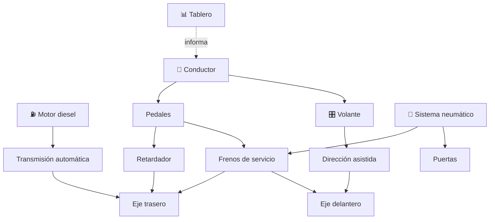

# 🚌 Curso: Buses

[🏠 Inicio](../../README.md) · [🚙 Catálogo de vehículos](../README.md) · [🎓 Guía de curso](../../docs/08-guia-de-estilo-y-curso.md)

> **Curso completo del bus de transporte de pasajeros.** Documenta el vehículo
> de principio a fin: historia, características, mecánica en profundidad, mandos,
> principios de operación con pasajeros, entornos, reglamentos chilenos y diseño
> de simulación. Sigue la plantilla de oro del curso de motos.

---

## 🎯 Objetivos de aprendizaje

Al terminar este curso deberías poder:

- Explicar como un bus acelera, frena, gira y gestiona su gran masa.
- Identificar sus sistemas mecánicos, en especial el sistema neumático.
- Reconocer todos los mandos e instrumentos, incluidos puertas y retardador.
- Comprender la operación con pasajeros de pie, paradas y accesibilidad.
- Conocer los reglamentos chilenos aplicables (licencia clase A, aforo, jornada).
- Traducir todo lo anterior en variables de un simulador educativo.

---

## 🗺️ Mapa del vehículo

---

## 📚 Módulos del curso

| # | Módulo | Contenido | Enlace |
| :-: | --- | --- | --- |
| 1 | 📜 Historia | Origen y evolución del bus, línea de tiempo. | [Abrir](historia/historia-bus.md) |
| 2 | 📋 Características | Que es, tipos de bus y para que sirve cada uno. | [Abrir](operacion/caracteristicas-bus.md) |
| 3 | 🔧 Sistemas mecánicos | Motor, transmisión, frenos neumáticos, puertas, accesibilidad. | [Abrir](operacion/sistemas-mecanicos-bus.md) |
| 4 | 🎛️ Mandos e instrumentos | Puesto de mando, controles, puertas y tablero. | [Abrir](mandos/manual-mandos-bus.md) |
| 5 | 🧪 Principios y operación | Masa, inercia, paradas y fases de operación. | [Abrir](operacion/principios-bus.md) |
| 6 | 🌍 Entornos de trabajo | Urbano, interurbano, corredor BRT, terminal. | [Abrir](operacion/entornos-bus.md) |
| 7 | ⚖️ Reglamentos | Ley chilena: licencia clase A, aforo, jornada. | [Abrir](reglamentos/reglamentos-bus.md) |
| 8 | 🎮 Diseño de simulación | Variables, ciclo y modos de juego. | [Abrir](simulacion/diseno-simulador-bus.md) |
| 9 | 🧰 Recursos | Glosario, enlaces y diagramas. | [Abrir](recursos/recursos-bus.md) |

---

## 🧩 Requisitos previos

Se recomienda haber revisado antes el [curso de motos](../motos/README.md) para
manejar los conceptos base de propulsión, frenado y transmisión. El bus agrega
la gestión de gran masa, el sistema neumático y la operación con pasajeros.
Marco legal común en
[⚖️ docs/07-marco-legal-chile.md](../../docs/07-marco-legal-chile.md).

---

[➡️ Empezar por el Módulo 1: Historia](historia/historia-bus.md)
