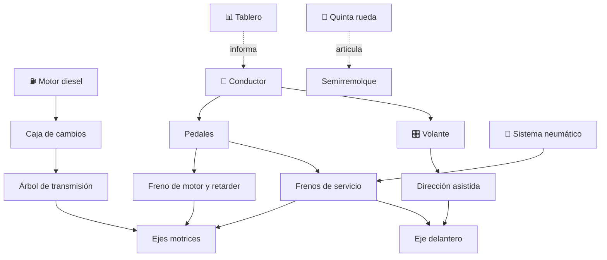

# 🚛 Curso: Camiones

[🏠 Inicio](../../README.md) · [🚙 Catálogo de vehículos](../README.md) · [🎓 Guía de curso](../../docs/08-guia-de-estilo-y-curso.md)

> **Curso completo del camión de carga.** Documenta el vehículo de principio a
> fin: historia, características, mecánica en profundidad, mandos, física de la
> conducción con carga, entornos, reglamentos chilenos y diseño de simulación.
> Sigue la plantilla de oro del curso de motos, con foco en el motor diesel, los
> frenos neumáticos y la gestión del peso bruto vehicular.

---

## 🎯 Objetivos de aprendizaje

Al terminar este curso deberías poder:

- Explicar como un camión acelera, frena y gestiona una gran masa cargada.
- Identificar sus sistemas mecánicos, en especial el motor diesel y el aire.
- Distinguir un camión simple de uno articulado y su quinta rueda.
- Reconocer todos los mandos e instrumentos, incluidos retarder y freno de motor.
- Comprender el peso bruto vehicular, la tara y el reparto por eje.
- Conocer los reglamentos chilenos aplicables (licencia clase A-4 y A-5, pesos).
- Traducir todo lo anterior en variables de un simulador educativo.

---

## 🗺️ Mapa del vehículo

---

## 📚 Módulos del curso

| # | Módulo | Contenido | Enlace |
| :-: | --- | --- | --- |
| 1 | 📜 Historia | Origen y evolución del camión, línea de tiempo. | [Abrir](historia/historia-camion.md) |
| 2 | 📋 Características | Que es, tipos de camión y para que sirve cada uno. | [Abrir](operacion/caracteristicas-camion.md) |
| 3 | 🔧 Sistemas mecánicos | Motor diesel, caja, frenos de aire, retarder, ejes, quinta rueda. | [Abrir](operacion/sistemas-mecanicos-camion.md) |
| 4 | 🎛️ Mandos e instrumentos | Cabina, controles, retarder y tablero. | [Abrir](mandos/manual-mandos-camion.md) |
| 5 | 🧪 Principios y operación | Masa, inercia, pendientes y fases de operación. | [Abrir](operacion/principios-camion.md) |
| 6 | 🌍 Entornos de trabajo | Ruta, ciudad, montaña, minero y distribución. | [Abrir](operacion/entornos-camion.md) |
| 7 | ⚖️ Reglamentos | Ley chilena: licencia clase A-4 y A-5, pesos y seguridad. | [Abrir](reglamentos/reglamentos-camion.md) |
| 8 | 🎮 Diseño de simulación | Variables, ciclo y modos de juego. | [Abrir](simulacion/diseno-simulador-camion.md) |
| 9 | 🧰 Recursos | Glosario, enlaces y diagramas. | [Abrir](recursos/recursos-camion.md) |

---

## 🧩 Requisitos previos

Se recomienda haber revisado antes el [curso de motos](../motos/README.md) para
manejar los conceptos base de propulsión, frenado y transmisión, y el
[curso de buses](../buses/README.md) para el sistema neumático. El camión agrega
la gestión de gran masa de carga, el freno de motor y la conducción articulada.
Marco legal común en
[⚖️ docs/07-marco-legal-chile.md](../../docs/07-marco-legal-chile.md).

---

[➡️ Empezar por el Módulo 1: Historia](historia/historia-camion.md)
