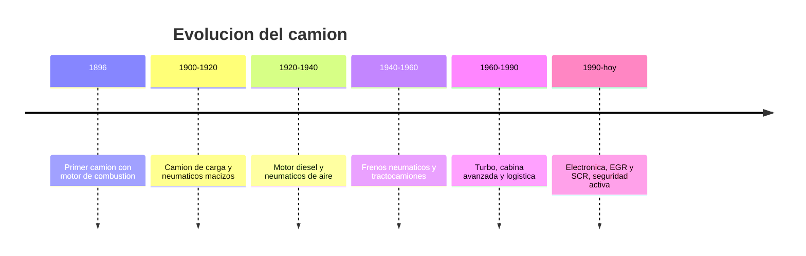

# 📜 Historia del camion

[🏠 Inicio](../../../README.md) · [🚛 Curso: Camiones](../README.md) · 📜 Historia

## Origen

El camion nace del deseo de mover carga pesada sin depender de la traccion
animal. Los primeros modelos, a finales del siglo XIX, montaron un motor de
combustion sobre un chasis reforzado. El salto decisivo llego con el motor
diesel en las decadas de 1920 y 1930, mas eficiente y con mucho par a bajas
vueltas, ideal para arrastrar grandes masas.

## Linea de tiempo

| Periodo | Hito | Importancia |
| --- | --- | --- |
| 1896 | Primer camion con motor de combustion | Prueba del concepto de carga motorizada. |
| 1900-1920 | Camion de carga y neumaticos macizos | Reemplazo del carro tirado por animales. |
| 1920-1940 | Motor diesel y neumaticos de aire | Eficiencia, par y mejor rodadura. |
| 1940-1960 | Frenos neumaticos y tractocamiones | Frenado seguro de gran masa y articulacion. |
| 1960-1990 | Turbo, cabina avanzada y logistica | Mas potencia y confort, transporte a escala. |
| 1990-presente | Electronica, EGR y SCR, seguridad activa | Menos emisiones y frenado asistido. |

## Evolucion tecnologica

- **Propulsion**: del motor de gasolina al diesel turboalimentado de alto par.
- **Frenado**: de frenos mecanicos a neumaticos con ABS, EBS y retarder.
- **Estructura**: chasis de largueros mas resistentes y cabinas seguras.
- **Transmision**: de cajas manuales de muchas marchas a cajas automatizadas.
- **Emisiones**: recirculacion de gases EGR y reduccion catalitica SCR con AdBlue.
- **Seguridad**: control de estabilidad, aviso de cambio de carril, frenado de emergencia.

## Tipos representativos

| Tipo | Uso tipico | Caracteristica destacada |
| --- | --- | --- |
| Camion rigido liviano | Reparto urbano | Chasis simple, facil de maniobrar. |
| Camion rigido pesado | Carga regional | Varios ejes, gran capacidad util. |
| Tractocamion | Larga distancia | Arrastra semirremolque con quinta rueda. |
| Volquete / tolva | Aridos y mineria | Caja basculante para descarga. |
| Cisterna | Liquidos y combustible | Estanque, centro de gravedad alto. |
| Portacontenedores | Logistica intermodal | Chasis para contenedor normalizado. |

## Impacto economico y logistico

El camion es la columna vertebral del transporte de carga por tierra: mueve la
mayor parte de las mercancias que llegan a fabricas, tiendas y hogares. Su
evolucion esta ligada a la eficiencia de combustible, a la reduccion de
emisiones y a la seguridad vial, porque su masa lo convierte en un vehiculo
critico dentro del trafico mixto.

## Fuentes

- Registrar aqui las fuentes publicas consultadas.
- Enlazar cada fuente tambien en [`manuales/fuentes.md`](../../../manuales/fuentes.md).

---

[🎓 Portada del curso](../README.md) · [➡️ Siguiente: Caracteristicas](../operacion/caracteristicas-camion.md)
