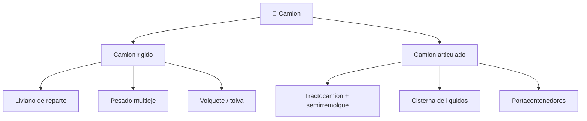

# 📋 Caracteristicas funcionales del camion

[🏠 Inicio](../../../README.md) · [🚛 Curso: Camiones](../README.md) · 📋 Caracteristicas

Que es un camion, que tipos existen y para que sirve cada uno. Este modulo da el
contexto antes de abrir la mecanica (Modulo 3).

---

## 🧭 Definicion

Un camion es un vehiculo motorizado disenado para transportar carga por
carretera. Se caracteriza por un chasis robusto, un motor de gran par (casi
siempre diesel) y una capacidad de carga que supera con creces la de un
automovil. Puede ser rigido, con la carga sobre su propio chasis, o articulado,
cuando un tractocamion arrastra un semirremolque unido por la quinta rueda.

---

## 🧬 Caracteristicas clave

| Caracteristica | Descripcion |
| --- | --- |
| Gran masa | La carga multiplica el peso; cambia la inercia y el frenado. |
| Par elevado | El motor diesel entrega fuerza a bajas vueltas para arrancar cargado. |
| Frenado neumatico | Usa aire comprimido por la energia que debe disipar. |
| Peso bruto vehicular | Suma de tara y carga; define ejes y licencia requerida. |
| Reparto por eje | La carga se distribuye entre ejes para no exceder limites. |
| Articulacion | El tractocamion pivota sobre la quinta rueda al girar. |

---

## 🗂️ Tipos de camion

| Tipo | Uso tipico | Rasgo destacado |
| --- | --- | --- |
| Rigido liviano | Reparto urbano | Agil, carga sobre chasis propio. |
| Rigido pesado | Carga regional | Varios ejes, alta capacidad util. |
| Volquete / tolva | Aridos, obra y mineria | Caja basculante que descarga por gravedad. |
| Tractocamion | Larga distancia | Cabeza tractora que arrastra semirremolque. |
| Cisterna | Combustible y liquidos | Centro de gravedad alto, carga que se mueve. |
| Portacontenedores | Logistica intermodal | Chasis con anclajes para contenedor. |

---

## 🎯 Para que se usa

- Transporte de carga general entre ciudades y regiones.
- Distribucion urbana de mercancias a comercios.
- Movimiento de aridos, tierra y minerales en obra y mineria.
- Transporte de combustible, quimicos y liquidos en cisterna.
- Logistica de contenedores entre puertos y centros de distribucion.

---

[⬅️ Anterior: Historia](../historia/historia-camion.md) · [➡️ Siguiente: Sistemas mecanicos](sistemas-mecanicos-camion.md)
