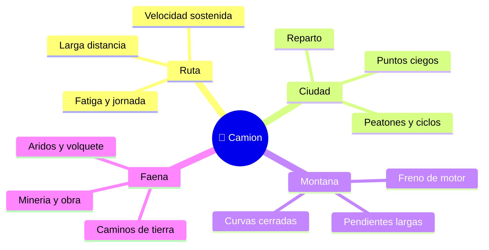

# 🌍 Entornos de trabajo del camion

[🏠 Inicio](../../../README.md) · [🚛 Curso: Camiones](../README.md) · 🌍 Entornos

Donde opera un camion y como cambia la conduccion segun el entorno. Cada entorno
implica reglas, riesgos y ajustes distintos, y en simulacion se traduce en
escenarios diferentes.

---

## 🗺️ Entornos principales

| Entorno | Caracteristicas | Riesgos tipicos | Ajuste de conduccion |
| --- | --- | --- | --- |
| Ruta interurbana | Velocidad sostenida, largas distancias. | Fatiga, viento lateral, adelantar. | Distancia amplia, jornada controlada. |
| Ciudad | Reparto, cruces, trafico denso. | Puntos ciegos, peatones, ciclos. | Baja velocidad, maniobras lentas. |
| Montana | Pendientes largas y curvas. | Sobrecalentamiento de frenos. | Marcha corta, freno de motor y retarder. |
| Faena minera / obra | Caminos de tierra, aridos. | Polvo, volcamiento, otros equipos. | Velocidad baja, respeto de senalizacion interna. |
| Lluvia / noche | Baja visibilidad y agarre. | Aquaplaning, deslumbramiento. | Mas distancia, luces, velocidad prudente. |

---

## 🌦️ Factores del entorno

- **Pendiente**: define el uso del freno de motor y del retarder, y la marcha.
- **Superficie**: asfalto, tierra, ripio o barro cambian el agarre y el frenado.
- **Clima**: lluvia, hielo o viento reducen adherencia y estabilidad.
- **Trafico**: mas vehiculos y usuarios vulnerables exigen anticipar y ceder.
- **Carga**: su peso, altura y si es liquida o suelta cambian la dinamica.

---

## 🎮 Traduccion a simulacion

Cada entorno es un escenario con su pendiente, superficie, clima y carga. Ver
como se modela en el
[Modulo 8: Diseno de simulacion](../simulacion/diseno-simulador-camion.md).

---

[⬅️ Anterior: Principios y operacion](principios-camion.md) · [➡️ Siguiente: Reglamentos](../reglamentos/reglamentos-camion.md)
