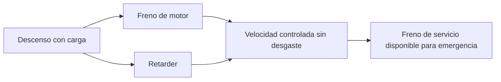

# 🧰 Recursos del camion

[🏠 Inicio](../../../README.md) · [🚛 Curso: Camiones](../README.md) · 🧰 Recursos

Glosario especifico, enlaces y diagramas de apoyo del curso de camiones. Amplia
el [glosario general](../../../docs/05-glosario-general.md).

---

## 📖 Glosario especifico

| Termino | Definicion |
| --- | --- |
| Peso bruto vehicular (PBV) | Suma de la tara y la carga util del camion. |
| Tara | Peso del camion vacio, sin carga. |
| Reparto por eje | Distribucion del peso entre los ejes, con limite legal por eje. |
| Tractocamion | Cabeza tractora que arrastra un semirremolque. |
| Semirremolque | Unidad de carga sin eje delantero, apoyada en la quinta rueda. |
| Quinta rueda | Plato de acople que une el tracto con el semirremolque. |
| Perno maestro (kingpin) | Punto de giro del semirremolque sobre el tracto. |
| Retarder | Freno auxiliar sin friccion, hidraulico o electromagnetico. |
| Freno de motor | Retencion que usa la compresion del diesel para frenar. |
| Fading | Perdida de frenado por sobrecalentamiento de las zapatas. |
| Tijera (jackknife) | Plegado en angulo del conjunto tracto y semirremolque. |

---

## 🗺️ Diagrama de frenado combinado

---

## 🔗 Enlaces y fuentes

- Marco legal: [⚖️ docs/07-marco-legal-chile.md](../../../docs/07-marco-legal-chile.md)
- Registro de fuentes: [📚 manuales/fuentes.md](../../../manuales/fuentes.md)
- Manuales oficiales del conductor (CONASET): ver el registro de fuentes.

Registrar cada recurso nuevo con su origen y licencia, siguiendo
[`recursos/README.md`](../../../recursos/README.md).

---

[🎓 Portada del curso](../README.md) · [⬅️ Anterior: Diseno de simulacion](../simulacion/diseno-simulador-camion.md)
