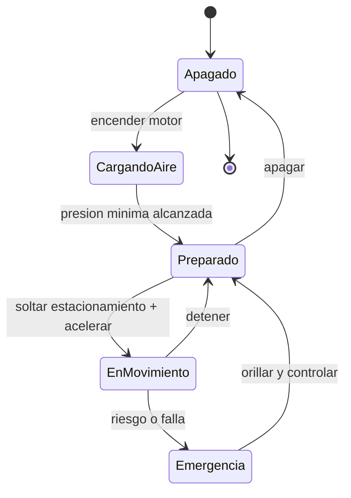

# 🎮 Diseno de simulacion del camion

[🏠 Inicio](../../../README.md) · [🚛 Curso: Camiones](../README.md) · 🎮 Simulacion

## Objetivo de la simulacion

Que el usuario aprenda a operar un camion con seguridad: cargar el aire, elegir
marchas, gestionar la inercia de la masa, frenar con freno de motor y retarder en
pendiente, repartir la carga y maniobrar un vehiculo articulado respetando el
barrido trasero.

## Nivel de realismo

- Nivel elegido: se ofrece del 1 al 3 (ver `docs/03-niveles-de-realismo.md`).
- Justificacion: el camion introduce la gestion de gran masa, el frenado
  neumatico y la articulacion, conceptos mas complejos que los de la moto pero
  sin la carga de trabajo especializada de una grua.

## Variables principales

| Variable | Tipo | Rango | Afecta a | Comentarios |
| --- | --- | --- | --- | --- |
| Velocidad | numerica | 0-100 km/h | Movimiento y frenado | Limitada por via y carga. |
| Regimen del motor | numerica | 0-2500 rpm | Par disponible | El diesel gira bajo. |
| Marcha | discreta | N,1..16 | Fuerza y velocidad | Con gama alta/baja. |
| Carga | numerica | 0-100% del PBV | Inercia y frenado | Define distancia de frenado. |
| Reparto por eje | numerica | por eje | Agarre y legalidad | No debe exceder el limite por eje. |
| Presion de aire | numerica | 0-12 bar | Frenos | Bajo el minimo no se circula. |
| Angulo de articulacion | numerica | -90..90 grados | Maniobra del semi | Riesgo de tijera si es extremo. |
| Adherencia | numerica | 0-1 | Freno, giro, traccion | Baja con lluvia y tierra. |

## Ciclo basico

1. Leer entrada del usuario (acelerador, frenos, retarder, marcha, direccion).
2. Actualizar estado del motor, la caja y la presion de aire.
3. Calcular fuerzas: propulsion, frenado combinado, gravedad y adherencia.
4. Aplicar restricciones del entorno (pendiente, superficie, clima, carga).
5. Actualizar velocidad, posicion y angulo de articulacion.
6. Refrescar instrumentos y retroalimentacion (sonido, testigos, avisos).

## Modos de juego futuros

- Tutorial guiado de mandos y carga de aire.
- Practica de descenso de montana con freno de motor y retarder.
- Misiones de reparto urbano con maniobras y puntos ciegos.
- Desafios de estacionamiento y enganche del semirremolque.
- Reparto de carga por eje sin superar limites.

## Elementos fuera de alcance

- Conduccion temeraria o exceso de velocidad presentados como objetivo.
- Sobrecarga deliberada como logro del juego.
- Datos que permitan alterar sistemas reales de frenado o emisiones.

## Pendientes

- [ ] Definir valores por defecto de cada variable por tipo de camion.
- [ ] Prototipar el modelo de presion de aire y frenado combinado.
- [ ] Ajustar el modelo de articulacion y el efecto de tijera.
- [ ] Agregar fuentes tecnicas publicas a
      [`manuales/fuentes.md`](../../../manuales/fuentes.md).

---

[⬅️ Anterior: Reglamentos](../reglamentos/reglamentos-camion.md) · [➡️ Siguiente: Recursos](../recursos/recursos-camion.md)
