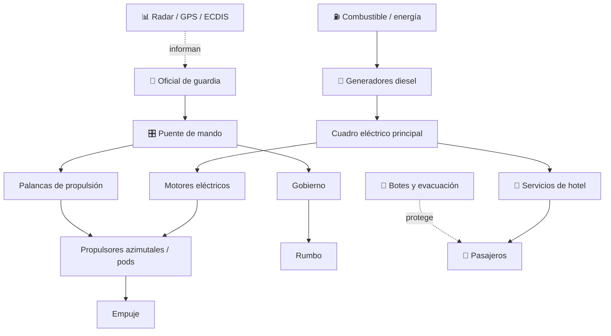

# ⛴️ Curso: Cruceros

[🏠 Inicio](../../README.md) · [🚙 Catálogo de vehículos](../README.md) · [🎓 Guía de curso](../../docs/08-guia-de-estilo-y-curso.md)

> **Curso civil de navegación de pasaje.** Documenta el buque de crucero de
> principio a fin: historia, características, mecánica naval en profundidad,
> puente de mando, física de flotación y gobierno, entornos, reglamentos
> marítimos chilenos e internacionales y diseño de simulación. El eje del
> curso es la seguridad y la evacuación de miles de pasajeros.

---

## 🎯 Objetivos de aprendizaje

Al terminar este curso deberías poder:

- Explicar como un crucero flota, avanza, gobierna y se detiene con miles de personas a bordo.
- Identificar sus sistemas (casco compartimentado, propulsión diesel-electrica, gobierno, hotel) y cómo se conectan.
- Reconocer los mandos e instrumentos del puente y su función.
- Comprender la física de la navegación de un gran buque de pasaje (flotación, inercia, estabilidad con superficie libre).
- Conocer los reglamentos aplicables (SOLAS, STCW, MARPOL, COLREG, DIRECTEMAR) con énfasis en seguridad y evacuación.
- Traducir todo lo anterior en variables de un simulador educativo.

---

## 🗺️ Mapa del vehículo

---

## 📚 Módulos del curso

| # | Módulo | Contenido | Enlace |
| :-: | --- | --- | --- |
| 1 | 📜 Historia | Origen y evolución del crucero, línea de tiempo. | [Abrir](historia/historia-crucero.md) |
| 2 | 📋 Características | Que es, tipos de crucero y para que sirve cada uno. | [Abrir](operacion/caracteristicas-crucero.md) |
| 3 | 🔧 Sistemas mecánicos | Casco, propulsión diesel-electrica, gobierno, hotel y seguridad. | [Abrir](operacion/sistemas-mecanicos-crucero.md) |
| 4 | 🎛️ Mandos e instrumentos | Puente de mando, controles e instrumentos de navegación. | [Abrir](mandos/manual-mandos-crucero.md) |
| 5 | 🧪 Principios y operación | Física de flotación y gobierno, fases de navegación. | [Abrir](operacion/principios-crucero.md) |
| 6 | 🌍 Entornos de trabajo | Puerto, costa, mar abierto y clima. | [Abrir](operacion/entornos-crucero.md) |
| 7 | ⚖️ Reglamentos | SOLAS, STCW, MARPOL, COLREG y marco DIRECTEMAR. | [Abrir](reglamentos/reglamentos-crucero.md) |
| 8 | 🎮 Diseño de simulación | Variables, ciclo y modos de simulación. | [Abrir](simulacion/diseno-simulador-crucero.md) |
| 9 | 🧰 Recursos | Glosario náutico, enlaces y diagramas. | [Abrir](recursos/recursos-crucero.md) |

---

## 🧩 Requisitos previos

Conviene haber visto antes el curso de
[🚢 Barcos mercantes](../barcos-mercantes/README.md), que introduce la flotación,
la propulsión y el gobierno de un gran buque. El crucero agrega la gestión de
miles de pasajeros, los servicios de hotel y la evacuación como eje central.
Marco legal común en
[⚖️ docs/07-marco-legal-chile.md](../../docs/07-marco-legal-chile.md).

---

[➡️ Empezar por el Módulo 1: Historia](historia/historia-crucero.md)
