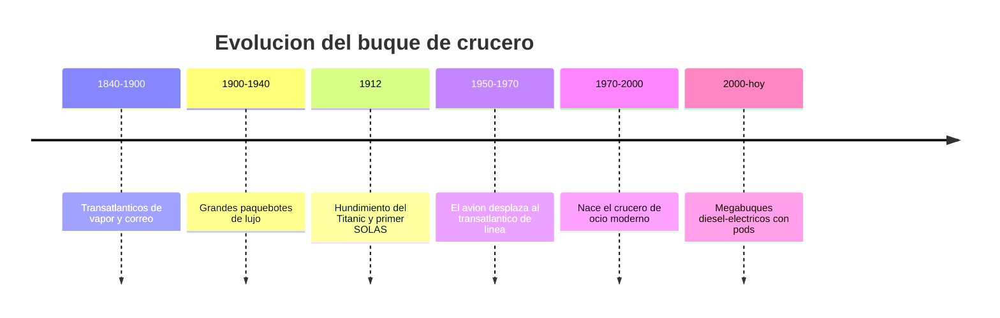

# 📜 Historia del crucero

[🏠 Inicio](../../../README.md) · [⛴️ Curso: Cruceros](../README.md) · 📜 Historia

## Origen

El crucero desciende del transatlantico de pasaje del siglo XIX, cuando el vapor
y el casco de hierro permitieron cruzar el oceano con horario fijo. Aquellos
buques transportaban correo, emigrantes y viajeros de lujo entre Europa y
America. El viaje era un medio de transporte, no un fin en si mismo.

## Linea de tiempo

| Periodo | Hito | Importancia |
| --- | --- | --- |
| 1840-1900 | Transatlanticos de vapor | Transporte oceanico regular de pasaje. |
| 1900-1940 | Grandes paquebotes de lujo | El confort y el prestigio como servicio. |
| 1912 | Titanic y primer convenio SOLAS | La seguridad de la vida en el mar se vuelve norma. |
| 1950-1970 | Auge del avion de linea | El transatlantico pierde su rol de transporte. |
| 1970-2000 | Crucero de ocio moderno | El viaje pasa a ser el destino turistico. |
| 2000-presente | Megabuques diesel-electricos | Pods, gran capacidad y servicios de hotel a gran escala. |

## Evolucion tecnologica

- **Casco**: del hierro remachado al acero soldado con compartimentado estanco.
- **Propulsion**: de la maquina de vapor y ejes fijos a la planta diesel-electrica con pods azimutales.
- **Seguridad**: de los botes insuficientes del Titanic a los sistemas SOLAS de evacuacion para todos a bordo.
- **Estabilidad**: aparicion de aletas estabilizadoras activas para el confort del pasaje.
- **Servicios**: de los camarotes basicos a ciudades flotantes con hoteleria, ocio y depuracion de aguas.
- **Navegacion**: del sextante y la carta de papel al GPS, el ECDIS y el posicionamiento dinamico.

## Tipos representativos

| Tipo | Uso tipico | Caracteristica destacada |
| --- | --- | --- |
| Transatlantico clasico | Travesia oceanica de linea | Casco robusto para mar gruesa. |
| Ferry de pasaje y carga rodada | Rutas cortas costeras | Rampas Ro-Ro y alta rotacion. |
| Crucero de ocio | Turismo por escalas | Servicios de hotel y entretenimiento. |
| Megacrucero | Turismo masivo | Miles de pasajeros y pods de propulsion. |
| Crucero de expedicion | Zonas remotas y polares | Casco reforzado y menor capacidad. |

## Impacto social y economico

El crucero convirtio el viaje por mar en una industria turistica global que mueve
puertos, empleo y cadenas de suministro. A la vez, concentra a miles de personas
en un mismo casco, por lo que la seguridad, la evacuacion y la gestion ambiental
son hoy el centro de su diseno y de su regulacion internacional.

## Fuentes

- Registrar aqui las fuentes publicas consultadas.
- Enlazar cada fuente tambien en [`manuales/fuentes.md`](../../../manuales/fuentes.md).

---

[🎓 Portada del curso](../README.md) · [➡️ Siguiente: Caracteristicas](../operacion/caracteristicas-crucero.md)
