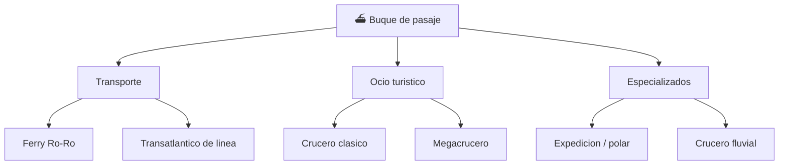

# 📋 Caracteristicas funcionales del crucero

[🏠 Inicio](../../../README.md) · [⛴️ Curso: Cruceros](../README.md) · 📋 Caracteristicas

Que es un crucero, que tipos existen y para que sirve cada uno. Este modulo da el
contexto antes de abrir la mecanica naval (Modulo 3).

---

## 🧭 Definicion

Un crucero es un buque de pasaje destinado al transporte y alojamiento de
personas por via maritima, casi siempre con fines turisticos. Flota por el
principio de Arquimedes, avanza por el empuje de su propulsion y gobierna
mediante el timon o los pods. A diferencia de un carguero, su carga son personas:
la seguridad, el confort y la evacuacion condicionan todo su diseno.

---

## 🧬 Caracteristicas clave

| Caracteristica | Descripcion |
| --- | --- |
| Carga humana | Transporta miles de pasajeros y tripulacion; la seguridad de la vida es prioritaria. |
| Gran volumen | Obra muerta muy alta con muchas cubiertas, sensible al viento. |
| Servicios de hotel | Agua, energia, climatizacion y ocio para una poblacion flotante. |
| Compartimentado | Mamparos estancos que permiten flotar aun con averias. |
| Estabilidad y confort | Aletas estabilizadoras reducen el balance para el pasaje. |
| Autonomia | Recorre largas rutas con multiples escalas sin repostar. |

---

## 🗂️ Tipos de crucero

| Tipo | Uso tipico | Rasgo destacado |
| --- | --- | --- |
| Ferry Ro-Ro | Rutas cortas costeras | Rampas de carga rodada y alta rotacion. |
| Transatlantico de linea | Travesias oceanicas | Casco robusto para mar gruesa. |
| Crucero clasico | Turismo por escalas | Equilibrio entre confort y tamano. |
| Megacrucero | Turismo masivo | Miles de pasajeros y propulsion por pods. |
| Crucero de expedicion | Zonas remotas y polares | Casco reforzado, capacidad reducida. |
| Crucero fluvial | Rios navegables | Calado bajo y eslora limitada. |

---

## 🎯 Para que se usa

- Turismo maritimo con escalas en varios puertos.
- Transporte de pasajeros y vehiculos en rutas costeras (ferry).
- Viajes de expedicion a zonas remotas y polares.
- Eventos, hoteleria y ocio como ciudad flotante.
- Conexion de islas y zonas sin acceso terrestre.

---

[⬅️ Anterior: Historia](../historia/historia-crucero.md) · [➡️ Siguiente: Sistemas mecanicos](sistemas-mecanicos-crucero.md)
