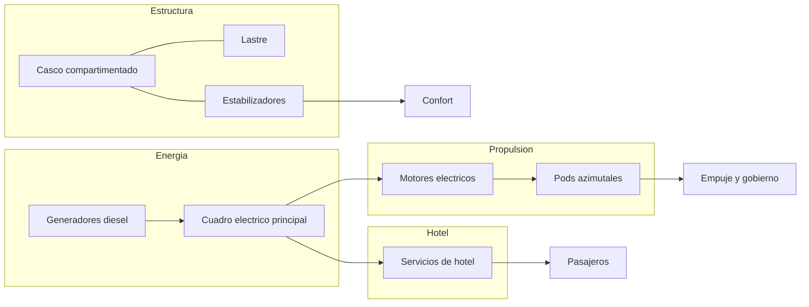
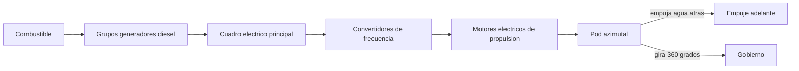
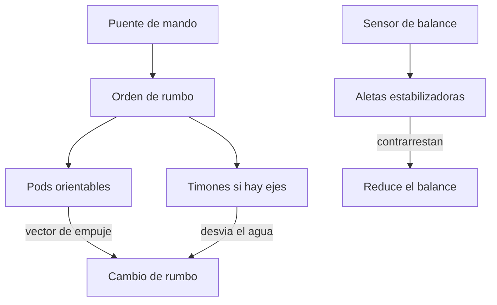
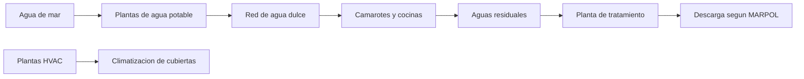
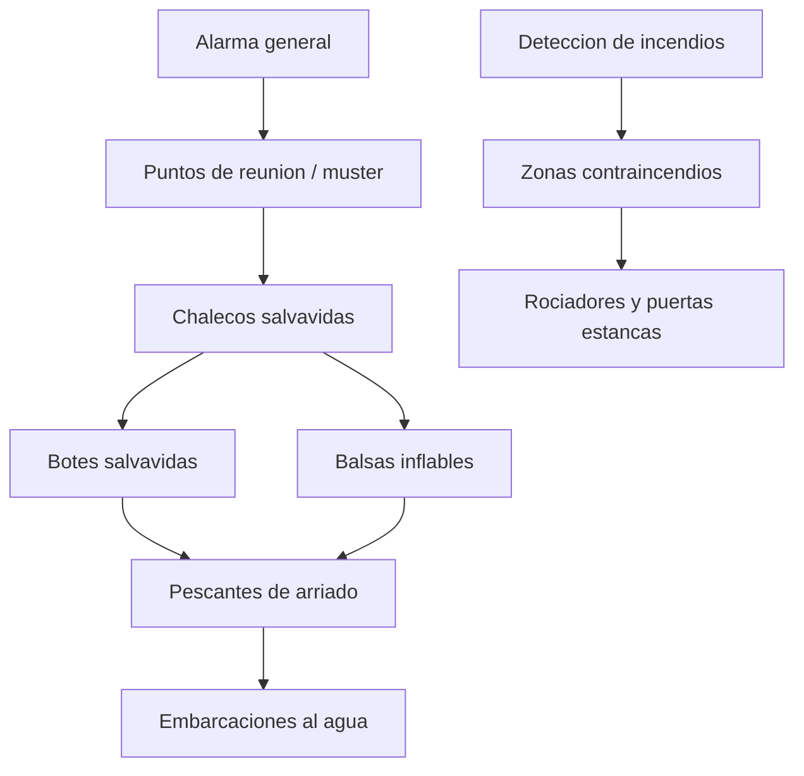

# 🔧 Sistemas mecanicos del crucero

[🏠 Inicio](../../../README.md) · [⛴️ Curso: Cruceros](../README.md) · 🔧 Sistemas mecanicos

Este modulo abre el crucero por dentro. Explica cada sistema, como funciona y como
se conecta con los demas. Es la base tecnica para entender los mandos (Modulo 4)
y la fisica de la navegacion (Modulo 5). En un buque de pasaje, la cadena de
energia alimenta por igual a la propulsion y a la ciudad flotante que vive a bordo.

---

## 1. 🚢 Casco y compartimentado

El casco es la estructura estanca que da flotacion, resistencia y forma
hidrodinamica. En un buque de pasaje, su division interna es tan importante como
su resistencia: debe seguir a flote aun con varios compartimentos inundados.

- **Obra viva**: parte sumergida; su forma define la resistencia al avance.
- **Obra muerta**: parte sobre la flotacion, muy alta por las cubiertas de pasaje.
- **Mamparos estancos transversales**: dividen el casco para limitar inundaciones.
- **Estabilidad tras averia (damage stability)**: SOLAS exige que el buque flote
  y se mantenga con una escora tolerable tras una via de agua definida.

| Parte | Funcion | Efecto en el buque |
| --- | --- | --- |
| Proa | Corta el agua | Menor resistencia al avance. |
| Popa | Aloja pods y timones | Gobierno y propulsion. |
| Quilla | Eje estructural inferior | Rigidez y estabilidad. |
| Francobordo | Altura hasta la cubierta | Reserva de flotabilidad. |
| Cubierta de cierre | Limite superior de mamparos | Referencia de compartimentado. |
| Calado | Profundidad sumergida | Limita puertos y canales. |

---

## 2. ⚡ Propulsion diesel-electrica y pods

El crucero moderno separa la generacion de energia de la propulsion. Los
generadores diesel producen electricidad, que alimenta motores electricos
acoplados a los pods; no hay ejes largos que atraviesen todo el buque.

- **Grupos generadores**: varios motores diesel mueven alternadores; se conectan
  y desconectan segun la demanda de propulsion y de hotel.
- **Cuadro electrico principal**: reparte la energia entre propulsion y servicios;
  es el corazon de la planta diesel-electrica.
- **Motores electricos**: convierten la electricidad en giro para los pods.
- **Pods azimutales**: unidades bajo el casco que giran 360 grados; propulsan y
  gobiernan a la vez, y mejoran mucho la maniobra en puerto.
- **Propulsores de proa (bow thrusters)**: dan movimiento lateral a baja velocidad.

| Componente | Funcion | Nota |
| --- | --- | --- |
| Grupo generador | Produce electricidad | Se acopla segun demanda. |
| Cuadro principal | Reparte energia | Propulsion mas hotel. |
| Convertidor de frecuencia | Regula revoluciones del motor | Control fino de empuje. |
| Motor de propulsion | Mueve el pod | Electrico, sin caja larga. |
| Pod azimutal | Empuja y gobierna | Giro de 360 grados. |
| Thruster de proa | Maniobra en puerto | Movimiento lateral. |

---

## 3. ⚙️ Gobierno y estabilizadores

En un buque con pods, el gobierno se logra orientando las unidades; en buques con
linea de ejes clasica, con timones. El confort del pasaje agrega los
estabilizadores.

- **Gobierno por pods**: se cambia el rumbo orientando el vector de empuje; muy
  eficaz incluso a baja velocidad.
- **Timones (buques con ejes)**: la pala desvia el flujo de agua en popa.
- **Aletas estabilizadoras**: superficies retractiles a los costados que se
  inclinan para contrarrestar el balance transversal y dar confort al pasaje.
- **Efecto de la velocidad**: el gobierno por pod mantiene autoridad a menor
  velocidad que un timon clasico.

---

## 4. 🔌 Generacion y distribucion electrica

La electricidad es el sistema central de un crucero: mueve la propulsion y toda
la hoteleria. Su fiabilidad es una cuestion de seguridad.

| Elemento | Funcion | Nota de seguridad |
| --- | --- | --- |
| Grupos generadores principales | Producen la energia de a bordo | Redundancia entre varios grupos. |
| Cuadro principal | Distribuye a propulsion y hotel | Puede dividirse en secciones. |
| Generador de emergencia | Alimenta cargas vitales si falla lo principal | Arranque automatico exigido por SOLAS. |
| Baterias y SAI | Respaldan luces y sistemas criticos | Transicion sin corte. |
| Blackout recovery | Reconexion tras apagon general | Procedimiento y automatismo definidos. |

- **Cargas de propulsion**: motores de los pods y thrusters.
- **Cargas de hotel**: iluminacion, climatizacion, cocinas, ascensores, ocio.
- **Cargas de seguridad**: alumbrado de emergencia, bombas contraincendios,
  comunicaciones, control de botes.

---

## 5. 🏨 Servicios de hotel

El crucero es una ciudad flotante. Ademas de navegar, debe dar agua, aire
acondicionado, energia y saneamiento a miles de personas.

- **Agua potable**: se produce a bordo por evaporadores u osmosis inversa desde
  agua de mar, y se almacena en tanques dedicados.
- **Climatizacion (HVAC)**: mantiene temperatura y ventilacion en camarotes y
  espacios publicos; es un gran consumidor de energia.
- **Aguas residuales**: plantas de tratamiento procesan aguas negras y grises
  antes de descargar, segun MARPOL.
- **Cocinas, lavanderia y ocio**: servicios que definen la vida del pasaje y su
  demanda de energia y agua.

---

## 6. 🛟 Seguridad de pasajeros y evacuacion

Es el sistema que distingue a un buque de pasaje. Debe permitir evacuar a todos
los que van a bordo en un tiempo definido.

| Elemento | Funcion | Referencia |
| --- | --- | --- |
| Botes salvavidas | Evacuacion ordenada del pasaje | Capacidad para todos a bordo, SOLAS. |
| Balsas inflables | Complemento de evacuacion | Se arrian y se inflan al agua. |
| Chalecos salvavidas | Flotabilidad individual | En camarotes y puntos de reunion. |
| Ejercicio de muster | Reunion y conteo del pasaje | Antes de zarpar, obligatorio. |
| Zonas contraincendios | Limitan la propagacion | Mamparos y puertas estancas. |
| Deteccion y rociadores | Detectan y extinguen fuego | Cubren camarotes y espacios publicos. |

- **Compartimentado activo**: puertas estancas que se cierran para contener vias
  de agua o incendios.
- **Rutas de evacuacion**: senalizadas y con alumbrado de emergencia hacia los
  puntos de reunion.
- **Dotacion de seguridad**: la tripulacion tiene roles asignados para guiar y
  contar a los pasajeros.

---

## 🔁 Como se conecta todo

1. Los **generadores diesel** producen la electricidad del buque.
2. El **cuadro principal** la reparte entre **propulsion** y **hotel**.
3. Los **motores electricos** mueven los **pods**, que empujan y gobiernan.
4. El **casco compartimentado** y los **estabilizadores** dan flotacion y confort.
5. Los **servicios de hotel** sostienen la vida del pasaje.
6. Los **sistemas de seguridad** permiten contener averias y evacuar a todos.

Con esto entendido, el [Modulo 4: Mandos](../mandos/manual-mandos-crucero.md)
muestra como la tripulacion opera cada uno de estos sistemas desde el puente.

---

[⬅️ Anterior: Caracteristicas](caracteristicas-crucero.md) · [➡️ Siguiente: Mandos e instrumentos](../mandos/manual-mandos-crucero.md)
