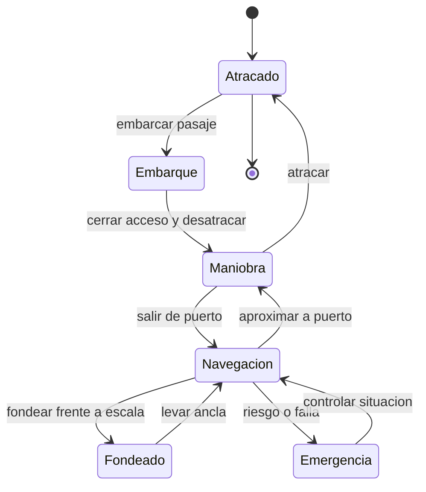

# 🎮 Diseno de simulacion del crucero

[🏠 Inicio](../../../README.md) · [⛴️ Curso: Cruceros](../README.md) · 🎮 Simulacion

## Objetivo de la simulacion

Que el usuario aprenda a gobernar un crucero respetando la inercia, manejar la
propulsion por pods y el gobierno, aplicar reglas basicas de navegacion (COLREG),
gestionar la seguridad del pasaje (muster y evacuacion) y realizar maniobras de
puerto de forma segura y progresiva.

## Nivel de realismo

- Nivel elegido: se ofrece del 1 al 3 (ver `docs/03-niveles-de-realismo.md`).
- Justificacion: el crucero suma a la navegacion de gran buque la gestion de miles
  de pasajeros y la evacuacion, por lo que es un curso avanzado respecto del
  carguero.

## Variables principales

| Variable | Tipo | Rango | Afecta a | Comentarios |
| --- | --- | --- | --- | --- |
| Velocidad | numerica | 0-24 nudos | Avance y gobierno | Los pods mantienen autoridad a baja velocidad. |
| Rumbo | numerica | 0-359 grados | Direccion | Cambia con retardo por la inercia. |
| Empuje de pods | numerica | -100..100 % | Avance y maniobra | Combina propulsion y gobierno. |
| Angulo de pods | numerica | -180..180 grados | Vector de empuje | Permite maniobra lateral. |
| Estabilizadores | discreta | retraido / desplegado | Balance y confort | Reduce el mareo del pasaje. |
| Pasajeros a bordo | numerica | 0-maximo | Seguridad y muster | Debe contarse en evacuacion. |
| Estabilidad (GM) | numerica | positiva | Escora y seguridad | Depende de la estiba y el lastre. |
| Viento y corriente | vectorial | variable | Deriva | Muy sensible por la obra muerta. |
| Combustible | numerica | 0-100% | Autonomia | Consumo por propulsion y hotel. |

## Ciclo basico

1. Leer entrada del usuario (pods, timon, thruster, estabilizadores, piloto automatico).
2. Actualizar estado de la planta electrica, la propulsion y el gobierno.
3. Calcular fuerzas: empuje, resistencia del agua, viento y corriente.
4. Aplicar la inercia de la masa del buque al cambio de velocidad y rumbo.
5. Actualizar posicion, rumbo, escora y estado del pasaje.
6. Refrescar instrumentos (radar, GPS, ECDIS), estabilizadores y paneles de seguridad.

## Modos de juego futuros

- Tutorial guiado del puente y las palancas de pod.
- Practica libre de maniobra de puerto con pods y thrusters.
- Travesia costera entre escalas respetando COLREG.
- Ejercicio de muster y evacuacion ordenada del pasaje.
- Situaciones de baja visibilidad con radar, sin contenido sensible.

## Elementos fuera de alcance

- Maniobras temerarias presentadas como recomendables.
- Reproduccion de accidentes o victimas de forma sensacionalista.
- Datos que permitan alterar sistemas reales de un buque.

## Pendientes

- [ ] Definir valores por defecto de cada variable por tipo de crucero.
- [ ] Prototipar el modelo de propulsion por pods y maniobra lateral.
- [ ] Modelar el procedimiento de muster y el conteo del pasaje.
- [ ] Agregar fuentes tecnicas publicas a [`manuales/fuentes.md`](../../../manuales/fuentes.md).

---

[⬅️ Anterior: Reglamentos](../reglamentos/reglamentos-crucero.md) · [➡️ Siguiente: Recursos](../recursos/recursos-crucero.md)
