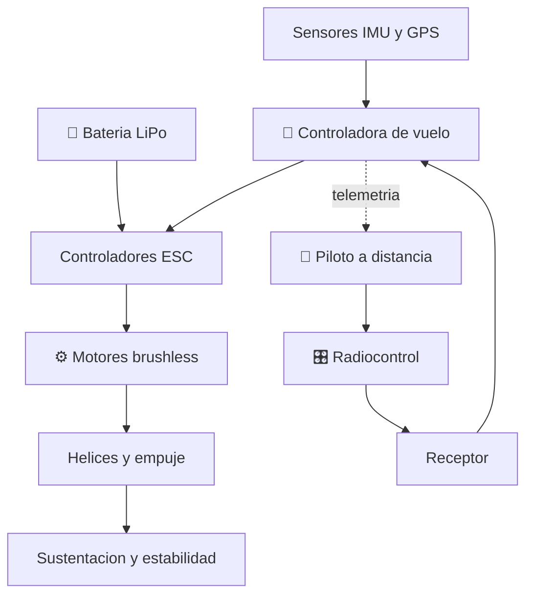

# 🕹️ Curso: Drones

[🏠 Inicio](../../README.md) · [🚙 Catalogo de vehiculos](../README.md) · [🎓 Guia de curso](../../docs/08-guia-de-estilo-y-curso.md)

> **Curso de aeronave pilotada a distancia (RPAS).** Documenta el dron de
> principio a fin: historia, caracteristicas, mecanica en profundidad, mandos,
> fisica del vuelo multirotor, entornos, reglamentos chilenos y diseno de
> simulacion. Sigue el modelo del curso de referencia del repositorio.

---

## 🎯 Objetivos de aprendizaje

Al terminar este curso deberias poder:

- Explicar como un dron multirotor genera sustentacion y se mantiene estable.
- Identificar sus sistemas y como se conectan: motores, ESC, bateria y controladora.
- Reconocer los mandos del radiocontrol y la estacion de tierra y su funcion.
- Comprender la fisica del vuelo por variacion de rpm de cada rotor.
- Conocer el marco chileno aplicable (DGAC, DAN 151, registro y restricciones).
- Traducir todo lo anterior en variables de un simulador educativo.

---

## 🗺️ Mapa del vehiculo

---

## 📚 Modulos del curso

| # | Modulo | Contenido | Enlace |
| :-: | --- | --- | --- |
| 1 | 📜 Historia | Origen y evolucion del dron, linea de tiempo. | [Abrir](historia/historia-dron.md) |
| 2 | 📋 Caracteristicas | Que es un RPAS, tipos de dron y para que sirve cada uno. | [Abrir](operacion/caracteristicas-dron.md) |
| 3 | 🔧 Sistemas mecanicos | Motores, ESC, helices, bateria, controladora, radio y camara. | [Abrir](operacion/sistemas-mecanicos-dron.md) |
| 4 | 🎛️ Mandos e instrumentos | Radiocontrol, estacion de tierra, sticks y telemetria. | [Abrir](mandos/manual-mandos-dron.md) |
| 5 | 🧪 Principios y operacion | Fisica del vuelo multirotor y fases de operacion. | [Abrir](operacion/principios-dron.md) |
| 6 | 🌍 Entornos de trabajo | Urbano, agricola, industrial, interiores y zonas prohibidas. | [Abrir](operacion/entornos-dron.md) |
| 7 | ⚖️ Reglamentos | Marco chileno: DGAC, DAN 151, registro y restricciones. | [Abrir](reglamentos/reglamentos-dron.md) |
| 8 | 🎮 Diseno de simulacion | Variables, ciclo y modos de juego. | [Abrir](simulacion/diseno-simulador-dron.md) |
| 9 | 🧰 Recursos | Glosario, enlaces y diagramas. | [Abrir](recursos/recursos-dron.md) |

---

## 🧩 Requisitos previos

Conviene haber revisado antes el curso de helicopteros, porque el dron comparte
el vuelo de ala rotatoria y el marco aeronautico de la DGAC, pero lo simplifica:
no lleva piloto a bordo, se gobierna a distancia y una controladora de vuelo
estabiliza el aparato variando el regimen de cada rotor. Marco legal comun en
[⚖️ docs/07-marco-legal-chile.md](../../docs/07-marco-legal-chile.md).

---

[➡️ Empezar por el Modulo 1: Historia](historia/historia-dron.md)
