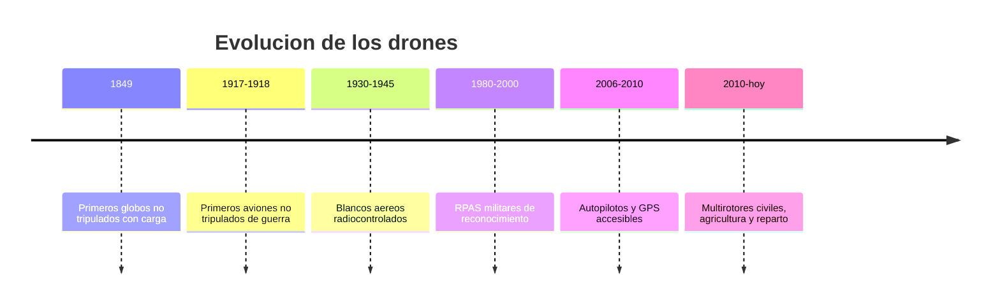

# 📜 Historia del dron

[🏠 Inicio](../../../README.md) · [🕹️ Curso: Drones](../README.md) · 📜 Historia

## Origen

La idea de una aeronave sin piloto a bordo es antigua: comenzo con globos y
blancos aereos controlados a distancia. El salto hacia el dron moderno llego
cuando los sensores, los motores brushless y las baterias de litio se hicieron
pequenos y economicos, permitiendo que una controladora estabilizara el vuelo de
forma automatica.

## Linea de tiempo

| Periodo | Hito | Importancia |
| --- | --- | --- |
| 1849 | Globos no tripulados con carga | Primer uso de aeronave sin piloto. |
| 1917-1918 | Aviones no tripulados de guerra | Prueba del concepto autonomo. |
| 1930-1945 | Blancos aereos radiocontrolados | Impulsa el control por radio. |
| 1980-2000 | RPAS militares de reconocimiento | Vuelo prolongado y camaras. |
| 2006-2010 | Autopilotos y GPS accesibles | Estabilizacion automatica barata. |
| 2010-presente | Multirotores civiles | Uso masivo civil y profesional. |

## Evolucion tecnologica

- **Estructura**: de fuselajes de avion a marcos multirotor ligeros de fibra.
- **Propulsion**: de motores de explosion a motores brushless y helices de paso fijo.
- **Energia**: de combustible a baterias LiPo de alta densidad.
- **Control**: de radio manual a controladoras con IMU, GPS y estabilizacion.
- **Sensores**: camaras estabilizadas por gimbal, barometros y sensores de obstaculos.
- **Automatizacion**: waypoints, retorno automatico y planes de vuelo programados.

## Tipos representativos

| Tipo | Uso tipico | Caracteristica destacada |
| --- | --- | --- |
| Multirotor de consumo | Fotografia y ocio | Facil de volar, estabilizacion automatica. |
| Multirotor profesional | Inspeccion y cine | Camara estabilizada y mayor autonomia. |
| Ala fija | Mapeo y agricultura | Gran alcance y eficiencia de vuelo. |
| VTOL hibrido | Mapeo de largo alcance | Despega en vertical y vuela como ala fija. |
| Agricola | Fumigacion y siembra | Deposito de carga y vuelo por franjas. |

## Impacto social y economico

El dron abarato tareas que antes exigian aviones o helicopteros tripulados:
fotografia aerea, inspeccion de infraestructura, mapeo, agricultura de precision
y, cada vez mas, reparto y apoyo en rescate. Su expansion obligo a crear marcos
legales especificos para la seguridad aerea y la privacidad.

## Fuentes

- Registrar aqui las fuentes publicas consultadas.
- Enlazar cada fuente tambien en [`manuales/fuentes.md`](../../../manuales/fuentes.md).

---

[🎓 Portada del curso](../README.md) · [➡️ Siguiente: Caracteristicas](../operacion/caracteristicas-dron.md)
