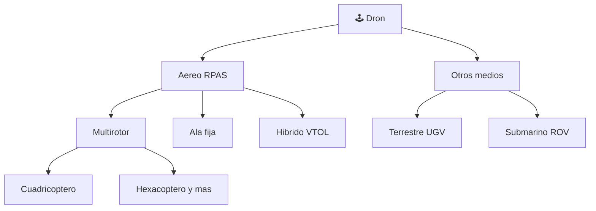

# 📋 Caracteristicas funcionales del dron

[🏠 Inicio](../../../README.md) · [🕹️ Curso: Drones](../README.md) · 📋 Caracteristicas

Que es un dron, que tipos existen y para que sirve cada uno. Este modulo da el
contexto antes de abrir la mecanica (Modulo 3).

---

## 🧭 Definicion

Un dron es una **aeronave pilotada a distancia** (RPAS, por sus siglas en ingles
para sistema de aeronave pilotada a distancia; tambien llamada UAV). No lleva
piloto a bordo: se gobierna desde tierra con un radiocontrol y una estacion, y
una controladora de vuelo estabiliza el aparato de forma automatica. El foco de
este curso es el dron aereo multirotor, el mas comun en uso civil.

Aunque la palabra "dron" tambien se aplica a vehiculos no tripulados terrestres
(UGV) y submarinos (ROV), este curso trata el dron aereo; los otros tipos se
mencionan al final solo como contexto.

---

## 🧬 Caracteristicas clave

| Caracteristica | Descripcion |
| --- | --- |
| Vuelo sin piloto a bordo | Se opera a distancia; el piloto ve desde tierra o por camara. |
| Estabilizacion automatica | La controladora corrige la actitud varias veces por segundo. |
| Despegue y aterrizaje vertical | El multirotor no necesita pista. |
| Vuelo estacionario | Puede mantenerse inmovil sobre un punto. |
| Autonomia limitada | La bateria define minutos de vuelo, no horas. |
| Carga util modular | Camara, sensores o deposito segun la mision. |

---

## 🗂️ Tipos de dron

| Tipo | Uso tipico | Rasgo destacado |
| --- | --- | --- |
| Multirotor | Fotografia, inspeccion, ocio | Vuelo estacionario y despegue vertical. |
| Ala fija | Mapeo y agricultura extensa | Gran alcance y eficiencia de vuelo. |
| Hibrido VTOL | Mapeo de largo alcance | Despega vertical y cruza como ala fija. |
| Terrestre UGV | Inspeccion y logistica en suelo | Rueda u oruga; no vuela. |
| Submarino ROV | Inspeccion bajo el agua | Va conectado por cable al operador. |

Los **UGV** y **ROV** se citan solo como contexto: comparten la idea de vehiculo
no tripulado, pero su fisica y sus mandos son distintos y quedan fuera del foco
de este curso.

---

## 🎯 Para que se usa

- **Fotografia y cine**: tomas aereas estabilizadas.
- **Agricultura**: mapeo de cultivos, fumigacion y siembra de precision.
- **Inspeccion**: torres, lineas electricas, techos y estructuras.
- **Mapeo**: fotogrametria y modelos 3D del terreno.
- **Reparto**: entrega de paquetes ligeros en pruebas y rutas cortas.
- **Rescate**: busqueda de personas y evaluacion de zonas de riesgo.

---

[⬅️ Anterior: Historia](../historia/historia-dron.md) · [➡️ Siguiente: Sistemas mecanicos](sistemas-mecanicos-dron.md)
