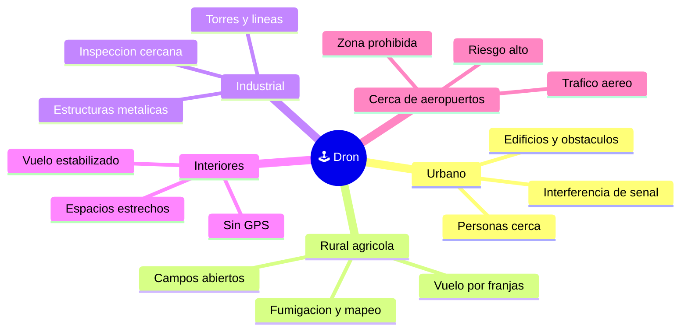

# 🌍 Entornos de trabajo del dron

[🏠 Inicio](../../../README.md) · [🕹️ Curso: Drones](../README.md) · 🌍 Entornos

Donde opera un dron y como cambia el vuelo segun el entorno. Cada entorno implica
reglas, riesgos y ajustes distintos, y en simulacion se traduce en escenarios
diferentes.

---

## 🗺️ Entornos principales

| Entorno | Caracteristicas | Riesgos tipicos | Ajuste de vuelo |
| --- | --- | --- | --- |
| Urbano | Edificios, calles, publico. | Interferencia, personas, obstaculos. | Baja altura, margenes amplios, sin sobrevolar gente. |
| Rural / agricola | Campos abiertos y amplios. | Viento, distancia larga. | Vuelo por franjas, vigilar bateria y enlace. |
| Industrial | Torres, lineas, estructuras. | Metal que altera la brujula. | Inspeccion cercana, atento al GPS. |
| Interiores | Sin GPS, espacio estrecho. | Choques, deriva sin posicion. | Modo estabilizado, control manual fino. |
| Cerca de aeropuertos | Zona prohibida, trafico aereo. | Riesgo grave para la aviacion. | No volar; respetar la restriccion. |

---

## 🌦️ Factores del entorno

- **Viento**: empuja el dron y consume bateria al compensarlo; con rachas fuertes
  puede superar el empuje disponible.
- **GPS**: cerca de edificios, bajo techo o entre estructuras metalicas, la senal
  se degrada y el dron pierde el mantenimiento de posicion.
- **Interferencia**: otras radios, wifi o estructuras metalicas debilitan el
  enlace de mando y de video.
- **Temperatura**: el frio reduce el rendimiento de la bateria LiPo y la autonomia.

---

## 🚫 Zonas prohibidas

Volar cerca de aeropuertos y sobre aglomeraciones de personas esta restringido por
la seguridad aerea. En estos entornos la regla es no operar, no ajustar el vuelo.
El detalle esta en el [Modulo 7: Reglamentos](../reglamentos/reglamentos-dron.md).

---

## 🎮 Traduccion a simulacion

Cada entorno es un escenario con su viento, calidad de GPS, interferencia y
obstaculos. Ver como se modela en el
[Modulo 8: Diseno de simulacion](../simulacion/diseno-simulador-dron.md).

---

[⬅️ Anterior: Principios y operacion](principios-dron.md) · [➡️ Siguiente: Reglamentos](../reglamentos/reglamentos-dron.md)
