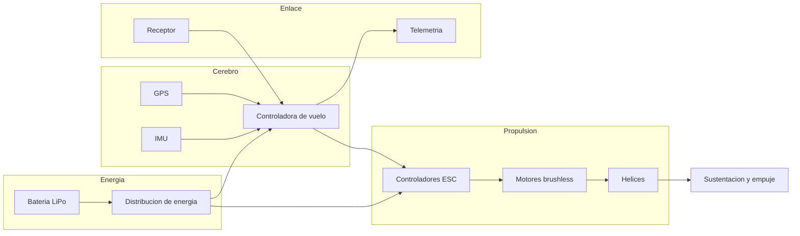
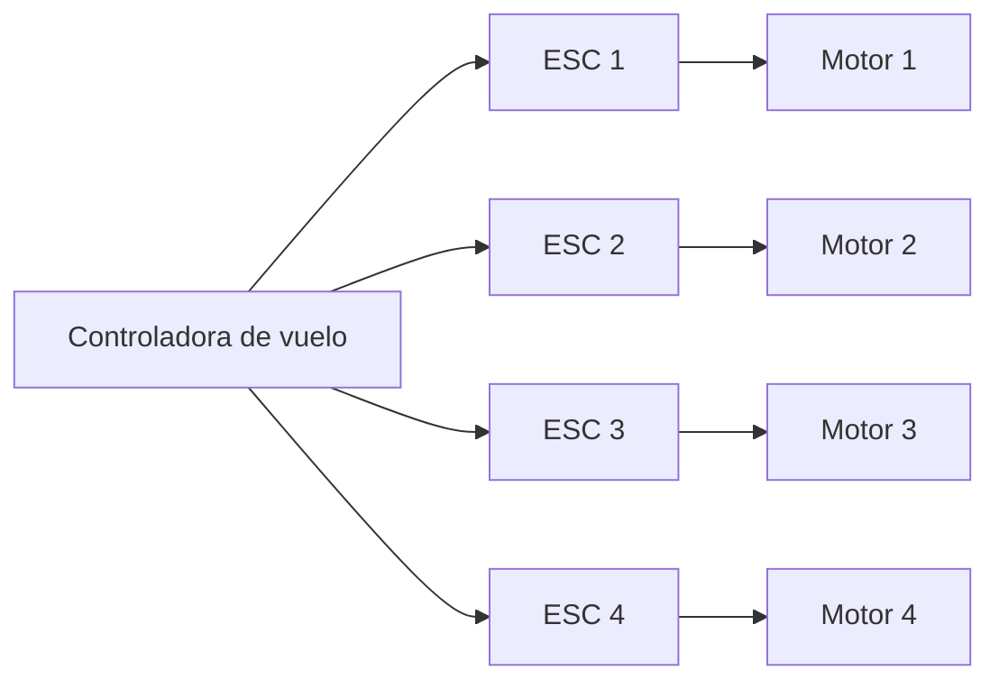
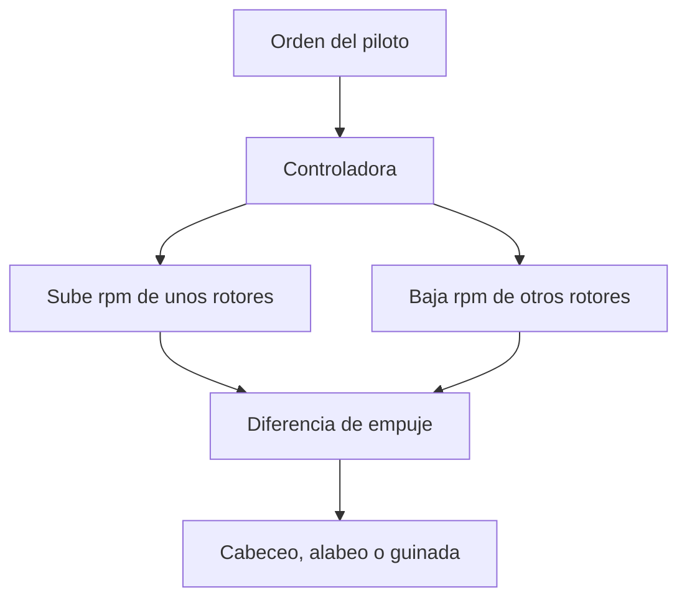
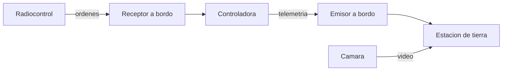

# 🔧 Sistemas mecanicos del dron

[🏠 Inicio](../../../README.md) · [🕹️ Curso: Drones](../README.md) · 🔧 Sistemas mecanicos

Este modulo abre el dron por dentro. Explica cada sistema, como funciona y como
se conecta con los demas. Es la base tecnica para entender los mandos (Modulo 4)
y la fisica del vuelo (Modulo 5). El foco es el multirotor, el tipo mas comun.

---

## 1. ⚙️ Motores brushless y ESC

El multirotor se mueve variando la velocidad de giro de cada rotor. Los motores
son **brushless** (sin escobillas): giran gracias a un campo magnetico controlado
electronicamente, sin contacto que se desgaste, lo que les da alta eficiencia y
respuesta rapida.

Cada motor necesita un **ESC** (controlador electronico de velocidad). El ESC
recibe una orden de la controladora y entrega a su motor la corriente justa para
girar al regimen pedido. En un cuadricoptero hay cuatro motores y cuatro ESC.

| Componente | Funcion | Parametro clave |
| --- | --- | --- |
| Motor brushless | Transforma energia electrica en giro. | KV: rpm por voltio aplicado. |
| ESC | Regula la corriente de cada motor. | Amperaje maximo que soporta. |
| Distribucion de energia | Reparte la bateria a los ESC. | Corriente total del conjunto. |

---

## 2. 🌀 Helices y empuje

Cada motor mueve una **helice** de paso fijo que, al girar, empuja aire hacia
abajo y genera empuje hacia arriba. La suma de los cuatro empujes sostiene el
dron. Para mantener el equilibrio, las helices giran en sentidos alternos: dos en
sentido horario y dos en sentido antihorario, de modo que sus pares se cancelan.

| Concepto | Descripcion |
| --- | --- |
| Empuje | Fuerza vertical que genera cada helice al girar. |
| Paso | Angulo de la pala; en multirotor es fijo, el control es por rpm. |
| Sentido de giro | Alternado para cancelar el par y no girar sobre si mismo. |
| Diametro | Helice mayor mueve mas aire; motor y ESC deben acompanar. |

---

## 3. 🎚️ Control por variacion de rpm

El multirotor no tiene superficies moviles: **todo el control nace de variar la
velocidad de cada rotor**. La controladora sube o baja el empuje de rotores
concretos para inclinar o girar el aparato.

| Movimiento | Que hace | Como se logra por rpm |
| --- | --- | --- |
| Ascenso / descenso | Sube o baja en vertical. | Sube o baja el rpm de los cuatro rotores por igual. |
| Cabeceo (pitch) | Inclina adelante o atras para avanzar. | Mas empuje atras y menos adelante, o al reves. |
| Alabeo (roll) | Inclina a un lado para desplazarse. | Mas empuje de un lado y menos del otro. |
| Guinada (yaw) | Gira la nariz a izquierda o derecha. | Desequilibra el par: mas rpm a los rotores de un sentido de giro. |

La guinada se logra aprovechando que unas helices giran horario y otras
antihorario: al acelerar el par de rotores que giran en un sentido y frenar los
del otro, aparece un par neto que rota el dron sobre su eje vertical.

---

## 4. 🔋 Bateria LiPo y autonomia

La energia viene de una **bateria de polimero de litio (LiPo)**, elegida por su
alta densidad de energia y su capacidad de entregar mucha corriente. Define,
junto con el peso, cuantos minutos vuela el dron.

| Parametro | Significado | Efecto |
| --- | --- | --- |
| Capacidad | Energia almacenada, en mAh. | Mas capacidad, mas autonomia y mas peso. |
| Celdas | Numero de celdas en serie, notado S. | Fija el voltaje; 4S es tipico en consumo. |
| Tasa de descarga | Corriente maxima, notada C. | Debe cubrir el pico de los motores. |
| Autonomia | Minutos de vuelo utiles. | Suele estar entre 10 y 40 minutos. |

Volar por debajo de un voltaje minimo dana la LiPo; por eso la controladora vigila
la carga y activa avisos o el retorno automatico cuando queda poca energia.

---

## 5. 🧠 Controladora de vuelo, IMU y GPS

La **controladora de vuelo** es el cerebro del dron. Lee sus sensores muchas veces
por segundo y ajusta el rpm de cada motor para mantener la actitud que pide el
piloto.

| Sensor | Que mide | Para que sirve |
| --- | --- | --- |
| IMU | Aceleraciones y giros en los tres ejes. | Conocer la actitud y estabilizar. |
| Giroscopo | Velocidad de rotacion. | Corregir cabeceo, alabeo y guinada. |
| Acelerometro | Aceleracion y direccion de la gravedad. | Saber que es "arriba". |
| Barometro | Presion del aire. | Estimar y mantener la altura. |
| GPS | Posicion y velocidad sobre el terreno. | Mantener el punto y navegar por waypoints. |
| Brujula | Rumbo magnetico. | Orientar la navegacion y el retorno. |

La **IMU** combina giroscopo y acelerometro y es imprescindible incluso para el
vuelo mas basico. El **GPS** no es obligatorio para volar, pero habilita el vuelo
estacionario preciso, la navegacion automatica y el retorno a casa.

---

## 6. 📡 Enlace de radio y telemetria

El dron se comunica con tierra por radio. Hay dos flujos:

- **Enlace de mando**: del radiocontrol al receptor; lleva las ordenes del piloto.
- **Telemetria**: del dron a la estacion; informa bateria, altura, posicion y modo.
- **Enlace de video**: transmite la imagen de la camara en tiempo casi real.

| Enlace | Direccion | Contenido |
| --- | --- | --- |
| Mando | Tierra a dron | Ordenes de los sticks y de los modos. |
| Telemetria | Dron a tierra | Estado del vuelo y de los sistemas. |
| Video | Dron a tierra | Imagen de la camara para el piloto. |

Si el enlace de mando se pierde, la controladora activa un **fail-safe** para no
quedar sin control (ver seccion 8).

---

## 7. 📷 Camara y gimbal

Muchos drones llevan una **camara** montada en un **gimbal**: un soporte con
motores que compensa los movimientos del dron para que la imagen salga estable.

| Elemento | Funcion |
| --- | --- |
| Camara | Captura foto y video; tambien sirve para pilotar en vista FPV. |
| Gimbal | Estabiliza la camara compensando cabeceo, alabeo y guinada. |
| Sensores extra | Camaras multiespectrales o termicas para agricultura e inspeccion. |

El gimbal separa el movimiento del dron del de la camara: aunque el dron corrija
su actitud, la imagen se mantiene nivelada.

---

## 8. 🛟 Fail-safe y retorno a casa

El dron incluye protecciones automaticas para reaccionar ante fallos sin que el
piloto tenga que resolver todo a mano.

| Proteccion | Cuando actua | Que hace |
| --- | --- | --- |
| Return to home | Perdida de enlace o poca bateria. | Vuelve al punto de despegue y aterriza. |
| Aviso de bateria baja | Voltaje o carga por debajo del umbral. | Alerta y, si sigue bajando, fuerza el retorno. |
| Fail-safe de enlace | Se pierde la senal de mando. | Mantiene posicion o inicia el retorno. |
| Limite geografico | Zona restringida o distancia maxima. | Frena o impide entrar a la zona. |

El **retorno a casa (RTH)** depende del GPS: guarda el punto de despegue como
"casa" y, al activarse, sube a una altura segura, vuela hasta ese punto y baja.

---

## 🔁 Como se conecta todo

1. La **bateria LiPo** alimenta los ESC y la controladora.
2. La **controladora** lee la **IMU** y el **GPS** y decide el rpm de cada motor.
3. Los **ESC** ajustan los **motores brushless** y sus **helices**.
4. La **diferencia de empuje** entre rotores produce cabeceo, alabeo y guinada.
5. El **enlace de radio** trae las ordenes y devuelve la **telemetria** y el video.
6. El **fail-safe** protege el vuelo si falla el enlace o baja la bateria.

Con esto entendido, el [Modulo 4: Mandos](../mandos/manual-mandos-dron.md) muestra
como el piloto opera cada uno de estos sistemas.

---

[⬅️ Anterior: Caracteristicas](caracteristicas-dron.md) · [➡️ Siguiente: Mandos e instrumentos](../mandos/manual-mandos-dron.md)
