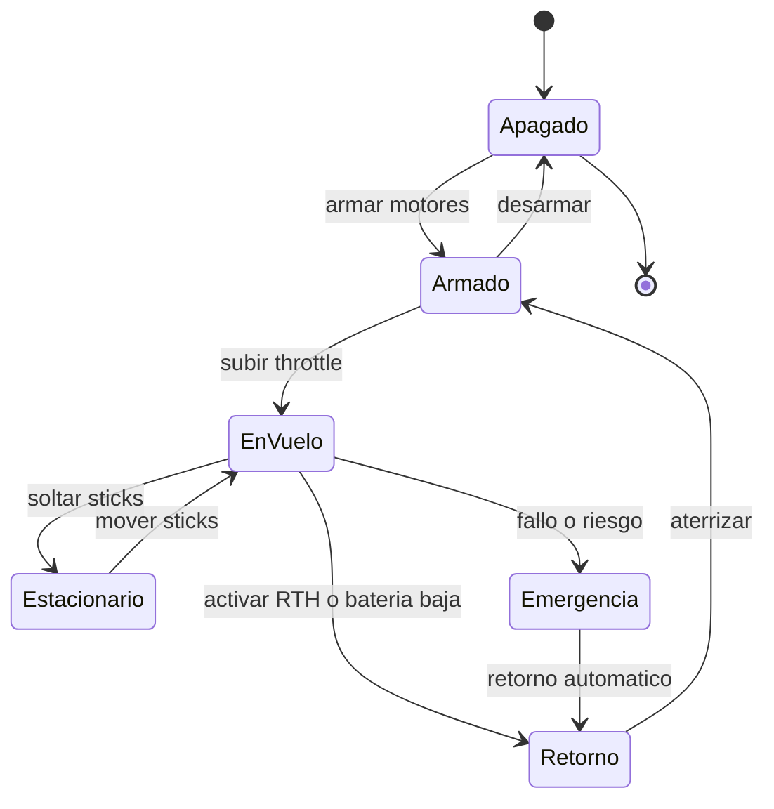

# 🎮 Diseno de simulacion del dron

[🏠 Inicio](../../../README.md) · [🕹️ Curso: Drones](../README.md) · 🎮 Simulacion

## Objetivo de la simulacion

Que el usuario aprenda a armar los motores, despegar en vertical, mantener el
vuelo estacionario, trasladarse coordinando los dos sticks, gestionar la bateria y
el enlace, y respetar las zonas prohibidas, de forma segura y progresiva.

## Nivel de realismo

- Nivel elegido: se ofrece del 1 al 3 (ver `docs/03-niveles-de-realismo.md`).
- Justificacion: el dron es de dificultad intermedia; la controladora estabiliza
  el vuelo, lo que baja la carga respecto del helicoptero, pero agrega la gestion
  del enlace, la bateria y las zonas restringidas.

## Variables principales

| Variable | Tipo | Rango | Afecta a | Comentarios |
| --- | --- | --- | --- | --- |
| Throttle | numerica | 0-100% | Empuje total | Sube o baja el dron. |
| Cabeceo | numerica | -30..30 grados | Avance y retroceso | Del stick derecho. |
| Alabeo | numerica | -30..30 grados | Desplazamiento lateral | Del stick derecho. |
| Guinada | numerica | -100..100% | Rumbo de la nariz | Del stick izquierdo. |
| Bateria | numerica | 0-100% | Autonomia y avisos | Dispara el retorno automatico. |
| Viento | numerica | 0-alto | Deriva y consumo | Puede superar el empuje. |
| Calidad de GPS | numerica | 0-100% | Mantenimiento de posicion | Baja entre obstaculos. |
| Enlace de radio | numerica | 0-100% | Control y fail-safe | Baja con distancia e interferencia. |
| Peso del conjunto | numerica | fijo + carga | Empuje necesario | Incluye camara o carga util. |

## Ciclo basico

1. Leer entrada del usuario (throttle, cabeceo, alabeo, guinada, modo).
2. Actualizar el estado de la controladora, la bateria y el enlace.
3. Calcular fuerzas: empuje de cada rotor, peso, viento y par.
4. Aplicar restricciones del entorno (GPS, interferencia, zona prohibida).
5. Actualizar posicion, altura, actitud y rumbo.
6. Refrescar instrumentos y retroalimentacion (telemetria, avisos, video).

## Modos de juego futuros

- Tutorial guiado de los dos sticks y del vuelo estacionario.
- Practica libre de despegue y aterrizaje vertical.
- Misiones de fotografia y de mapeo por waypoints.
- Inspeccion de torres y lineas manteniendo distancia segura.
- Gestion de emergencias: bateria baja, perdida de enlace y retorno a casa.

## Elementos fuera de alcance

- Maniobras que presenten como recomendable volar sobre personas o aeropuertos.
- Reproduccion de vuelo temerario o invasivo como objetivo del juego.
- Datos tecnicos que permitan alterar sistemas reales o burlar restricciones.

## Pendientes

- [ ] Definir valores por defecto de cada variable por tipo de dron.
- [ ] Prototipar el ciclo basico del vuelo estacionario en un motor simple.
- [ ] Ajustar el modelo de viento y de consumo de bateria.
- [ ] Confirmar los umbrales de la DAN 151 y reflejarlos en las zonas del escenario.
- [ ] Agregar fuentes tecnicas publicas a [`manuales/fuentes.md`](../../../manuales/fuentes.md).

---

[⬅️ Anterior: Reglamentos](../reglamentos/reglamentos-dron.md) · [➡️ Siguiente: Recursos](../recursos/recursos-dron.md)
