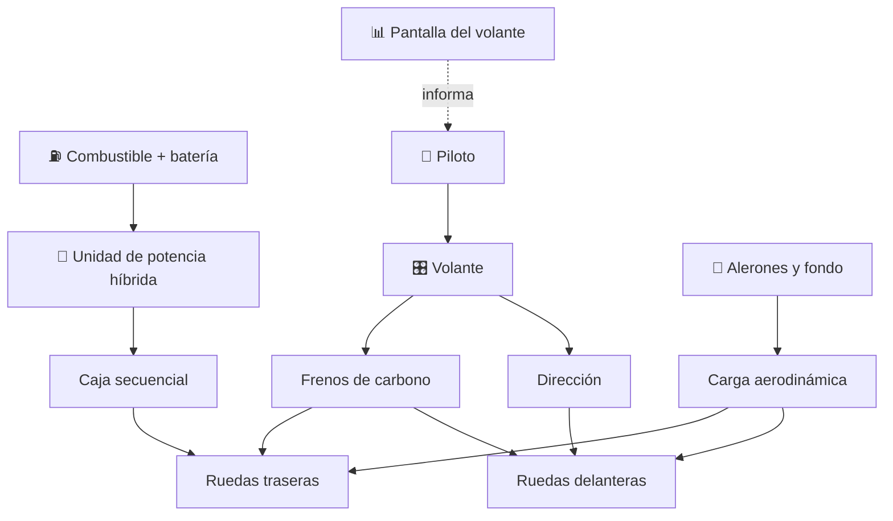

# 🏎️ Curso: Fórmula 1

[🏠 Inicio](../../README.md) · [🚙 Catálogo de vehículos](../README.md) · [🎓 Guía de curso](../../docs/08-guia-de-estilo-y-curso.md)

> **Curso técnico de competición.** Documenta el monoplaza de Fórmula 1 de
> principio a fin: historia, características, mecánica en profundidad, puesto de
> mando, física del rendimiento, circuitos, reglamento FIA y diseño de
> simulación. No es un vehículo de vía pública: se rige por el reglamento
> deportivo y técnico de la FIA, no por la ley de tránsito.

---

## 🎯 Objetivos de aprendizaje

Al terminar este curso deberías poder:

- Explicar como un monoplaza acelera, frena, gira y genera carga aerodinámica.
- Identificar la unidad de potencia híbrida y los sistemas de recuperación.
- Reconocer los mandos del volante y el tablero de datos del piloto.
- Comprender la física del agarre: carga aerodinámica, efecto suelo y neumáticos.
- Conocer el reglamento deportivo y técnico de la FIA que rige la competición.
- Traducir todo lo anterior en variables de un simulador educativo.

---

## 🗺️ Mapa del vehículo

---

## 📚 Módulos del curso

| # | Módulo | Contenido | Enlace |
| :-: | --- | --- | --- |
| 1 | 📜 Historia | Origen y evolución de la Fórmula 1, línea de tiempo. | [Abrir](historia/historia-formula-1.md) |
| 2 | 📋 Características | Que es un monoplaza, tipos y para que sirve cada uno. | [Abrir](operacion/caracteristicas-formula-1.md) |
| 3 | 🔧 Sistemas mecánicos | Unidad híbrida, aerodinámica, neumáticos, frenos, caja. | [Abrir](operacion/sistemas-mecanicos-formula-1.md) |
| 4 | 🎛️ Mandos e instrumentos | Volante multifunción, pedales y telemetría. | [Abrir](mandos/manual-mandos-formula-1.md) |
| 5 | 🧪 Principios y operación | Física del rendimiento y fases de una vuelta. | [Abrir](operacion/principios-formula-1.md) |
| 6 | 🌍 Entornos de trabajo | Circuitos urbanos, permanentes y mixtos. | [Abrir](operacion/entornos-formula-1.md) |
| 7 | ⚖️ Reglamentos | Reglamento deportivo y técnico de la FIA. | [Abrir](reglamentos/reglamentos-formula-1.md) |
| 8 | 🎮 Diseño de simulación | Variables, ciclo y modos de juego. | [Abrir](simulacion/diseno-simulador-formula-1.md) |
| 9 | 🧰 Recursos | Glosario, enlaces y diagramas. | [Abrir](recursos/recursos-formula-1.md) |

---

## 🧩 Requisitos previos

Se recomienda haber revisado antes el curso de
[🚗 automóviles](../automoviles/README.md), que introduce motor, transmisión y
frenos con menor complejidad. La Fórmula 1 lleva esos principios al límite:
hibridación, carga aerodinámica y efecto suelo. Marco técnico de competición en
[⚖️ docs/07-marco-legal-chile.md](../../docs/07-marco-legal-chile.md), sección
1.9 (Fórmula 1).

---

[➡️ Empezar por el Módulo 1: Historia](historia/historia-formula-1.md)
