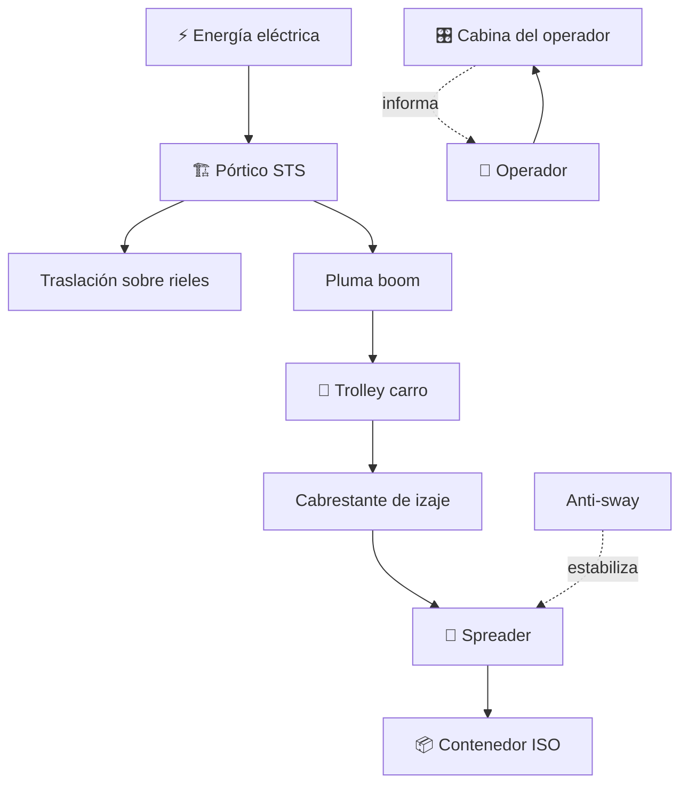

# ⚓ Curso: Grúa portuaria

[🏠 Inicio](../../README.md) · [🚙 Catálogo de vehículos](../README.md) · [🎓 Guía de curso](../../docs/08-guia-de-estilo-y-curso.md)

> **Curso de izaje portuario.** Documenta la grúa portuaria de contenedores de
> principio a fin: historia, características, mecánica del pórtico en
> profundidad, mandos, principios de estabilidad, entornos del terminal,
> seguridad laboral chilena y diseño de simulación. Es una grúa FIJA que carga y
> descarga buques portacontenedores desde el muelle.

---

## 🎯 Objetivos de aprendizaje

Al terminar este curso deberías poder:

- Explicar como una grúa pórtico ship-to-shore descarga contenedores de un buque.
- Identificar sus sistemas mecánicos y cómo se conectan sobre los rieles del muelle.
- Reconocer todos los mandos e instrumentos de la cabina del operador.
- Comprender los principios de estabilidad, límites de carga y control del balanceo.
- Conocer el marco chileno de izaje fijo y seguridad laboral aplicable.
- Traducir todo lo anterior en variables de un simulador educativo.

---

## 🗺️ Mapa del vehículo

---

## 📚 Módulos del curso

| # | Módulo | Contenido | Enlace |
| :-: | --- | --- | --- |
| 1 | 📜 Historia | Del izaje manual y de vapor a las grúas STS y la contenedorización. | [Abrir](historia/historia-grua-portuaria.md) |
| 2 | 📋 Características | Que es, tipos de grúa portuaria, contenedor ISO y spreader. | [Abrir](operacion/caracteristicas-grua-portuaria.md) |
| 3 | 🔧 Sistemas mecánicos | Pórtico, rieles, trolley, spreader, izaje, anti-sway y seguridad. | [Abrir](operacion/sistemas-mecanicos-grua-portuaria.md) |
| 4 | 🎛️ Mandos e instrumentos | Cabina del operador, joysticks e indicadores. | [Abrir](mandos/manual-mandos-grua-portuaria.md) |
| 5 | 🧪 Principios y operación | Estabilidad, límites de carga y control del balanceo. | [Abrir](operacion/principios-grua-portuaria.md) |
| 6 | 🌍 Entornos de trabajo | Muelle, viento, jornada diurna y nocturna, patio. | [Abrir](operacion/entornos-grua-portuaria.md) |
| 7 | ⚖️ Reglamentos | Marco chileno: izaje fijo, Ley 16.744 y D.S. 594. | [Abrir](reglamentos/reglamentos-grua-portuaria.md) |
| 8 | 🎮 Diseño de simulación | Variables, ciclo de descarga y modos de juego. | [Abrir](simulacion/diseno-simulador-grua-portuaria.md) |
| 9 | 🧰 Recursos | Glosario, enlaces y diagramas. | [Abrir](recursos/recursos-grua-portuaria.md) |

---

## 🧩 Requisitos previos

Conviene haber visto antes el curso de grúas móviles, porque comparte conceptos
de izaje, momento de carga y estabilidad. La grúa portuaria agrega la operación
sobre rieles fijos, el manejo del contenedor ISO y el ciclo repetitivo
buque-muelle. Marco legal común en
[⚖️ docs/07-marco-legal-chile.md](../../docs/07-marco-legal-chile.md).

---

[➡️ Empezar por el Módulo 1: Historia](historia/historia-grua-portuaria.md)
