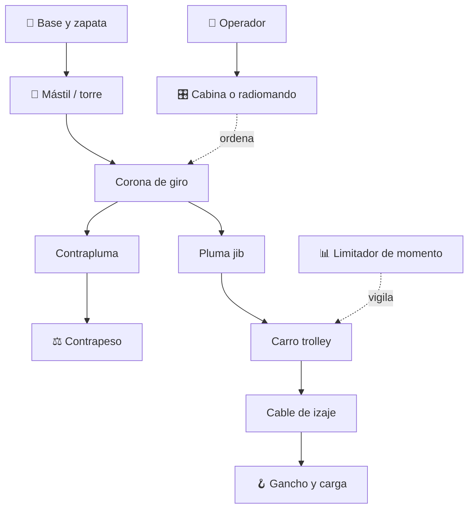

# 🗼 Curso: Grúa torre

[🏠 Inicio](../../README.md) · [🚙 Catálogo de vehículos](../README.md) · [🎓 Guía de curso](../../docs/08-guia-de-estilo-y-curso.md)

> **Curso de la grúa torre de construcción.** Documenta la grúa torre de
> principio a fin: historia, características, mecánica del izaje en altura,
> mandos, física de momentos, entornos de obra, marco de seguridad laboral
> chileno y diseño de simulación. Es una grúa fija, no circula por vía pública.

---

## 🎯 Objetivos de aprendizaje

Al terminar este curso deberías poder:

- Explicar como una grúa torre iza cargas en altura manteniendo el equilibrio.
- Identificar sus sistemas mecánicos (mástil, pluma, contrapluma, carro, giro).
- Reconocer todos los mandos e instrumentos y su función.
- Comprender la física del momento de carga y por qué el radio limita el peso.
- Conocer el marco de seguridad laboral chileno aplicable al izaje fijo.
- Traducir todo lo anterior en variables de un simulador educativo.

---

## 🗺️ Mapa del vehículo

---

## 📚 Módulos del curso

| # | Módulo | Contenido | Enlace |
| :-: | --- | --- | --- |
| 1 | 📜 Historia | Origen y evolución de la grúa torre, línea de tiempo. | [Abrir](historia/historia-grua-torre.md) |
| 2 | 📋 Características | Que es, tipos de grúa torre y para que sirve cada uno. | [Abrir](operacion/caracteristicas-grua-torre.md) |
| 3 | 🔧 Sistemas mecánicos | Mástil, pluma, contrapeso, carro, giro, momento, trepado. | [Abrir](operacion/sistemas-mecanicos-grua-torre.md) |
| 4 | 🎛️ Mandos e instrumentos | Cabina, radiomando, palancas y limitadores. | [Abrir](mandos/manual-mandos-grua-torre.md) |
| 5 | 🧪 Principios y operación | Equilibrio de momentos y fases de izaje. | [Abrir](operacion/principios-grua-torre.md) |
| 6 | 🌍 Entornos de trabajo | Obra en altura, ciudad densa, viento, montaje. | [Abrir](operacion/entornos-grua-torre.md) |
| 7 | ⚖️ Reglamentos | Marco chileno: seguridad laboral e izaje fijo. | [Abrir](reglamentos/reglamentos-grua-torre.md) |
| 8 | 🎮 Diseño de simulación | Variables, ciclo y modos de juego. | [Abrir](simulacion/diseno-simulador-grua-torre.md) |
| 9 | 🧰 Recursos | Glosario, enlaces y diagramas. | [Abrir](recursos/recursos-grua-torre.md) |

---

## 🧩 Requisitos previos

Conviene haber revisado antes el curso de grúas móviles, porque la grúa torre
comparte la física del momento de carga (peso por radio) pero la lleva a una
estructura fija de gran altura. Marco legal común en
[⚖️ docs/07-marco-legal-chile.md](../../docs/07-marco-legal-chile.md).

---

[➡️ Empezar por el Módulo 1: Historia](historia/historia-grua-torre.md)
