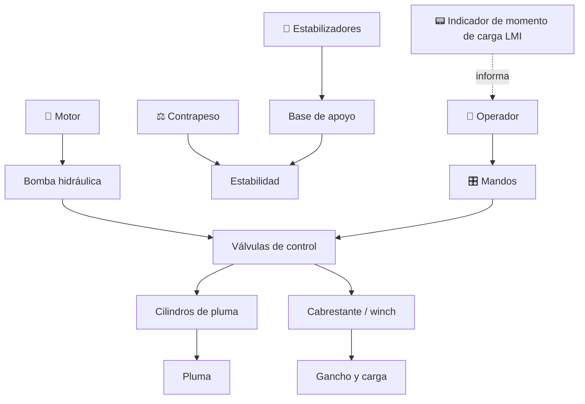

# 🏗️ Curso: Grúas

[🏠 Inicio](../../README.md) · [🚙 Catálogo de vehículos](../README.md) · [🎓 Guía de curso](../../docs/08-guia-de-estilo-y-curso.md)

> **Curso de operación de grúas.** Documenta la grúa de principio a fin:
> historia, características, mecánica e izaje en profundidad, mandos, física de
> la estabilidad, entornos, reglamentos chilenos y diseño de simulación. El
> núcleo del curso es la estabilidad: momento de carga, radio y contrapeso.

---

## 🎯 Objetivos de aprendizaje

Al terminar este curso deberías poder:

- Explicar como una grúa iza, gira y traslada una carga sin volcar.
- Identificar sus sistemas mecánicos e hidráulicos y cómo se conectan.
- Leer una tabla de carga y relacionar radio, ángulo y capacidad.
- Comprender el momento de vuelco, el contrapeso y el rol del LMI.
- Reconocer todos los mandos e instrumentos y su función.
- Conocer los reglamentos chilenos aplicables (licencia clase D, seguridad).
- Traducir todo lo anterior en variables de un simulador educativo.

---

## 🗺️ Mapa del vehículo

---

## 📚 Módulos del curso

| # | Módulo | Contenido | Enlace |
| :-: | --- | --- | --- |
| 1 | 📜 Historia | Origen y evolución de la grúa, línea de tiempo. | [Abrir](historia/historia-grua.md) |
| 2 | 📋 Características | Que es, tipos de grúa y para que sirve cada uno. | [Abrir](operacion/caracteristicas-grua.md) |
| 3 | 🔧 Sistemas mecánicos | Pluma, cabrestante, estabilizadores, tablas de carga, hidráulica. | [Abrir](operacion/sistemas-mecanicos-grua.md) |
| 4 | 🎛️ Mandos e instrumentos | Cabina, controles, joysticks, LMI y tablero. | [Abrir](mandos/manual-mandos-grua.md) |
| 5 | 🧪 Principios y operación | Momento de carga, estabilidad y fases de izaje. | [Abrir](operacion/principios-grua.md) |
| 6 | 🌍 Entornos de trabajo | Obra, puerto, industria, rescate y terreno irregular. | [Abrir](operacion/entornos-grua.md) |
| 7 | ⚖️ Reglamentos | Ley chilena: licencia clase D, seguridad de izaje. | [Abrir](reglamentos/reglamentos-grua.md) |
| 8 | 🎮 Diseño de simulación | Variables, ciclo y modos de juego. | [Abrir](simulacion/diseno-simulador-grua.md) |
| 9 | 🧰 Recursos | Glosario, enlaces y diagramas. | [Abrir](recursos/recursos-grua.md) |

---

## 🧩 Requisitos previos

Se recomienda haber revisado antes el curso de [motos](../motos/README.md) como
introducción a la mecánica y a los mandos. La grúa es un vehículo avanzado: su
dificultad no está en desplazarse, sino en izar cargas sin superar el momento de
vuelco. Marco legal común en
[⚖️ docs/07-marco-legal-chile.md](../../docs/07-marco-legal-chile.md).

---

[➡️ Empezar por el Módulo 1: Historia](historia/historia-grua.md)
