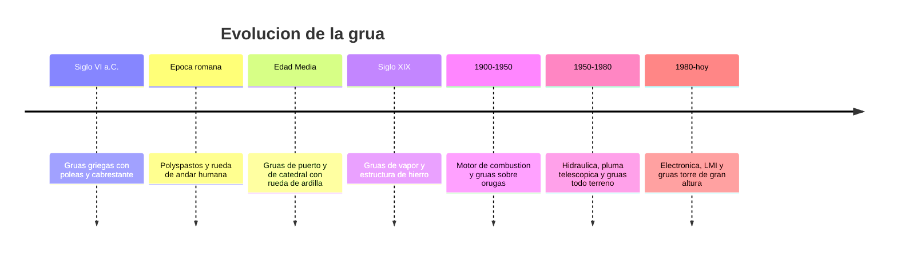

# 📜 Historia de la grúa

[🏠 Inicio](../../../README.md) · [🏗️ Curso: Grúas](../README.md) · 📜 Historia

## Origen

La grúa nace de la necesidad de elevar cargas más pesadas que las que una
persona puede levantar. Los primeros dispositivos combinaron la palanca, la
polea y el cabrestante para multiplicar la fuerza humana. Los griegos ya usaban
grúas simples hacia el siglo VI a.C. para construir templos, y los romanos las
perfeccionaron con el polyspastos, un aparejo de varias poleas movido por una
rueda de andar donde caminaban operarios.

## Línea de tiempo

| Periodo | Hito | Importancia |
| --- | --- | --- |
| Siglo VI a.C. | Grúas griegas con polea y cabrestante | Nace el izaje mecánico. |
| Época romana | Polyspastos y rueda de andar | Multiplica la fuerza con poleas. |
| Edad Media | Grúas de puerto y de catedral | Izaje a gran altura con rueda de ardilla. |
| Siglo XIX | Grúas de vapor y hierro | Potencia y estructuras más resistentes. |
| 1900-1950 | Combustión y orugas | Movilidad y autonomía en obra. |
| 1950-1980 | Hidráulica y pluma telescópica | Extensión rápida y control fino. |
| 1980-presente | Electrónica, LMI y grúas torre | Seguridad de izaje y gran altura. |

## Evolución tecnológica

- **Fuerza**: de la fuerza humana y animal al vapor, la combustión y la hidráulica.
- **Estructura**: de la madera al hierro forjado y luego al acero de alta resistencia.
- **Pluma**: de la pluma fija de celosía a la pluma telescópica hidráulica.
- **Movilidad**: de grúas fijas a grúas sobre camión, orugas y todo terreno.
- **Control**: de palancas mecánicas a joysticks electrohidraulicos proporcionales.
- **Seguridad**: aparición del indicador de momento de carga (LMI) y cortes automáticos.

## Tipos representativos

| Tipo | Uso típico | Característica destacada |
| --- | --- | --- |
| Grúa móvil sobre camión | Obra y montaje itinerante | Se desplaza por carretera y opera con estabilizadores. |
| Grúa todo terreno (RT) | Terreno irregular de obra | Tracción en todas las ruedas, pluma telescópica. |
| Grúa sobre orugas | Grandes obras y larga permanencia | Iza sin estabilizadores y puede desplazarse con carga. |
| Grúa torre | Edificación en altura | Fija, gran alcance y altura, pluma horizontal. |
| Grúa articulada | Carga y descarga de camiones | Pluma plegable montada sobre vehículo. |
| Puente grúa | Naves industriales | Recorre un carril elevado, izaje vertical. |

## Impacto en la construcción e industria

La grúa es la máquina que hizo posible la construcción moderna en altura, los
puertos de contenedores y el montaje industrial pesado. Sin ella no existirían
los rascacielos, los puentes de gran luz ni la logística portuaria actual. Su
evolución está ligada a la seguridad: cada avance busca izar más carga a mayor
alcance sin aumentar el riesgo de vuelco, hoy controlado por sistemas
electrónicos que vigilan el momento de carga en tiempo real.

## Fuentes

- Registrar aquí las fuentes públicas consultadas.
- Enlazar cada fuente también en [`manuales/fuentes.md`](../../../manuales/fuentes.md).

---

[🎓 Portada del curso](../README.md) · [➡️ Siguiente: Características](../operacion/caracteristicas-grua.md)
