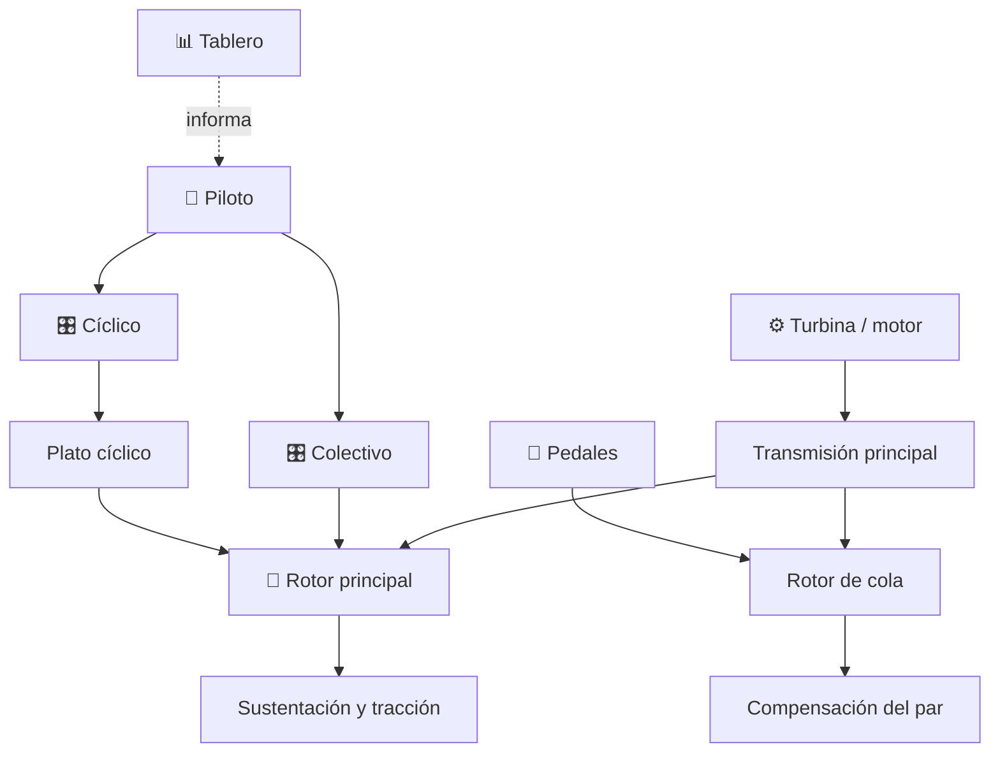

# 🚁 Curso: Helicópteros

[🏠 Inicio](../../README.md) · [🚙 Catálogo de vehículos](../README.md) · [🎓 Guía de curso](../../docs/08-guia-de-estilo-y-curso.md)

> **Curso de aeronave de ala rotatoria.** Documenta el helicóptero de principio
> a fin: historia, características, mecánica en profundidad, mandos, física del
> vuelo, entornos, reglamentos chilenos y diseño de simulación. Sigue el modelo
> del curso de referencia del repositorio.

---

## 🎯 Objetivos de aprendizaje

Al terminar este curso deberías poder:

- Explicar como un helicóptero genera sustentación y logra el vuelo estacionario.
- Identificar sus sistemas mecánicos y cómo se conectan.
- Reconocer todos los mandos e instrumentos y su función.
- Comprender la física del vuelo de ala rotatoria (par, anti-par, autorrotación).
- Conocer los reglamentos chilenos aplicables (licencia, certificación, seguridad).
- Traducir todo lo anterior en variables de un simulador educativo.

---

## 🗺️ Mapa del vehículo

---

## 📚 Módulos del curso

| # | Módulo | Contenido | Enlace |
| :-: | --- | --- | --- |
| 1 | 📜 Historia | Origen y evolución del helicóptero, línea de tiempo. | [Abrir](historia/historia-helicoptero.md) |
| 2 | 📋 Características | Que es, tipos de helicóptero y para que sirve cada uno. | [Abrir](operacion/caracteristicas-helicoptero.md) |
| 3 | 🔧 Sistemas mecánicos | Rotor principal, rotor de cola, plato cíclico, transmisión, turbina. | [Abrir](operacion/sistemas-mecanicos-helicoptero.md) |
| 4 | 🎛️ Mandos e instrumentos | Puesto de mando, colectivo, cíclico, pedales y tablero. | [Abrir](mandos/manual-mandos-helicoptero.md) |
| 5 | 🧪 Principios y operación | Física del vuelo de ala rotatoria y fases de operación. | [Abrir](operacion/principios-helicoptero.md) |
| 6 | 🌍 Entornos de trabajo | Helipuertos, rescate, hospitales, incendios forestales. | [Abrir](operacion/entornos-helicoptero.md) |
| 7 | ⚖️ Reglamentos | Ley chilena: Código Aeronáutico, DGAC, DAN 61, certificación. | [Abrir](reglamentos/reglamentos-helicoptero.md) |
| 8 | 🎮 Diseño de simulación | Variables, ciclo y modos de juego. | [Abrir](simulacion/diseno-simulador-helicoptero.md) |
| 9 | 🧰 Recursos | Glosario, enlaces y diagramas. | [Abrir](recursos/recursos-helicoptero.md) |

---

## 🧩 Requisitos previos

Se recomienda haber revisado antes el curso de aviones pequeños, porque el
helicóptero comparte marco aeronáutico y muchos instrumentos de vuelo, pero
agrega la complejidad del vuelo de ala rotatoria: par, anti-par, plato cíclico y
autorrotación. Marco legal común en
[⚖️ docs/07-marco-legal-chile.md](../../docs/07-marco-legal-chile.md).

---

[➡️ Empezar por el Módulo 1: Historia](historia/historia-helicoptero.md)
