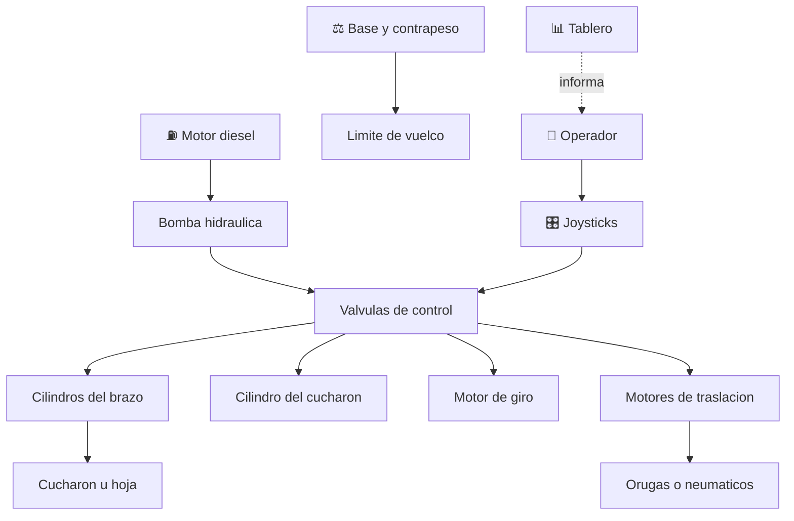

# 🚧 Curso: Maquinaria de construccion

[🏠 Inicio](../../README.md) · [🚙 Catalogo de vehiculos](../README.md) · [🎓 Guia de curso](../../docs/08-guia-de-estilo-y-curso.md)

> **Curso completo de la maquinaria de construccion.** Documenta las maquinas de
> movimiento de tierra de principio a fin: historia, caracteristicas, mecanica e
> hidraulica en profundidad, mandos, fisica de la estabilidad y las cargas,
> entornos, reglamentos chilenos y diseno de simulacion. El nucleo del curso es
> la hidraulica de trabajo, el movimiento de tierra y la estabilidad.

---

## 🎯 Objetivos de aprendizaje

Al terminar este curso deberias poder:

- Explicar como una maquina de construccion excava, empuja y carga material.
- Identificar sus sistemas, en especial la hidraulica de trabajo.
- Distinguir el trabajo con brazo y cucharon del trabajo con hoja empujadora.
- Comparar orugas y neumaticos y su efecto en agarre y estabilidad.
- Comprender la estabilidad, las cargas y el limite de vuelco.
- Conocer los reglamentos chilenos aplicables (licencia clase D, seguridad).
- Traducir todo lo anterior en variables de un simulador educativo.

---

## 🗺️ Mapa del vehiculo

---

## 📚 Modulos del curso

| # | Modulo | Contenido | Enlace |
| :-: | --- | --- | --- |
| 1 | 📜 Historia | Origen y evolucion de la maquinaria, linea de tiempo. | [Abrir](historia/historia-maquinaria.md) |
| 2 | 📋 Caracteristicas | Que es, tipos de maquina y para que sirve cada uno. | [Abrir](operacion/caracteristicas-maquinaria.md) |
| 3 | 🔧 Sistemas mecanicos | Hidraulica, movimiento de tierra, brazo, hoja, orugas, estabilidad. | [Abrir](operacion/sistemas-mecanicos-maquinaria.md) |
| 4 | 🎛️ Mandos e instrumentos | Cabina, joysticks, pedales y tablero. | [Abrir](mandos/manual-mandos-maquinaria.md) |
| 5 | 🧪 Principios y operacion | Cargas, estabilidad y fases de trabajo. | [Abrir](operacion/principios-maquinaria.md) |
| 6 | 🌍 Entornos de trabajo | Obra, mineria, vialidad, demolicion y zanjas. | [Abrir](operacion/entornos-maquinaria.md) |
| 7 | ⚖️ Reglamentos | Ley chilena: licencia clase D, seguridad de faena. | [Abrir](reglamentos/reglamentos-maquinaria.md) |
| 8 | 🎮 Diseno de simulacion | Variables, ciclo y modos de juego. | [Abrir](simulacion/diseno-simulador-maquinaria.md) |
| 9 | 🧰 Recursos | Glosario, enlaces y diagramas. | [Abrir](recursos/recursos-maquinaria.md) |

---

## 🧩 Requisitos previos

Se recomienda haber revisado antes el [curso de gruas](../gruas/README.md), que
introduce la hidraulica de trabajo y la estabilidad frente al vuelco. La
maquinaria de construccion comparte esos principios y agrega el movimiento de
tierra con brazo, cucharon y hoja. Marco legal comun en
[⚖️ docs/07-marco-legal-chile.md](../../docs/07-marco-legal-chile.md).

---

[➡️ Empezar por el Modulo 1: Historia](historia/historia-maquinaria.md)
