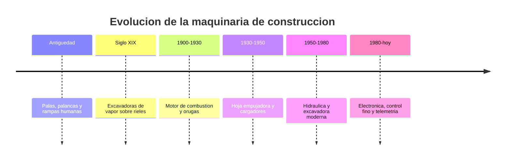

# 📜 Historia de la maquinaria de construccion

[🏠 Inicio](../../../README.md) · [🚧 Curso: Maquinaria de construccion](../README.md) · 📜 Historia

## Origen

Durante siglos, mover tierra dependio de la fuerza humana y animal con palas,
palancas y rampas. La mecanizacion comenzo en el siglo XIX con las excavadoras de
vapor montadas sobre rieles. El motor de combustion y las orugas las liberaron
del riel a comienzos del siglo XX, y la **hidraulica**, a mediados de siglo,
transformo por completo la excavadora al permitir mover el brazo y el cucharon
con fuerza y precision.

## Linea de tiempo

| Periodo | Hito | Importancia |
| --- | --- | --- |
| Antiguedad | Palas, palancas y rampas | Movimiento de tierra manual. |
| Siglo XIX | Excavadoras de vapor sobre rieles | Primera mecanizacion pesada. |
| 1900-1930 | Combustion y orugas | Autonomia y movilidad en terreno. |
| 1930-1950 | Hoja empujadora y cargadores | Empuje y carga de material a escala. |
| 1950-1980 | Hidraulica y excavadora moderna | Fuerza y control fino del brazo. |
| 1980-presente | Electronica y telemetria | Precision, seguridad y gestion de flota. |

## Evolucion tecnologica

- **Fuerza**: de la fuerza humana al vapor, la combustion y la hidraulica.
- **Movilidad**: del riel fijo a las orugas y los neumaticos.
- **Trabajo**: de cables y poleas a cilindros hidraulicos precisos.
- **Control**: de palancas mecanicas a joysticks electrohidraulicos.
- **Seguridad**: cabinas ROPS y FOPS, camaras y sensores de zona.
- **Precision**: guiado por GPS y control automatico de la hoja o el cucharon.

## Tipos representativos

| Tipo | Uso tipico | Caracteristica destacada |
| --- | --- | --- |
| Excavadora | Excavacion y zanjas | Brazo articulado y giro de 360 grados. |
| Cargador frontal | Carga de material | Cucharon frontal de gran volumen. |
| Bulldozer | Empuje y nivelacion | Hoja empujadora y orugas. |
| Retroexcavadora | Obra mixta | Pala frontal y brazo trasero. |
| Motoniveladora | Terminacion de caminos | Hoja central regulable. |
| Minicargador | Espacios reducidos | Compacto, muy maniobrable. |

## Impacto en la construccion e infraestructura

La maquinaria de construccion hizo posible la infraestructura moderna: caminos,
puentes, represas, mineria y edificacion a gran escala. Al mecanizar el
movimiento de tierra, multiplico lo que un equipo puede hacer en un dia y redujo
el esfuerzo humano en las tareas mas pesadas. Su evolucion sigue apuntando a la
precision, la eficiencia de combustible y la seguridad de la faena.

## Fuentes

- Registrar aqui las fuentes publicas consultadas.
- Enlazar cada fuente tambien en [`manuales/fuentes.md`](../../../manuales/fuentes.md).

---

[🎓 Portada del curso](../README.md) · [➡️ Siguiente: Caracteristicas](../operacion/caracteristicas-maquinaria.md)
