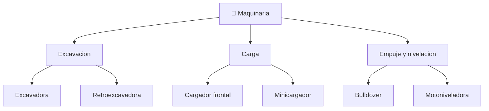

# 📋 Caracteristicas funcionales de la maquinaria de construccion

[🏠 Inicio](../../../README.md) · [🚧 Curso: Maquinaria de construccion](../README.md) · 📋 Caracteristicas

Que es la maquinaria de construccion, que tipos existen y para que sirve cada
uno. Este modulo da el contexto antes de abrir la mecanica (Modulo 3).

---

## 🧭 Definicion

La maquinaria de construccion es un conjunto de maquinas automotrices disenadas
para mover, excavar, empujar, cargar y nivelar tierra y material. A diferencia de
un vehiculo de transporte, su objetivo no es desplazarse sino **trabajar el
terreno**. Casi toda usa hidraulica de alta presion para accionar brazos,
cucharones y hojas, y se desplaza sobre orugas o neumaticos segun el terreno.

---

## 🧬 Caracteristicas clave

| Caracteristica | Descripcion |
| --- | --- |
| Hidraulica de trabajo | Cilindros y motores mueven las herramientas con gran fuerza. |
| Herramienta de trabajo | Cucharon, hoja o pala segun la maquina y la labor. |
| Orugas o neumaticos | Las orugas dan agarre y reparten peso; los neumaticos, velocidad. |
| Estabilidad | La carga y el alcance pueden acercar la maquina al vuelco. |
| Baja velocidad | Prioriza fuerza y control, no desplazamiento rapido. |
| Robustez | Estructura pesada para resistir esfuerzos y golpes. |

---

## 🗂️ Tipos de maquina

| Tipo | Uso tipico | Rasgo destacado |
| --- | --- | --- |
| Excavadora | Excavacion y zanjas | Brazo articulado, giro de 360 grados. |
| Cargador frontal | Carga de material a camion | Cucharon frontal de gran volumen. |
| Bulldozer | Empuje y desmonte | Hoja empujadora, orugas de mucho agarre. |
| Retroexcavadora | Obra mixta y urbana | Pala frontal y brazo excavador atras. |
| Motoniveladora | Terminacion de caminos | Hoja central de angulo regulable. |
| Minicargador | Espacios reducidos | Compacto, cambia de herramienta rapido. |

---

## 🎯 Para que se usa

- Excavacion de zanjas, fundaciones y piscinas.
- Carga de tierra, arido y mineral sobre camiones.
- Empuje y desmonte de terreno para nivelar.
- Terminacion y perfilado de caminos y explanadas.
- Demolicion y manejo de escombros con herramientas especiales.

---

[⬅️ Anterior: Historia](../historia/historia-maquinaria.md) · [➡️ Siguiente: Sistemas mecanicos](sistemas-mecanicos-maquinaria.md)
