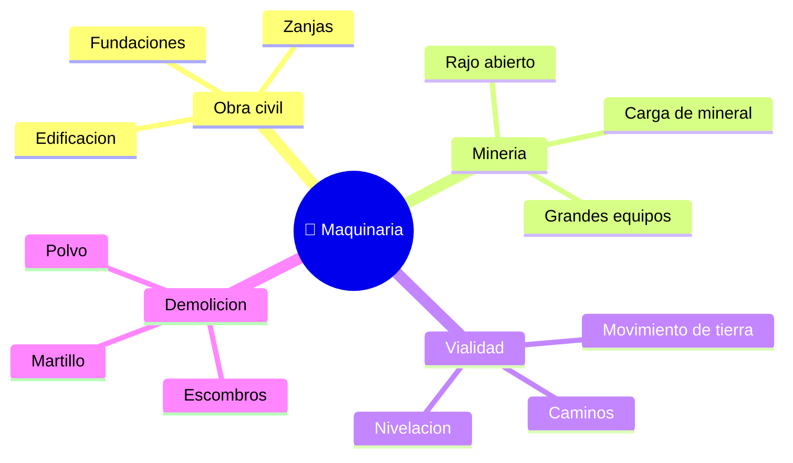

# 🌍 Entornos de trabajo de la maquinaria de construccion

[🏠 Inicio](../../../README.md) · [🚧 Curso: Maquinaria de construccion](../README.md) · 🌍 Entornos

Donde opera la maquinaria de construccion y como cambia la operacion segun el
entorno. Cada entorno implica reglas, riesgos y ajustes distintos, y en
simulacion se traduce en escenarios diferentes.

---

## 🗺️ Entornos principales

| Entorno | Caracteristicas | Riesgos tipicos | Ajuste de operacion |
| --- | --- | --- | --- |
| Obra civil | Zanjas, fundaciones, poco espacio. | Ductos ocultos, personas cerca. | Radio controlado, senaleros. |
| Mineria a rajo | Grandes volumenes, equipos pesados. | Trafico de camiones, polvo. | Reglas de faena, distancia y radio. |
| Vialidad | Movimiento de tierra y nivelacion. | Trafico vehicular, taludes. | Senalizacion, hoja y pendiente controladas. |
| Demolicion | Escombros y estructuras. | Caida de material, polvo. | FOPS, riego, area despejada. |
| Terreno blando / lluvia | Barro, suelo que cede. | Hundimiento, deslizamiento. | Orugas anchas, base firme, baja velocidad. |

---

## 🌦️ Factores del entorno

- **Terreno**: firmeza, pendiente y humedad definen estabilidad y agarre.
- **Espacio**: en obra urbana el radio de giro y los servicios enterrados limitan.
- **Personas**: la faena suele tener trabajadores a pie; el radio de trabajo es
  zona de exclusion.
- **Clima**: lluvia, polvo y calor afectan visibilidad, suelo y la maquina.
- **Otros equipos**: camiones y maquinas comparten la faena y deben coordinarse.

---

## 🎮 Traduccion a simulacion

Cada entorno es un escenario con su terreno, espacio, clima y presencia de
personas y equipos. Ver como se modela en el
[Modulo 8: Diseno de simulacion](../simulacion/diseno-simulador-maquinaria.md).

---

[⬅️ Anterior: Principios y operacion](principios-maquinaria.md) · [➡️ Siguiente: Reglamentos](../reglamentos/reglamentos-maquinaria.md)
