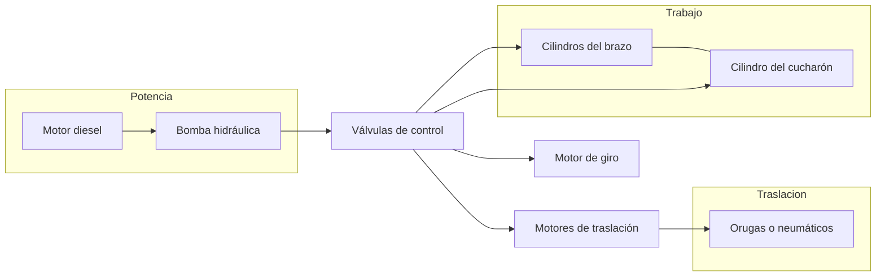
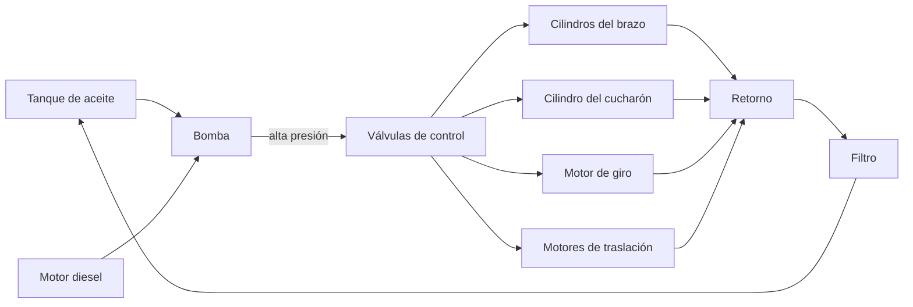
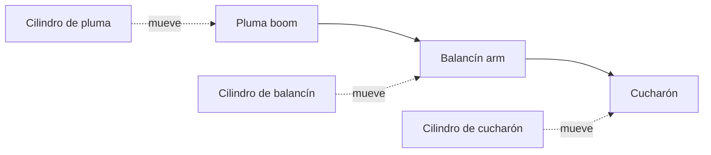

# 🔧 Sistemas mecánicos de la maquinaria de construcción

[🏠 Inicio](../../../README.md) · [🚧 Curso: Maquinaria de construcción](../README.md) · 🔧 Sistemas mecánicos

Este módulo abre la máquina por dentro y es el corazón del curso. Explica cada
sistema, como funciona y cómo se conecta con los demás, con foco en la hidráulica
de trabajo, el movimiento de tierra y la estabilidad. Es la base técnica para
entender los mandos (Módulo 4) y la física de la operación (Módulo 5).

---

## 1. 💧 Sistema hidráulico

La hidráulica es la fuerza de trabajo de la maquinaria moderna: convierte la
potencia del motor diesel en movimiento controlado y potente del brazo, el
cucharón, la hoja, el giro y la traslación.

| Componente | Función |
| --- | --- |
| Bomba | Convierte el giro del motor en caudal de aceite a presión. |
| Válvulas de control | Dirigen el aceite al actuador que el operador acciona. |
| Cilindros | Transforman presión en movimiento lineal del brazo y el cucharón. |
| Motor de giro | Convierte presión en rotación de la superestructura. |
| Motores de traslación | Mueven las orugas o las ruedas. |
| Presión | Empuje disponible; a mayor presión, más fuerza de excavación. |
| Tanque y filtros | Almacenan y limpian el aceite en circuito cerrado. |

El movimiento **proporcional** de los joysticks regula el caudal que llega a cada
actuador, por lo que la velocidad del brazo o el cucharón depende de cuanto se
desplaza el mando. Varios movimientos pueden combinarse a la vez.

---

## 2. 🦾 Brazo y cucharón

En una excavadora, el frente de trabajo es un brazo articulado que termina en un
cucharón. Cada articulación la mueve un cilindro hidráulico.

| Elemento | Función |
| --- | --- |
| Pluma (boom) | Primer tramo del brazo; sube y baja el conjunto. |
| Balancín (arm) | Segundo tramo; acerca y aleja el cucharón. |
| Cucharón | Recoge, corta y descarga el material. |
| Dientes | Puntas que rompen y penetran el terreno. |

El **ciclo de excavación** típico es: penetrar con el cucharón, arrastrar
cerrando el balancín, cerrar el cucharón para llenar, levantar la pluma, girar
hacia el camión y descargar abriendo el cucharón. La coordinación de estos
movimientos es la habilidad central del operador.

---

## 3. 🔪 Hoja empujadora

En un bulldozer o una motoniveladora, la herramienta es una **hoja** que empuja y
nivela el material en vez de recogerlo.

| Elemento | Función |
| --- | --- |
| Hoja | Placa de acero que empuja y corta el terreno. |
| Cilindros de altura | Suben y bajan la hoja para regular la profundidad. |
| Ángulo e inclinación | Orientan la hoja para dirigir el material. |
| Escarificador (ripper) | Diente trasero que rompe suelo duro. |

- **Empujar**: el bulldozer avanza con la hoja baja para arrastrar material.
- **Nivelar**: la motoniveladora deja una superficie pareja con la hoja central.
- **Escarificar**: el ripper rompe roca o suelo compacto antes de empujarlo.

---

## 4. ⛓️ Orugas y neumáticos

La forma de desplazarse define el agarre, la estabilidad y la velocidad de la
máquina. Cada opción tiene ventajas claras.

| Sistema | Ventaja | Desventaja |
| --- | --- | --- |
| Orugas | Gran agarre, reparte el peso, estable en terreno blando. | Lenta, dana el pavimento, no viaja por carretera. |
| Neumáticos | Rápida, viaja por camino, ágil en obra. | Menos agarre y estabilidad en terreno suelto. |

- **Presión sobre el suelo**: las orugas reparten el peso en mucha superficie, por
  eso flotan en barro donde una rueda se hundiría.
- **Traslación**: cada oruga o par de ruedas tiene su motor hidráulico; girar una
  más que otra hace virar la máquina (giro diferencial).
- **Zapatas**: las placas de la oruga; anchas para suelo blando, angostas para
  terreno firme y más velocidad.

---

## 5. ⚖️ Estabilidad y cargas

Como en una grúa, la maquinaria puede volcar si la carga y el alcance superan lo
que su base y su contrapeso resisten. La estabilidad se explica con momentos:
fuerza por distancia respecto al punto de vuelco.

| Magnitud | Descripción |
| --- | --- |
| Momento de vuelco | Peso de la carga por su distancia al punto de vuelco. |
| Momento resistente | Peso de la máquina y contrapeso por su brazo. |
| Punto de vuelco | Borde de la base de apoyo del lado de la carga. |
| Margen de estabilidad | Diferencia que debe mantenerse siempre positiva. |

Factores que afectan la estabilidad:

- **Alcance**: cuanto más lejos se extiende el brazo con carga, mayor el momento
  de vuelco y menor la capacidad segura.
- **Giro lateral**: la máquina es menos estable girada hacia el costado que hacia
  el frente o la cola, donde el contrapeso y el tren ayudan.
- **Pendiente y terreno**: un suelo inclinado o que cede acerca el vuelco.
- **Contrapeso**: masa trasera que aumenta el momento resistente.

Reglas básicas: trabajar sobre terreno nivelado y firme, no extender el brazo con
carga más de lo necesario, y descargar con el giro hacia la zona más estable.

---

## 6. 🛡️ Cabina y protección

El operador trabaja rodeado de riesgos de caída de material y de vuelco, por lo
que la cabina cumple funciones de seguridad, no solo de confort.

| Elemento | Función |
| --- | --- |
| ROPS | Estructura que protege si la máquina vuelca. |
| FOPS | Estructura que protege de la caída de objetos. |
| Cámaras y espejos | Cubren los puntos ciegos alrededor de la máquina. |
| Cinturón | Mantiene al operador dentro de la zona protegida. |
| Bocina y alarma de retroceso | Advierten a las personas del entorno. |

---

## 🔁 Cómo se conecta todo

1. El **motor diesel** mueve la **bomba** hidráulica.
2. La bomba envia aceite a presión a las **válvulas** de control.
3. Las válvulas alimentan los **cilindros** del brazo y el cucharón, el **giro**
   y los **motores de traslación** según lo que ordena el operador.
4. Las **orugas o neumáticos** trasladan la máquina y le dan agarre.
5. El **contrapeso** y la base definen el límite de estabilidad.
6. La cabina **ROPS/FOPS** protege al operador durante toda la faena.

Con esto entendido, el
[Módulo 4: Mandos](../mandos/manual-mandos-maquinaria.md) muestra como el
operador acciona cada uno de estos sistemas.

---

[⬅️ Anterior: Características](caracteristicas-maquinaria.md) · [➡️ Siguiente: Mandos e instrumentos](../mandos/manual-mandos-maquinaria.md)
