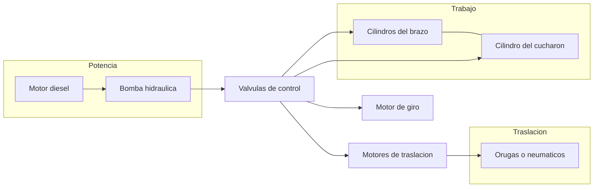
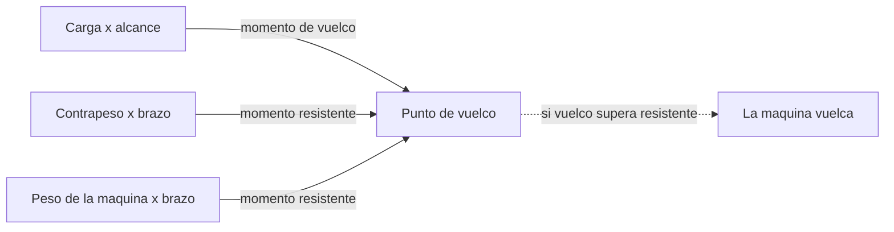

# 🔧 Sistemas mecanicos de la maquinaria de construccion

[🏠 Inicio](../../../README.md) · [🚧 Curso: Maquinaria de construccion](../README.md) · 🔧 Sistemas mecanicos

Este modulo abre la maquina por dentro y es el corazon del curso. Explica cada
sistema, como funciona y como se conecta con los demas, con foco en la hidraulica
de trabajo, el movimiento de tierra y la estabilidad. Es la base tecnica para
entender los mandos (Modulo 4) y la fisica de la operacion (Modulo 5).

---

## 1. 💧 Sistema hidraulico

La hidraulica es la fuerza de trabajo de la maquinaria moderna: convierte la
potencia del motor diesel en movimiento controlado y potente del brazo, el
cucharon, la hoja, el giro y la traslacion.

| Componente | Funcion |
| --- | --- |
| Bomba | Convierte el giro del motor en caudal de aceite a presion. |
| Valvulas de control | Dirigen el aceite al actuador que el operador acciona. |
| Cilindros | Transforman presion en movimiento lineal del brazo y el cucharon. |
| Motor de giro | Convierte presion en rotacion de la superestructura. |
| Motores de traslacion | Mueven las orugas o las ruedas. |
| Presion | Empuje disponible; a mayor presion, mas fuerza de excavacion. |
| Tanque y filtros | Almacenan y limpian el aceite en circuito cerrado. |

El movimiento **proporcional** de los joysticks regula el caudal que llega a cada
actuador, por lo que la velocidad del brazo o el cucharon depende de cuanto se
desplaza el mando. Varios movimientos pueden combinarse a la vez.

---

## 2. 🦾 Brazo y cucharon

En una excavadora, el frente de trabajo es un brazo articulado que termina en un
cucharon. Cada articulacion la mueve un cilindro hidraulico.

| Elemento | Funcion |
| --- | --- |
| Pluma (boom) | Primer tramo del brazo; sube y baja el conjunto. |
| Balancin (arm) | Segundo tramo; acerca y aleja el cucharon. |
| Cucharon | Recoge, corta y descarga el material. |
| Dientes | Puntas que rompen y penetran el terreno. |

El **ciclo de excavacion** tipico es: penetrar con el cucharon, arrastrar
cerrando el balancin, cerrar el cucharon para llenar, levantar la pluma, girar
hacia el camion y descargar abriendo el cucharon. La coordinacion de estos
movimientos es la habilidad central del operador.

---

## 3. 🔪 Hoja empujadora

En un bulldozer o una motoniveladora, la herramienta es una **hoja** que empuja y
nivela el material en vez de recogerlo.

| Elemento | Funcion |
| --- | --- |
| Hoja | Placa de acero que empuja y corta el terreno. |
| Cilindros de altura | Suben y bajan la hoja para regular la profundidad. |
| Angulo e inclinacion | Orientan la hoja para dirigir el material. |
| Escarificador (ripper) | Diente trasero que rompe suelo duro. |

- **Empujar**: el bulldozer avanza con la hoja baja para arrastrar material.
- **Nivelar**: la motoniveladora deja una superficie pareja con la hoja central.
- **Escarificar**: el ripper rompe roca o suelo compacto antes de empujarlo.

---

## 4. ⛓️ Orugas y neumaticos

La forma de desplazarse define el agarre, la estabilidad y la velocidad de la
maquina. Cada opcion tiene ventajas claras.

| Sistema | Ventaja | Desventaja |
| --- | --- | --- |
| Orugas | Gran agarre, reparte el peso, estable en terreno blando. | Lenta, dana el pavimento, no viaja por carretera. |
| Neumaticos | Rapida, viaja por camino, agil en obra. | Menos agarre y estabilidad en terreno suelto. |

- **Presion sobre el suelo**: las orugas reparten el peso en mucha superficie, por
  eso flotan en barro donde una rueda se hundiria.
- **Traslacion**: cada oruga o par de ruedas tiene su motor hidraulico; girar una
  mas que otra hace virar la maquina (giro diferencial).
- **Zapatas**: las placas de la oruga; anchas para suelo blando, angostas para
  terreno firme y mas velocidad.

---

## 5. ⚖️ Estabilidad y cargas

Como en una grua, la maquinaria puede volcar si la carga y el alcance superan lo
que su base y su contrapeso resisten. La estabilidad se explica con momentos:
fuerza por distancia respecto al punto de vuelco.

| Magnitud | Descripcion |
| --- | --- |
| Momento de vuelco | Peso de la carga por su distancia al punto de vuelco. |
| Momento resistente | Peso de la maquina y contrapeso por su brazo. |
| Punto de vuelco | Borde de la base de apoyo del lado de la carga. |
| Margen de estabilidad | Diferencia que debe mantenerse siempre positiva. |

Factores que afectan la estabilidad:

- **Alcance**: cuanto mas lejos se extiende el brazo con carga, mayor el momento
  de vuelco y menor la capacidad segura.
- **Giro lateral**: la maquina es menos estable girada hacia el costado que hacia
  el frente o la cola, donde el contrapeso y el tren ayudan.
- **Pendiente y terreno**: un suelo inclinado o que cede acerca el vuelco.
- **Contrapeso**: masa trasera que aumenta el momento resistente.

Reglas basicas: trabajar sobre terreno nivelado y firme, no extender el brazo con
carga mas de lo necesario, y descargar con el giro hacia la zona mas estable.

---

## 6. 🛡️ Cabina y proteccion

El operador trabaja rodeado de riesgos de caida de material y de vuelco, por lo
que la cabina cumple funciones de seguridad, no solo de confort.

| Elemento | Funcion |
| --- | --- |
| ROPS | Estructura que protege si la maquina vuelca. |
| FOPS | Estructura que protege de la caida de objetos. |
| Camaras y espejos | Cubren los puntos ciegos alrededor de la maquina. |
| Cinturon | Mantiene al operador dentro de la zona protegida. |
| Bocina y alarma de retroceso | Advierten a las personas del entorno. |

---

## 🔁 Como se conecta todo

1. El **motor diesel** mueve la **bomba** hidraulica.
2. La bomba envia aceite a presion a las **valvulas** de control.
3. Las valvulas alimentan los **cilindros** del brazo y el cucharon, el **giro**
   y los **motores de traslacion** segun lo que ordena el operador.
4. Las **orugas o neumaticos** trasladan la maquina y le dan agarre.
5. El **contrapeso** y la base definen el limite de estabilidad.
6. La cabina **ROPS/FOPS** protege al operador durante toda la faena.

Con esto entendido, el
[Modulo 4: Mandos](../mandos/manual-mandos-maquinaria.md) muestra como el
operador acciona cada uno de estos sistemas.

---

[⬅️ Anterior: Caracteristicas](caracteristicas-maquinaria.md) · [➡️ Siguiente: Mandos e instrumentos](../mandos/manual-mandos-maquinaria.md)
