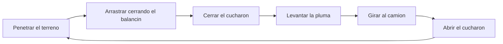

# 🧰 Recursos de la maquinaria de construccion

[🏠 Inicio](../../../README.md) · [🚧 Curso: Maquinaria de construccion](../README.md) · 🧰 Recursos

Glosario especifico, enlaces y diagramas de apoyo del curso de maquinaria de
construccion. Amplia el [glosario general](../../../docs/05-glosario-general.md).

---

## 📖 Glosario especifico

| Termino | Definicion |
| --- | --- |
| Hidraulica de trabajo | Sistema de aceite a presion que mueve brazos, cucharones y hojas. |
| Pluma (boom) | Primer tramo del brazo de una excavadora. |
| Balancin (arm) | Segundo tramo del brazo que acerca y aleja el cucharon. |
| Cucharon | Herramienta que recoge, corta y descarga material. |
| Hoja empujadora | Placa que empuja y nivela el terreno. |
| Escarificador (ripper) | Diente que rompe suelo duro antes de empujarlo. |
| Traslacion | Movimiento de la maquina por giro de orugas o ruedas. |
| Giro diferencial | Virar moviendo una oruga mas que la otra. |
| Momento de vuelco | Peso de la carga por su distancia al punto de vuelco. |
| Zona de exclusion | Radio de trabajo que debe estar libre de personas. |
| ROPS / FOPS | Estructuras que protegen del vuelco y de la caida de objetos. |

---

## 🗺️ Diagrama del ciclo de excavacion

---

## 🔗 Enlaces y fuentes

- Marco legal: [⚖️ docs/07-marco-legal-chile.md](../../../docs/07-marco-legal-chile.md)
- Registro de fuentes: [📚 manuales/fuentes.md](../../../manuales/fuentes.md)
- Manuales oficiales del conductor (CONASET): ver el registro de fuentes.

Registrar cada recurso nuevo con su origen y licencia, siguiendo
[`recursos/README.md`](../../../recursos/README.md).

---

[🎓 Portada del curso](../README.md) · [⬅️ Anterior: Diseno de simulacion](../simulacion/diseno-simulador-maquinaria.md)
