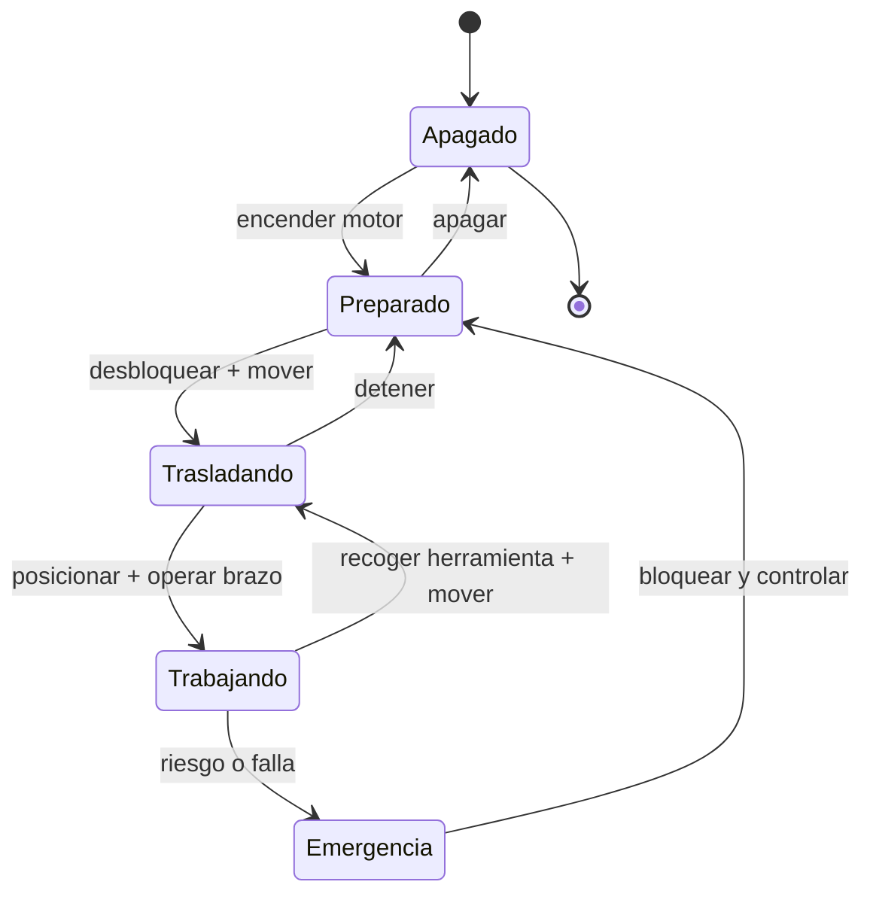

# 🎮 Diseno de simulacion de la maquinaria de construccion

[🏠 Inicio](../../../README.md) · [🚧 Curso: Maquinaria de construccion](../README.md) · 🎮 Simulacion

## Objetivo de la simulacion

Que el usuario aprenda a operar maquinaria de construccion con seguridad:
coordinar el brazo y el cucharon o la hoja, trasladar la maquina sobre orugas o
neumaticos, mantener la estabilidad frente al vuelco y respetar la zona de
exclusion de la faena.

## Nivel de realismo

- Nivel elegido: se ofrece del 1 al 3 (ver `docs/03-niveles-de-realismo.md`).
- Justificacion: la maquinaria comparte con la grua la hidraulica de trabajo y la
  estabilidad por momentos, y agrega el ciclo de movimiento de tierra, por lo que
  se ubica en el nivel avanzado del catalogo.

## Variables principales

| Variable | Tipo | Rango | Afecta a | Comentarios |
| --- | --- | --- | --- | --- |
| Presion hidraulica | numerica | 0-350 bar | Fuerza de trabajo | Empuje de cilindros y motores. |
| Angulo de pluma | numerica | -30..60 grados | Alcance y altura | Define el radio de trabajo. |
| Angulo de balancin | numerica | 0..150 grados | Acercar/alejar carga | Combina con la pluma. |
| Llenado del cucharon | numerica | 0-100% | Peso de la carga | Afecta el momento de vuelco. |
| Alcance | numerica | 0-12 m | Momento de carga | Mas alcance, menos capacidad. |
| Giro | numerica | 0-360 grados | Estabilidad lateral | Menos estable de costado. |
| Pendiente del terreno | numerica | -20..20 grados | Riesgo de vuelco | Factor de estabilidad. |
| Traslacion | numerica | 0-100% por lado | Avance y giro | Giro diferencial de orugas. |

## Ciclo basico

1. Leer entrada del usuario (joysticks, pedales, acelerador, bloqueo).
2. Actualizar estado del motor y la presion hidraulica.
3. Calcular fuerzas y movimientos de brazo, cucharon, giro y traslacion.
4. Aplicar restricciones del entorno (terreno, pendiente, personas, otros equipos).
5. Actualizar posicion, alcance, carga y margen de estabilidad.
6. Refrescar instrumentos y retroalimentacion (sonido, testigos, aviso de vuelco).

## Modos de juego futuros

- Tutorial guiado de joysticks y ciclo de excavacion.
- Practica de carga de camion coordinando giro y descarga.
- Desafios de nivelacion con hoja empujadora.
- Excavacion de zanjas respetando servicios enterrados.
- Trabajo en pendiente sin superar el limite de vuelco.

## Elementos fuera de alcance

- Presentar la operacion sin ROPS/FOPS como algo aceptable.
- Ignorar la zona de exclusion como opcion valida de juego.
- Datos que permitan alterar sistemas reales de la maquina.

## Pendientes

- [ ] Definir valores por defecto de cada variable por tipo de maquina.
- [ ] Prototipar el ciclo de excavacion y la carga del cucharon.
- [ ] Ajustar el modelo de estabilidad y limite de vuelco.
- [ ] Agregar fuentes tecnicas publicas a
      [`manuales/fuentes.md`](../../../manuales/fuentes.md).

---

[⬅️ Anterior: Reglamentos](../reglamentos/reglamentos-maquinaria.md) · [➡️ Siguiente: Recursos](../recursos/recursos-maquinaria.md)
