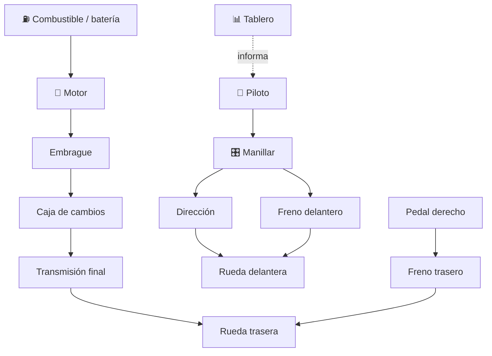

# 🏍️ Curso: Motocicletas

[🏠 Inicio](../../README.md) · [🚙 Catálogo de vehículos](../README.md) · [🎓 Guía de curso](../../docs/08-guia-de-estilo-y-curso.md)

> **Curso de referencia del repositorio.** Documenta la motocicleta de principio
> a fin: historia, características, mecánica en profundidad, mandos, física,
> entornos, reglamentos chilenos y diseño de simulación. Es el modelo que
> siguen los demás vehículos.

---

## 🎯 Objetivos de aprendizaje

Al terminar este curso deberías poder:

- Explicar como una moto acelera, frena, gira y mantiene el equilibrio.
- Identificar sus sistemas mecánicos y cómo se conectan.
- Reconocer todos los mandos e instrumentos y su función.
- Comprender la física de la conducción (contramanillar, transferencia de peso).
- Conocer los reglamentos chilenos aplicables (licencia, casco, seguridad).
- Traducir todo lo anterior en variables de un simulador educativo.

---

## 🗺️ Mapa del vehículo

---

## 📚 Módulos del curso

| # | Módulo | Contenido | Enlace |
| :-: | --- | --- | --- |
| 1 | 📜 Historia | Origen y evolución de la moto, línea de tiempo. | [Abrir](historia/historia-moto.md) |
| 2 | 📋 Características | Que es, tipos de moto y para que sirve cada uno. | [Abrir](operacion/caracteristicas-moto.md) |
| 3 | 🔧 Sistemas mecánicos | Motor, transmisión, chasis, suspensión, frenos, neumáticos. | [Abrir](operacion/sistemas-mecanicos-moto.md) |
| 4 | 🎛️ Mandos e instrumentos | Puesto de mando, controles y tablero. | [Abrir](mandos/manual-mandos-moto.md) |
| 5 | 🧪 Principios y operación | Física de la conducción y fases de operación. | [Abrir](operacion/principios-moto.md) |
| 6 | 🌍 Entornos de trabajo | Ciudad, carretera, todo terreno, reparto. | [Abrir](operacion/entornos-moto.md) |
| 7 | ⚖️ Reglamentos | Ley chilena: licencia clase C, casco, seguridad. | [Abrir](reglamentos/reglamentos-moto.md) |
| 8 | 🎮 Diseño de simulación | Variables, ciclo y modos de juego. | [Abrir](simulacion/diseno-simulador-moto.md) |
| 9 | 🧰 Recursos | Glosario, enlaces y diagramas. | [Abrir](recursos/recursos-moto.md) |

---

## 🧩 Requisitos previos

Ninguno. La moto es el punto de entrada recomendado porque permite explicar
aceleración, frenado, equilibrio y transmisión con menor complejidad que un
buque o una aeronave. Marco legal común en
[⚖️ docs/07-marco-legal-chile.md](../../docs/07-marco-legal-chile.md).

---

[➡️ Empezar por el Módulo 1: Historia](historia/historia-moto.md)
