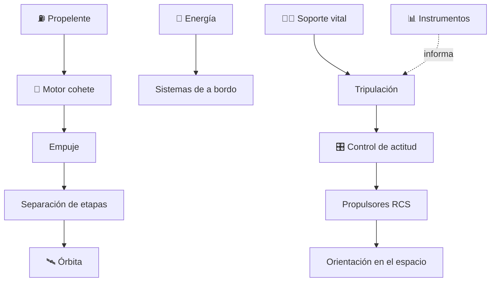

# 🚀 Curso: Naves espaciales

[🏠 Inicio](../../README.md) · [🚙 Catálogo de vehículos](../README.md) · [🎓 Guía de curso](../../docs/08-guia-de-estilo-y-curso.md)

> **Curso de vuelo espacial.** Documenta la nave espacial de principio a fin:
> historia, características, sistemas (propulsión, etapas, soporte vital,
> energía, control de actitud), cabina y mandos, física orbital, entornos del
> espacio, marco legal internacional y diseño de simulación. **Distingue siempre
> la ciencia real de la ciencia ficción.**

---

## 🎯 Objetivos de aprendizaje

Al terminar este curso deberías poder:

- Explicar como una nave alcanza la órbita, se mantiene en ella y reingresa.
- Identificar propulsión cohete, etapas, soporte vital, energía y control de actitud.
- Reconocer los mandos e instrumentos de una cabina espacial.
- Comprender los principios físicos del vuelo orbital (delta-v, microgravedad).
- Conocer el marco de tratados espaciales que aplica a la actividad espacial.
- Traducir todo lo anterior en variables de un simulador, separando ciencia y ficción.

---

## 🔬 Ciencia real y ficción

Este curso marca siempre la diferencia entre lo que la física actual permite
(**ciencia real**) y lo que pertenece a la imaginación (**ficción plausible**).
Cada módulo lo señala de forma explícita para no confundir aprendizaje con relato.

---

## 🗺️ Mapa del vehículo

---

## 📚 Módulos del curso

| # | Módulo | Contenido | Enlace |
| :-: | --- | --- | --- |
| 1 | 📜 Historia | Historia de la exploración espacial, línea de tiempo. | [Abrir](historia/historia-nave-espacial.md) |
| 2 | 📋 Características | Que es, tipos de nave y para que sirve cada uno. | [Abrir](operacion/caracteristicas-nave-espacial.md) |
| 3 | 🔧 Sistemas mecánicos | Propulsión, etapas, soporte vital, energía, control de actitud. | [Abrir](operacion/sistemas-mecanicos-nave-espacial.md) |
| 4 | 🎛️ Mandos e instrumentos | Cabina, controles y panel de la nave. | [Abrir](mandos/manual-mandos-nave-espacial.md) |
| 5 | 🧪 Principios y operación | Física orbital y fases de la misión. | [Abrir](operacion/principios-nave-espacial.md) |
| 6 | 🌍 Entornos de trabajo | Órbita baja, espacio profundo y reentrada. | [Abrir](operacion/entornos-nave-espacial.md) |
| 7 | ⚖️ Reglamentos | Tratados espaciales y marco nacional. | [Abrir](reglamentos/reglamentos-nave-espacial.md) |
| 8 | 🎮 Diseño de simulación | Variables, ciclo y modos de juego. | [Abrir](simulacion/diseno-simulador-nave-espacial.md) |
| 9 | 🧰 Recursos | Glosario, enlaces y diagramas. | [Abrir](recursos/recursos-nave-espacial.md) |

---

## 🧩 Requisitos previos

Se recomienda haber revisado antes los cursos de aviación
([🛩️ aviones pequeños](../aviones-pequenos/README.md)), que introducen empuje,
sustentación y control. La nave espacial reemplaza la sustentación por la
mecánica orbital y agrega el soporte vital. Marco legal común en
[⚖️ docs/07-marco-legal-chile.md](../../docs/07-marco-legal-chile.md).

---

[➡️ Empezar por el Módulo 1: Historia](historia/historia-nave-espacial.md)
