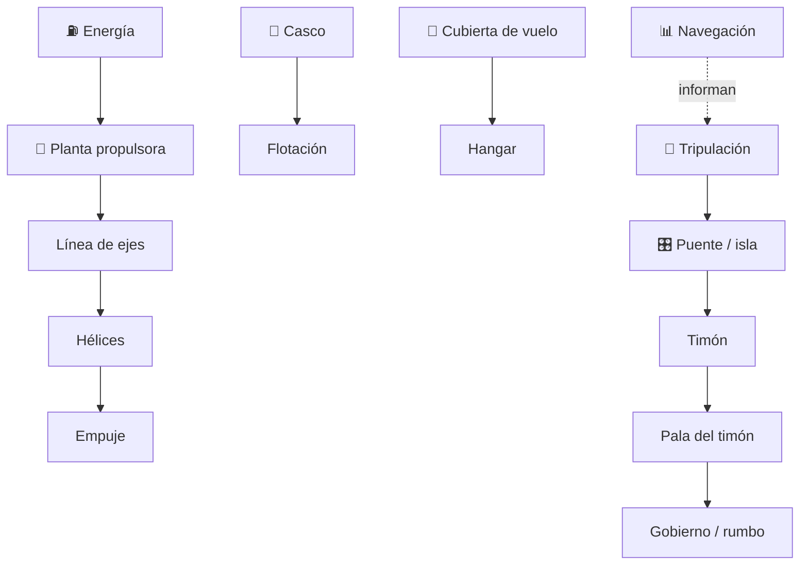

# 🛳️ Curso: Portaviones

[🏠 Inicio](../../README.md) · [🚙 Catálogo de vehículos](../README.md) · [🎓 Guía de curso](../../docs/08-guia-de-estilo-y-curso.md)

> **Curso divulgativo e histórico.** Documenta el portaviones solo con
> información pública: historia, características generales, principios físicos
> de flotación y estabilidad, cubierta de vuelo y hangar a nivel divulgativo,
> puente educativo, entornos y marco público. No incluye táctica, doctrina ni
> sistemas de armas. Ver [🦺 docs/04-seguridad-y-limites.md](../../docs/04-seguridad-y-limites.md).

---

## 🎯 Objetivos de aprendizaje

Al terminar este curso deberías poder:

- Explicar como un buque muy grande flota, avanza y mantiene estabilidad.
- Identificar sus sistemas generales (casco, propulsión, gobierno, cubierta).
- Reconocer, a nivel divulgativo, la cubierta de vuelo y el hangar.
- Comprender la física pública de flotación, estabilidad y logística de cubierta.
- Conocer el marco institucional e internacional público aplicable.
- Traducir todo lo anterior en variables de un simulador educativo responsable.

---

## 🗺️ Mapa del vehículo

---

## 📚 Módulos del curso

| # | Módulo | Contenido | Enlace |
| :-: | --- | --- | --- |
| 1 | 📜 Historia | Origen y evolución pública de la aviación naval. | [Abrir](historia/historia-portaviones.md) |
| 2 | 📋 Características | Que es, tipos históricos y su papel general. | [Abrir](operacion/caracteristicas-portaviones.md) |
| 3 | 🔧 Sistemas mecánicos | Casco, propulsión, gobierno, cubierta y hangar. | [Abrir](operacion/sistemas-mecanicos-portaviones.md) |
| 4 | 🎛️ Mandos e instrumentos | Puente e isla, a nivel educativo. | [Abrir](mandos/manual-mandos-portaviones.md) |
| 5 | 🧪 Principios y operación | Física de flotación, estabilidad y cubierta. | [Abrir](operacion/principios-portaviones.md) |
| 6 | 🌍 Entornos de trabajo | Puerto, costa, mar abierto y clima. | [Abrir](operacion/entornos-portaviones.md) |
| 7 | ⚖️ Reglamentos | Marco público institucional e internacional. | [Abrir](reglamentos/reglamentos-portaviones.md) |
| 8 | 🎮 Diseño de simulación | Variables, ciclo y modos de simulación. | [Abrir](simulacion/diseno-simulador-portaviones.md) |
| 9 | 🧰 Recursos | Glosario náutico, enlaces y diagramas. | [Abrir](recursos/recursos-portaviones.md) |

---

## 🧩 Requisitos previos

Conviene haber visto antes el curso de
[🚢 Barcos mercantes](../barcos-mercantes/README.md) para dominar flotación,
inercia y gobierno. El portaviones agrega la escala y la cubierta de vuelo,
siempre desde un enfoque histórico y público. Límites en
[🦺 docs/04-seguridad-y-limites.md](../../docs/04-seguridad-y-limites.md).

---

[➡️ Empezar por el Módulo 1: Historia](historia/historia-portaviones.md)
