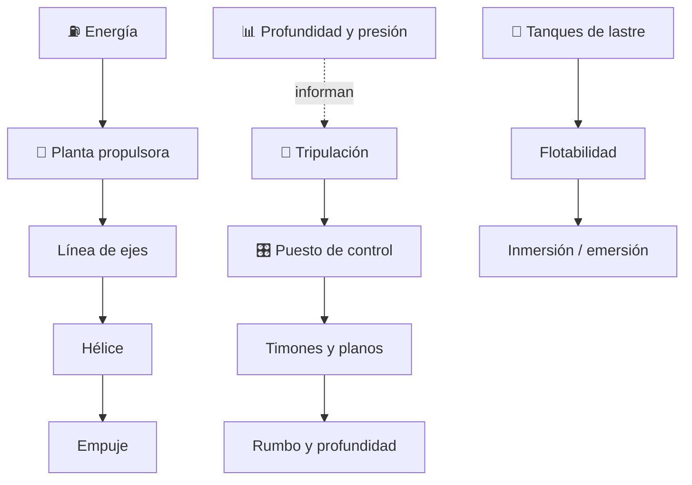

# 🌊 Curso: Submarinos

[🏠 Inicio](../../README.md) · [🚙 Catálogo de vehículos](../README.md) · [🎓 Guía de curso](../../docs/08-guia-de-estilo-y-curso.md)

> **Curso divulgativo e histórico.** Documenta el submarino solo con información
> pública: historia, características generales, principios físicos de
> flotabilidad, lastre, presión e inmersión, puesto de control educativo,
> entornos y marco público. No incluye táctica, doctrina ni sistemas de armas.
> Ver [🦺 docs/04-seguridad-y-limites.md](../../docs/04-seguridad-y-limites.md).

---

## 🎯 Objetivos de aprendizaje

Al terminar este curso deberías poder:

- Explicar como un submarino flota, se sumerge, avanza y emerge.
- Identificar sus sistemas generales (casco, lastre, propulsión, gobierno).
- Reconocer, a nivel educativo, el puesto de control y sus instrumentos.
- Comprender la física pública de flotabilidad, lastre, presión e inmersión.
- Conocer el marco institucional e internacional público aplicable.
- Traducir todo lo anterior en variables de un simulador educativo responsable.

---

## 🗺️ Mapa del vehículo

---

## 📚 Módulos del curso

| # | Módulo | Contenido | Enlace |
| :-: | --- | --- | --- |
| 1 | 📜 Historia | Origen y evolución pública del submarino. | [Abrir](historia/historia-submarino.md) |
| 2 | 📋 Características | Que es, tipos históricos y su papel general. | [Abrir](operacion/caracteristicas-submarino.md) |
| 3 | 🔧 Sistemas mecánicos | Casco, lastre, inmersión, presión, propulsión y gobierno. | [Abrir](operacion/sistemas-mecanicos-submarino.md) |
| 4 | 🎛️ Mandos e instrumentos | Puesto de control, a nivel educativo. | [Abrir](mandos/manual-mandos-submarino.md) |
| 5 | 🧪 Principios y operación | Física de flotabilidad, lastre, presión e inmersión. | [Abrir](operacion/principios-submarino.md) |
| 6 | 🌍 Entornos de trabajo | Superficie, cota, profundidad y clima. | [Abrir](operacion/entornos-submarino.md) |
| 7 | ⚖️ Reglamentos | Marco público institucional e internacional. | [Abrir](reglamentos/reglamentos-submarino.md) |
| 8 | 🎮 Diseño de simulación | Variables, ciclo y modos de simulación. | [Abrir](simulacion/diseno-simulador-submarino.md) |
| 9 | 🧰 Recursos | Glosario náutico, enlaces y diagramas. | [Abrir](recursos/recursos-submarino.md) |

---

## 🧩 Requisitos previos

Conviene haber visto antes el curso de
[🚢 Barcos mercantes](../barcos-mercantes/README.md) para dominar flotación,
inercia y gobierno. El submarino agrega la flotabilidad variable, el lastre y la
presión, siempre desde un enfoque histórico y público. Límites en
[🦺 docs/04-seguridad-y-limites.md](../../docs/04-seguridad-y-limites.md).

---

[➡️ Empezar por el Módulo 1: Historia](historia/historia-submarino.md)
